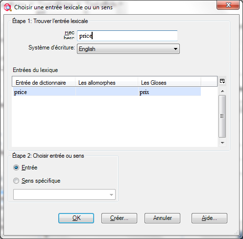
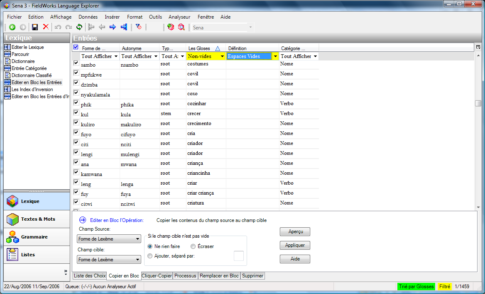
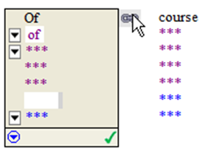
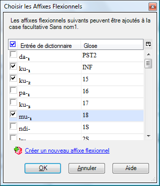
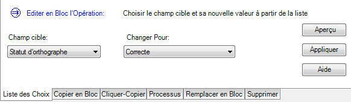

version 8.3

# Introduction

Ce cours vous donne une base sur l’usage du logiciel Explorateur de Langue FieldWorks, en anglais « **F**ieldWorks **L**anguage **Ex**plorer » (ou « **FLEx »**) comme outil de lexicographie (c’est-à-dire outil pour la création d’un dictionnaire et l’analyse de langue). FLEx fait partie d’un ensemble de logiciels (appelé FieldWorks) qui sert à la gestion des données linguistiques et culturelles.

Ce cours est basé sur les « Vidéos démo » qui sont disponibles dans le logiciel, sous le menu « Aide ». À ce point, les vidéos sont disponibles seulement en anglais. Mais le texte de ce cours vous assistera à suivre les idées présentées dans les vidéos, même si vous ne comprenez pas l’anglais. C’est possible de regarder les vidéos en suivant ce texte, or juste de suivre le texte de ce document et consulter la vidéo en cas de questions.

Ce cours ne vous fournit pas des données à entrer. Vous êtes encouragés à utiliser vos propres données linguistiques quand vous pratiquez les techniques présentés ici. Si vous n’avez pas de données à entrer, vous pouvez pratiquer avec votre langue maternelle ou avec le projet exemple Sena 3 (inclus dans l’installation par défaut).

## Objectifs du cours

À la fin de ce cours, vous devrez être capable de :

-   Ouvrir et configurer le bureau de travail FLEx
-   Trier, filtrer et chercher les données
-   Créer et modifier les entrées dans le lexique
-   Travailler avec les homographes, genres et traits de flexion
-   Ajouter des phrases exemples et rechercher les phrases dans le corpus de textes
-   Traiter les affixes et les allomorphes
-   Créer les relations lexicales et les formes complexes (comme variantes)
-   Utiliser l’entrée classée par catégorie
-   Éditer les entrées en bloc
-   Analyser les textes interlinéaires avec coupage de morphèmes
-   Utiliser une concordance

## Installation et Configuration Initiale

Normalement l’installation et la configuration de FLEx se fait avec l’aide du formateur. Les fichiers d’installation sont disponibles sur l’Internet à <http://fieldworks.sil.org/download/>. Assurez-vous d’installer la version 7+ de FieldWorks[^1]. Avec Windows 7, utiliser l’installation minimale (B). Avec les autres versions de Windows, utiliser l’installation complète (A). Pour suivre ce cours, il est aussi conseillé d’installer les « Vidéos démo », disponibles à <http://fieldworks.sil.org/download/movies/>.

[^1]: Cette version est disponible actuellement á <http://fieldworks.sil.org/download/beta/>, mais bientôt la version 7 sera disponible sur le chemin principal noté dessus.

Si vous avez déjà une ancienne installation de FieldWorks, lors de l’installation de FieldWorks 7, vous aurez la possibilité de migrer les anciens projets vers le nouveau format. Pour migrer des projets plus tard, utilisez la commande Fichier \> Gestion de projet \> Restaurer un projet.

Si vous n’avez pas encore de projet, créez un projet en utilisant la commande Fichier \> Nouveau projet FieldWorks. Faites attention surtout à la sélection ou la création de langue et de système d’écriture.

Vous pouvez changer la langue de l’interface de l’anglais vers le français en utilisant la commande Tools \> Options \> Interface et sélectionnant « français » comme « User interface language » (langue de l’interface utilisateur).

## Introduction aux vidéos

Les sections suivantes dans ce document couvrent les idées et les techniques présentées dans les vidéos de démonstration de FLEx. Soyez libre de suivre le texte ou de regarder les vidéos, ou tous les deux à la fois. Le titre de chaque section indique le titre de la vidéo (en anglais entre parenthèses) pour mieux trouver la vidéo correspondante.

# Lexique

Dans la zone « Lexique », surtout dans l’affichage « Modifier le lexique »

# Visite rapide (1-quick tour.mp4)

Les outils dans l’explorateur de langue (FLEx) sont organisés en **zones**. Dans chaque zone il y a plusieurs affichages.

La liste d’affichages change selon la zone sélectionnée.

| **Zone**           | Là où vous pouvez…                                                              | Contient affichages/outils pour…                                                                                                       |
|--------------------|---------------------------------------------------------------------------------|----------------------------------------------------------------------------------------------------------------------------------------|
| **Lexique**        | maintenir votre base de données lexicale                                        | éditer le dictionnaire éditer les entrées en bloc ajouter les lexèmes par domaines sémantiques                                         |
| **Textes et Mots** | entrer et interlinéariser les textes vernaculaire                               | analyser les textes interlinéaires examiner les analyses des mots rechercher les mots avec une concordance                             |
| **Grammaire**      | écrire et organiser l’information et les règles de grammaire                    | contrôler la liste de catégories grammaticales créer des règles flexionnelles basées sur les modèles générer une esquisse grammaticale |
| **Listes**         | maintenir les diverses listes utilisées pour classer et catégoriser les données | ajouter/éditer les éléments dans les listes                                                                                            |

# Mise en page des volets (2.Pane Layout)

Souvent les affichages contiennent un volet de lecture rapide et un volet d’édition. Le volet de lecture rapide (ou parcourir) à gauche montre plusieurs entrées tandis que le volet d’édition à droite permet l’utilisateur de travailler sur une entrée en détail. L’entrée sélectionnée dans le volet à gauche est affichée en détail dans le volet à droite. Vous pouvez réduire au minimum un volet en glissant la ligne de séparation entre les volets à gauche ou à droite.

# 3-Configuration des colonnes (3-configure columns)

Dans un volet de lecture rapide vous pouvez changer les colonnes affichées et leurs positions.

## Changer les colonnes affichées

-   Utilisez le bouton de colonne de configuration (à la droite de la dernière colonne)

    

-   Cochez et décochez les éléments dans le menu pour faire apparaître et cacher des colonnes

    

**Changer la position de colonne**

**ou**

-   Changez la position d’une colonne en cliquant-glissant l’en-tête de la colonne vers l’endroit désiré

    

**Changer les colonnes affichées**

-   Cliquez sur le menu Outils \> Configurer \> Colonnes...
-   Pour ajouter une colonne, sélectionnez la colonne à gauche et cliquez Ajouter
-   Pour supprimer une colonne, sélectionnez la colonne à droite et cliquez Enlever
-   

## Changer la position de colonne

-   Changez la position des colonnes en sélectionnant une colonne active et en cliquant les flèches à droite
-   Choisissez les systèmes d’écriture de chaque colonne selon les besoins (par exemple vous pouvez afficher la glose en deux langues différentes)

    

# 4-Filtrage (4-Filtering)

Les filtres sont contrôlés par les sélecteurs dessous les en-têtes des colonnes. Cliquez la flèche à droite pour voir le menu des filtres disponible pour ce champs.

## Filtres standard

Il y a quatre filtres standards :

-   Tout afficher : tous les entrées, en effet arrêtant un filtre activé pour ce champ
-   Vides : les champs sans données
-   Non-vides : les champs avec données
-   Filtrer pour…: filtre personnalisé (voir dessous)

    

## Filtres actifs

Quand un filtre est actif, l’en-tête du champ est **jaune** et la barre d’état au coin inférieur droit de la fenêtre se lit « **Filtré** » en jaune.

Les chiffres à côté indiquent quelle entrée est sélectionnée/entrées totales dans le filtre actuel. Dans cet exemple c’est le troisième entrée de 201 totale.

## Arrêter le filtre

-   Choisissez « Tout afficher » dans le menu de filtre d’un champ
-   \- ou -
-   Cliquez sur le bouton **Arrêter tous les filtres** dans la barre d’outils. Cette option est utile quand vous voulez arrêter plusieurs filtres à la fois.

## Filtres personnalisés

Pour définir un filtre spécifique,

-   sélectionnez « Filtrer pour… » dans le menu de filtre.

    Par exemple, trouvez tous les mots qui contiennent les caractères « ou ». Ou trouvez tous les mots qui commencent avec les caractères « mb ».

-   Cochez les cases pour respecter la casse (majuscule/minuscule) ou les diacritiques.
-   

## Filtrage selon type de données (Special Filters for Data Types)

Certains champs ont des options de filtres spéciaux, selon le type de données dans le champ. Voici quelques exemples :

## Dans une langue avec dictionnaire

Erreurs d’orthographe

## Avec une liste de référence

-   Filtre **Choisir**…
-   Cliquez une case pour sélectionner
-   Ctrl-cliquez pour inclure tous les sous-éléments

## Date

Limiter…

# 6-Filtrage avec des expressions régulières (6-Filtering with Regular Expressions)

Pour plus de flexibilité dans le filtrage personnalisé vous pouvez utiliser ce qui est appelé une **expression rationnelle (régulière)**.

## Filtrer

-   Sélectionnez « **Filtrer pour**… » dans le menu de filtre,
-   Dans la boîte de dialogue, sélectionnez « **Expressions régulières** ».
-   À ce point vous pouvez taper l’expression ou utiliser le menu d’aide à droite « **\>** ».

    

## Exemple

Par exemple, nous voulons trouver tous les lexèmes commençant avec mb- ou mp- ou mu-.

-   Dans le menu sélectionnez « \^ Début de ligne »,
-   Puis sélectionnez « () Regroupement » parce que nous voulons mettre les trois combinaisons de lettres en groupe.

-   Tapez les trois paires de caractères, mettant le « \| Alternative » entre chaque paire.

    (Alternative veut dire « ou » : mb **ou** mp **ou** mu.)

-   Cliquez sur **OK** pour appliquer le filtre.

Il y a un secours sur les expressions régulières en bas du menu d’aide que vous venez d’utiliser. Malheureusement ce secours est en anglais, mais il y a d’autre sur l’Internet aussi. (Note : FLEx emploie les expressions régulières de .NET).

Quelques expressions régulières utiles :

| \^(mp\|mb\|mu) | soit **mp** soit **mb** soit **mu** au début du champ                           |
|----------------|---------------------------------------------------------------------------------|
| ra\#           | tous les mots qui finissent avec **ra**                                         |
| e+             | tous les mots avec plusieurs **e** ensemble                                     |
| d.b            | tous les mots avec **d** et **b** et exactement une lettre entre **d** et **b** |

# 7-Triage (7-Sorting)

## L’ordre primaire

-   Cliquez sur l’en-tête de la colonne pour trier par cette colonne.

    

## L’ordre Secondaire

-   Shift+Cliquez sur l’en-tête d’une autre colonne pour ajouter un triage secondaire (Note: la flèche est plus petite)

    

## Arranger à partir de la fin

-   Cliquez avec le bouton droit sur l’en-tête de colonne pour d’autres options, y compris triage à partir de la fin du mot
-   

    Note : Avec triage sur les champs répétés (par exemple, Les Gloses) le nombre d'entrées totale dans la barre d’état peut changer, parce qu’une entrée peut avoir plusieurs gloses et donc apparaître dans la liste plusieurs fois.

# 8-Affichage des champs caches, Visibilité des champs (8-Showing Hidden Fields, Field Visibility)

Il se peut que vous n’avez pas accès à tous les champs nécessaire pour votre travail dans le volet d’édition.

## Pour voir les champs qui sont cachés

-   Vous pouvez afficher tous les champs possibles en cliquant la case à cocher « **Afficher les champs cachés** » en haut du volet.

    

## Pour changer la visibilité

-   Cliquez sur le nom d’un champ et puis sur le bouton bleu vers la gauche du champ (le menu de contexte)

    

-   Choisissez Visibilité du Champ

    

-   Puis choisissez l’option de visibilité qui convient pour ce champ.

    

    Toujours visible montrera ce champ dans tous les entrées.

-   Cliquez sur la case à cocher « Afficher les champs cachés » pour revenir à l’affichage (et la visibilité) normal

## Pour cacher des champs

-   Choisissez Visibilité du champ dans le menu de contexte
-   Choisissez une des options « Normalement caché »
-   

# 9-Champs Insérés (9-Inserted Fields)

## Champs Insérés

Quelques champs ne se montrent pas jusqu’à ce que vous ajoutiez l’objet.

-   Cliquez sur **la flèche blanche** en haut de l’entrée détaillée. Sélectionner la section à insérer.

    

    C’est possible d’ajouter ces sections depuis le menu Insérer aussi.

# Visibilité de système d’écriture (10-WS visibility)

Si un champ affiche les données dans plusieurs systèmes d’écriture, vous pouvez changer la visibilité d’un système d’écriture.

## Changer la visibilité d’un système d’écriture

-   Cliquez sur le menu de contexte

    

-   Sélectionner Systèmes d’écriture

    

-   Cochez ou décochez le système d’écriture désiré

# Ajouter des champs personnalisés (11-Adding Custom Fields)

## Ajouter des champs personnalisés

-   **Outils** \> **Configurer** \> **Champs personnalisés**

    

-   Cliquez sur **Ajouter**
-   Tapez un nom
-   Choisissez l’**Endroit** (section de l’entrée ou se trouve ce champ)
-   Choisissez le(s) Système(s) d’écriture
-   Cliquez sur **OK**

# Ajouter une entrée (12-Create Entry)

## Ajouter une entrée

-   Cliquez le bouton **Créer une nouvelle entrée lexicale** sur la barre d’outils

    

    \- ou -

-   Dans le menu **Insérer**, choisissez **Entrée…**

    Le dialogue qui s’affiche vous permet d’entrer les données de base pour l’entrée lexicale.

    

-   Tapez la forme de lexème et la glose.

    En tapant, FLEx vous montre les entrées similaires en bas, pour éviter la duplication d’entrée.

-   (Cliquez sur le lien Atteindre entrée similaire pour montrer et peut-être éditer cette entrée similaire.)
-   Sélectionnez la Catégorie
-   Cliquez **Créer**.  
    L’entrée est créée et affichée dans le volet d’édition.

# Recherche d’une entrée (13-Finding an Entry)-

Pour trouver une entrée qui n’est pas affichée sur l’écran, utilisez la fonction de « rechercher » :

## Recherche d’une entrée

Dans la zone « Lexique », Affichage « Modifier le lexique » et autres

-   Cliquez le bouton **Rechercher une entrée lexicale** sur la barre d’outils

    \- ou -

-   Dans le menu **Édition**, choisissez **Rechercher une entrée lexicale …**

    

-   Commencez à tapez l’entrée.

    Les résultats sont montrés lorsque vous tapez.

-   Si vous voyez l’entrée recherchée, cliquez sur le mot et cliquez sur le bouton **Atteindre**
-   Si l’entrée n’est pas trouvée, c’est possible d’ajouter cette entrée en cliquant le bouton **Créer**.

    Dans ce cas, le dialogue de création d’entrée s’affiche.

# Les homographes et les sens (14-Homographs and Senses)

Quand deux mots différents ont la même forme de lexème, ils devraient être ajoutés en tant qu’**entrées séparées** (c.à.d. homographes) s’ils ne sont pas ou en tant que **sens différents de la même entrée** si leurs sens sont étroitement liés.

## Ajouter un homographe

-   Ajoutez une nouvelle entrée comme d’habitude (voyez dessus). Une entrée identique est affichée quand vous tapez la Forme de Lexème.
-   Ignorez l’entrée identique et cliquez **Créer** pour créer la nouvelle entrée.

    

    Les numéros d’homographe sont affichés automatiquement dans les entrées.

-   

## Ajouter un sens

-   Cliquez dans la section de sens
-   Cliquez sur **Insérer un sens**.

    

    Un deuxième sens est ajouté.

-   Complétez les détails pour le nouveau sens.

    Dans l’aperçu du dictionnaire, les numéros de sens sont affichés automatiquement

    Vous pouvez changer l’ordre des sens à l’aide du menu de contexte dans le sens

# Ajouter l’information grammaticale – catégorie (15-Adding Grammatical Info – POS)

Vous pouvez ajouter ou changer la catégorie d’un sens.

## Ajouter l’information grammaticale

-   Choisissez l’entrée
-   Dans la section de sens, cliquez sur **Info. grammatical**
-   Cliquez sur le bouton pour montre le choix de catégories

## deuxième sens

Si vous ajoutez un deuxième sens, FLEx copie la catégorie du premier sens, mais vous pouvez le changer.

L’information grammaticale est liée avec une section à la fin de l’entrée, « Détails d’info. grammaticale ».

Rappel : Choisissez **Afficher les champs cachés** pour voir tous les champs.

# Spécifier le genre (16-Specifying Gender)

Vous pouvez spécifier le genre d’un mot ou sa classe nominale, mais d’abord vous devez définir les Traits de flexion, pour qu’ils puisse être utiliser dans les entrées.

## Spécifier le genre

-   Cliquez sur la zone Grammaire et l’affichage Traits de flexion.

**- ou -**

-   Menu **Affichage** \> **Grammaire** \> **Traits de flexion**
-   Menu **Insérer** \> **Trait**

## Le catalogue

-   Dans le catalogue, sélectionnez le trait selon le type de trait.

    (Ouvrez les dossiers en cliquant le « + » à côté.)

-   Cochez tous les traits de flexion que vous voulez utiliser dans ce trait.

    

    Dans cet exemple, nous avons un trait de genre avec deux valeurs possible : masculin et féminin.

-   Cliquez sur **Ajouter** pour définir ce trait de flexion dans le projet pour cette langue.

## Dans les entrées pour les noms,

-   Cliquer dans le champ de **Traits de flexion**

    

-   Cliquer sur …. (les trois points) pour ouvrir une boîte de dialogue.

    (Peut-être il sera nécessaire de cocher Afficher les champs cachés.)

-   Dans ce dialogue vous pouvez sélectionner *le trait de flexion* pour cette entrée et cliquer **OK**.

Le trait de flexion s’affiche dans l’entrée – dans les Détails d’info. grammaticale au bas de l’entrée, et quand la vue est rafraichi (F5), dans l’Info. grammaticale dans le sens.

# Afficher les traits de flexion dans le dictionnaire (17-Showing Inflection Features in Dictionary View)

## Afficher les traits de flexion dans le dictionnaire

Menu **Outils** \> **Configurer** \> **Dictionnaire**…

La boîte de dialogue s’affiche.

-   Agrandissez les listes (en cliquant les « + ») pour trouver Les sens, Info. grammaticale, et cochez Traits de flexion.
-   Cliquez **OK**.

    Le trait de flexion s’affiche après la catégorie dans l’aperçu de dictionnaire.

    

# 18 Ajouter une phrase d’exemple (Adding an Example Sentence)

Pour ajouter une phrase d’exemple, tapez simplement dans le champ « Exemple ».

## ajouter une phrase d’exemple

-   Tapez simplement dans le champ « Exemple ».

    

    Les champs de Traduction et Référence apparaîtront dès que vous tapez dans le champ Exemple

# Rechercher une phrase d’exemple dans vos textes (19-Finding an Example Sentence in Your Texts)

Vous pouvez utiliser l’outil de concordance pour rechercher les phrase d’exemple dans votre corpus de textes.

## 

-   Cliquez le menu de contexte bleu dans le champ Exemple.

    

    

-   Dans le menu, cliquez **Rechercher une phrase exemple…**

    Le dialogue de concordance vous permet de sélectionner une ou plusieurs phrases exemples à insérer dans l’entrée pour le mot.

    N.B. Vous devez faire les analyses des textes (interlinéaire – voir dessous) et les analyses doivent être approuvé pour voir les phrases dans la concordance. L’outil affiche seulement les phrases liées avec le sens de l’exemple sélectionné, pas ceux des autres sens.

# Ajouter entrées pour des affixes (20-Adding Affix Entries)

## Ajouter une affixe dérivationnelle

-   Créez une nouvelle entrée

    

-   Tapez un trait d’union « - » puis la forme de l’affixe. Le Type de Morphème change immédiatement à suffixe.
-   Choisissez le **Type affixe** (c.-à-d. dérivationnel)
-   Choisissez **S’attache à la catégorie :** quelle catégorie de mot prend cette affixe ?
-   Indiquez tout **Changements à la catégorie** des mots créés avec cette affixe
-   Ajoutez une glose, si possible
-   Cliquez sur **Créer**

## Ajouter une affixe flexionnel

-   Créez une nouvelle entrée

    

-   Tapez un trait d’union « - » puis la forme de l’affixe.

    Le Type de Morphème change immédiatement à suffixe.

-   Choisissez le **Type affixe** (c.-à-d. flexionnel)
-   Choisissez **S’attache à la catégorie :** quelle catégorie de mot prend cette affixe ?
-   Cliquez sur le lien **Constructeur de glose d’affixe de flexion**

    

## 

-   Recherchez les détails de glose pour cette affixe (dansp.ex. ce cas, nom, accord, nombre, pluriel)
-   Sélectionnez le bouton radio correspondant
-   Cliquez le bouton **Insérer**
-   Cliquez **Accepter la glose**
-   

    La glose « pl » est insérée.

## 

On pense que c’est beaucoup de travail pour taper « pl » simplement, mais il y a des cas complexe ou le constructeur facilite le travail. Il y a d’autres avantages que nous verrons après la création de l’entrée.

-   Cliquez **Créer**

    

## 

Nous voyons maintenant que FLEx a rempli les Traits de flexion dans l’information grammaticale, et les gloses sont standards.

# Ajouter des allomorphes (21-Adding allomorphs)

Les allomorphes sont utiles pour spécifier les formes variantes des affixes.

## 

-   Dans le volet d’édition, cliquez dans la section **Les allomorphes**
-   Cliquez sur le lien Insérer l’allomorphe

## 

-   Dans les champs ajoutés, tapez la forme de l’allomorphe.
-   Cliquez dans le champ des Environnements.
-   Si l’environnement désiré existe déjà, cliquez les trois points et sélectionnez-le.
-   

## 

-   Pour créer un nouvel environnement, tapez-le directement, ou utilisez le menu de contexte pour obtenir d’aide avec la syntaxe. Dans ce cas nous voulons définir un environnement ou l’allomorphe suit un « x » à la fin du mot.
-   Insérer barre oblique d’environnement
-   Taper « x »
-   Insérer barre d’environnement
-   Insérer frontière de mot
-   Maintenant nous avons l’environnement complet : « /x_\# ». Donc cet allomorphe sera utilisé dans l’analyse seulement dans cet environnement – après « x » et à al fin du mot.

|                                                  |
|-------------------------------------------------------------------------------------------------|
|                                                  |
|   |

# Ajouter des relations lexicales (22-Adding Lexical Relations)

Vous pouvez ajouter une relation lexicale à une entrée, ou créer vos propres relations lexicales pour votre projet si les relations intégrés ne suffisent pas.

## 

Par exemple, trier les entrées par glose pour voir les mots semblables pour lesquels nous pouvons définir les synonymes.

## 

-   Dans le volet d’édition, cliquez dans la section **Relations lexicales**

## 

-   Cliquez sur le menu de contexte.
-   Sélectionnez la relation lexicale désirée, par exemple Insérer Synonyms relation.

## 

-   Dans le dialogue, tapez le mot lié.
-   Sélectionnez l’entrée dans la liste.
-   Cliquez Ajouter.

## 

La relation lexicale s’affiche dans l’entrée. La relation est insérée dans le mot lié aussi.

|  |
|-------------------------------------------------|
|  |
|  |
|  |
|  |

Pour ajouter une autre entrée à cette **même** relation lexicale, par exemple un autre synonyme, utilisez les trois points.

Une relation reste même si vous changez des détails d’une entrée, par exemple un changement d’orthographe du lexème.

# Spécification des formes complexes (23-Specifying Components of Complex Forms)

Si un lexème contient plusieurs morphèmes, vous pouvez préciser ses composants.

## 

-   Cliquez dans le champ Composants dans l’entrée.
-   Cliquez les trois points pour indiquer un des composants.

## 

-   Tapez le composant.
-   Sélectionnez-le dans la liste.
-   Cliquez OK pour ajouter ce composant.
-   Si le composant n’est pas encore dans le dictionnaire, vous pouvez cliquer le bouton Créer pour l’ajouter.

## 

Choisir un deuxième composant en répétant l’action de cliquer sur les trois points encore. Voici une entrée avec deux composants. Vous voyez d’autres champs affichés.

-   Cliquez dans le champ Type de forme complexe. Cliquez les trois points pour choisir le Type de forme complexe.
-   Dans ce cas, c’est un type Dérivé. Cochez la case et cliquez OK.

Si les types présentés ne conviennent pas, vous pouvez ajouter d’autres types en cliquant Modifier les types de formes complexes.

|                                                  |
|-------------------------------------------------------------------------------------------------|
|                                                  |
|   |

**Note** : Ce n’est pas nécessaire d’ajouter des composants de tous les dérivés, seulement ceux dont la signification des composants n’est pas prévisible.

# Ajouter une variante (24-Adding a Variant)

Vous pouvez noter les variantes d’une entrée, par exemple des variations d’orthographe.

## 

-   Dans l’entrée, cliquez dans la section **Variantes**
-   Cliquez le lien Insérer une variante

## 

-   Tapez la variante
-   Si la variante existe déjà, cliquez Ajouter pour faire le lien
-   Si elle n’existe pas, cliquez Créer pour créer une variante de notre mot initial

## 

-   Cliquez dans le champ **Type de variante** et cliquez les trois points pour préciser le type de variante

## 

-   Dans ce dialogue de choix, sélectionnez le type de variante qui convient. Vous pouvez cocher plusieurs cases.
-   Comme d’habitude, vous pouvez modifier la liste (lien en bas) si les types de variantes ne conviennent pas
-   Cliquez OK

## 

Voici la variante. La case à cocher détermine si cette variante apparaît dans le dictionnaire comme entrée secondaire. Dans ce cas, décochez parce que les entrées seront très proches dans le dictionnaire.

# Spécifier une variante avec forme complexe (25-Specifying a Complex Form Variant)

C’est possible de spécifier des composants et aussi d’ajouter une variante du lexème dans la même entrée.

## 

-   Ajoutez les composants d’abord, puis cliquez dans le menu de contexte pour l’entrée (la flèche blanche).
-   Sélectionnez La forme de lexème est une variante

## 

Maintenant vous avez les champs nécessaires pour ajouter l’information sur la variante.

|  |
|-------------------------------------------------|
|  |

# Affichage des formes complexes dans le dictionnaire ( ??-Displaying Complex Forms in Dictionary View)

Les entrées avec une forme complexe ont un champ qui détermine l’affichage dans le dictionnaire.

## 

-   Cliquez sur le champ **Afficher les sous-entrées**

## 

-   Vous pouvez changer l’entrée sous laquelle cette sous-entrée s’affichera en cliquant les trois point dans ce champ

**- ou -**

-   en cliquant-droit sur le composant dans la liste de composants et sélectionnant Afficher une sous-entrée sous ce composant

|                                                  |
|-------------------------------------------------------------------------------------------------|
|   |

Il y a deux types d’affichage (de vue) du dictionnaire :

1.  stem-based : les sous-entrées sont affichées comme entrée, et dans les entrées sélectionnées par le choix dessus
2.  root-based : les sous-entrées sont affichées uniquement sous les entrées sélectionnées par le choix dessus

Vous pouvez changer la vue de dictionnaire dans le menu Outils \> Configurer \> Dictionnaire…

Choisir la vue désirée. 

Voici la vue « stem-based » : 

Voici la vue « root-based » : 

# Utilisation de l’entrée classée par catégorie (27-Categorized Entry)

## 

Dans la zone Lexique, l’affichage Entrée catégoriée

L’entrée classée par catégorie est un outil spécial pour entrer rapidement les mots qui ont été obtenus dans un atelier de collecte de mots par les domaines sémantiques. (Voir le processus de développement de dictionnaire sur le site web de [www.sil.org/computing/ddp](http://www.sil.org/computing/ddp)).

Sélectionnez l’affichage Entrée catégoriée dans la zone Lexique. (S’il y a un dialogue d’information, cliquez OK.)

-   Choisissez le domaine sémantique désiré dans le volet de centre (par exemple 2.1.1. Partie de la tête)
-   Dans le volet droit supérieur s’affiche les questions utiles pour éliciter les mots dans ce domaine.
-   Vous pouvez configurer le volet pour montrer ou cacher les questions et réponses, ou de cacher le volet complètement.
-   Dans le volet droit inférieur, entrez les mots dans ce domaine sémantique. FLEx crée une nouvelle entrée lexique pour chaque mot ajouté ici et il la marque avec ce domaine sémantique.

## 

-   Mettre le point d’insertion dans le champ vide sous Mot
-   Tapez le mot puis appuyer TAB pour arriver a la Définition
-   Quand vous finissez la définition, appuyer ENTER pour revenir à la ligne

## 

La nouvelle entrée créée contient la forme de lexème, la définition et le domaine sémantique.

-   

-   Si un lexème correspondant existe déjà et la définition corresponde, FLEx ajoute le domaine sémantique à l’entrée. Mais si la définition ne correspond pas, FLEx ajoute un deuxième sens à l’entrée avec la définition et le domaine sémantique. De cette façon cet outil n’ajoute pas de nombreux doubles en faisant l’entrée classée par catégorie.

# Édition en bloc

Dans la zone « Lexique », dans l’affichage « Éditer en bloc les entrées »

# Édition en bloc : Liste des choix (28-Bulk Edit List Choice)

Les outils d’édition en bloc vous permettent d’apporter des modifications à des nombreuses entrées choisies à la fois. Il y a plusieurs outils d’édition en bloc dans FLEx.

Chacun vous permet de travailler dans différents genres de champs. Dans la zone Lexique, il y a deux affichages disponibles : Éditer en bloc les **entrées** et Éditer en bloc les **entrées d’inversion**. Un troisième se trouve dans la zone Textes et Mots : Éditer en bloc les **formes de mot**.

Dans l’outil d’édition en bloc des **entrées**, c’est possible d’éditer des champs de : entrée, sens, phrase exemple, allomorphe, et prononciation.

Les affichages d’édition en bloc fournissent différentes options sur des onglets en bas du volet :

Le premier onglet, **Choisir d’une liste** est réservé aux champs où les données viennent d’une liste, par exemple, la catégorie grammaticale ou le type de morphème. Assurez-vous que le champ cible est affiché dans une des colonnes. Sinon, configurez les colonnes. Placez un filtre pour afficher seulement les entrées désirées.

Dans cet exemple, nous voulons éditer la catégorie grammaticale de plusieurs entrées. D’abord, nous avons filtré pour les gloses anglaises qui commencent par « to˽ », c.-à-d. les verbes, et les catégories vides. Maintenant nous voyons seulement les verbes qui n’ont pas de catégorie.

## 

-   Sélectionner Catégorie grammaticale dans **Champ cible**
-   Sélectionner la catégorie désiré (**vt** dans ce cas) dans **Changer pour**
-   Cochez la case à côté de toutes les entrées que vous voulez changer
-   Cliquez sur le menu  dans l’en-tête pour Toutes cocher/décocher
-   Dans cet exemple nous cochons toutes

## 

-   Cliquez sur **Aperçu** pour voir les modifications à faire
-   Révisez(?) Passez en revue(?) les changements (décochez les entrées que vous ne voulez pas changer)
-   Cliquez sur **Appliquer** pour apporter des modifications

**Note** : Il est conseillé de faire un aperçu avant que vous apportiez des modifications, pour vérifier tous les changements. C’est également conseillé de sauvegarder le projet avant de faire des grands changements.

# Éditer en bloc: Copie (29-bulk edit copy)

La copie en bloc est pour copier des données d'un champ à l'autre. Par exemple, copiez les définitions d'un mot au champ de glose.

## 

-   
-   

## 

### Éditer en bloc en utilisant « Copier en bloc »

*Dans la zone de lexique*

-   Cliquez sur l’affichage Éditer en bloc entrées
-   Cliquez sur l’onglet **Copier en bloc**
-   Assurez-vous que les champs désirés de source et de cible sont montrés dans les colonnes (sinon configurez les colonnes)
-   Placez un filtre selon les besoins pour montrer les entrées désirées.
-   Cochez toutes les entrées que vous ne voulez pas copier.
-   Choisissez le champ **Source**
-   Choisissez le champ **Cible**
-   Cliquez sur **Aperçu**
-   Passez en revue les changements et faites d'autres ajustements pour ne pas sélectionner tous les autres entrées qu’on ne veut pas copier
-   Cliquez sur **Appliquer** pour apporter les modifications.

# Éditer en bloc : Cliquer-Copier (30-bulk edit click)

La cliquer-copier est un outil peu commun avec lequel quelque chose sur laquelle vous cliquez est copier dans un champ indiqué. Par exemple, vous pouvez placer l'inversion comme cible et cliquez sur n'importe quoi dans le champ de définition pour faire des entrées d'inversion.

## Éditer en bloc un champ avec cliquer-copier

## 

*Dans la zone de lexique*

-   Cliquez sur Éditer en bloc entrées
-   Cliquez sur l’onglet **Cliquer-copier**
-   Assurez-vous que le champ désiré de cible est montré dans les colonnes (sinon configurez les colonnes)
-   Placez un filtre selon les besoins pour montrer les entrées désirés.
-   Choisissez le champ de **Cible**
-   Cliquez sur n'importe quel mot dans le domaine de source et le mot sera ajouté au champ de cible.

    Note : si le champ de cible n'est pas vide il ajoute le mot séparé par des virgules. Pour changer voir les options dans « si le champ de cible n'est pas section vide. »

# Éditer en bloc: Processus (31-bulk edit process)

L'onglet de processus vous permet de l'appliquer à un champ qui est alors enregistré dans le même champ ou dans un champ différent.

Les processus soutenus dans cet outil incluent des convertisseurs de codage tels que TECkit et des tables conformes aux changements régulier.

## Éditer en bloc : un champ avec un processus

*Dans la zone de Lexique*

-   Cliquez sur Éditer en bloc entrées
-   Cliquez sur l’onglet **Processus**
-   Cliquez sur le bouton **Installation**
-   Cliquez sur **Ajouter**
-   Tapez un nom pour le nouveau convertisseur
-   Choisissez le type de Convertisseur
-   Choisissez alors le dossier et de fichier de **TECkit**
-   Choisissez alors le type de convertisseur (p.e. Unicode vers et de Unicode)
-   Assurez que les champs désirés de sources et de cible sont montrées dans les colonnes (sinon configurez les colonnes)
-   Choisissez le champ de **Source**
-   Choisissez le champ de **Cible** (avec le système d’écriture correct)
-   Cliquez sur **Aperçu**
-   Réexaminez les résultats
-   Cliquez sur **Appliquer**

# Textes interlinéaire

Dans la zone « Textes et Mots », surtout dans l’affichage « Textes interlinéaires »

# Survol des textes interlinéaires (34-interlinear overview)

Pour créer un nouveau texte dans FLEx, cliquez sur la zone Textes et Mots et l’affichage Textes interlinéaire et sélectionnez le menu Insérer \> Nouveau texte **- ou -** cliquez le bouton dans la barre d’outils . Un nouveau texte est ajouté à la liste des textes et affiché à droite.

## 

-   Cliquez dans la boîte de titre et tapez le titre du texte (dans la langue d’analyse aussi, si possible)
-   Appuyez TAB pour avancer le point d’insertion dans la boîte du texte

## 

-   Tapez le texte ou copiez/collez-le depuis un autre logiciel
-   Les divers onglets ont des fonctions différentes

|  |
|-------------------------------------------------|
|  |

| **Onglet**             | **Fonction**                                                                                                                                 |
|------------------------|----------------------------------------------------------------------------------------------------------------------------------------------|
| Info                   | maintenir les métadonnées pour le texte                                                                                                      |
| Ligne de base          | saisir/coller le texte (onglet de défaut à la création)                                                                                      |
| Glose                  | affichage interlinéaire préconfiguré pour écrire la glose et catégorie du mot et les traductions libres                                      |
| Analyser               | affichage interlinéaire préconfiguré pour diviser des mots en morphèmes et pour choisir et créer les entrées correspondantes dans le lexique |
| Étiqueter              | indiquer les mots multiples liés                                                                                                             |
| Affichage d’impression | aperçu interlinéaire pour impression ou exportation, configurez les champs au besoin                                                         |
| Tableau de texte       | préparer un diagramme de discours                                                                                                            |

# Interlinéarisation (35-Interlinearization)

Normalement, l’analyse des textes et l’interlinéarisation se fait dans l’onglet **Analyser**.

## 

-   Cliquez dans l’onglet **Analyser**

Les mots en bleu sont des mots analysés auparavant dans d’autres textes ou les mots trouvés dans le lexique. Les mots en bleu sont des analyses suggérés. Ils doivent être approuvés dans ce contexte (son usage dans ce texte).

## 

-   Cliquez sur le mot en bleu
-   Cliquez le cocher ? vert pour Approuver et déplacer au suivant (note : le raccourci est Enter)
-   Une fois approuvé, le mot n’est plus en bleu

## 

-   Cliquez sur le mot « The »
-   FLEx n’a pas trouvé une entrée dans le lexique pour ce mot, donc nous devons le créer
-   Cliquez la petite flèche noir sur la ligne Entrées lex.
-   Sélectionnez Créer une nouvelle entrée dans le menu qui s’affiche

## 

-   Dans le dialogue pour la nouvelle entrée, tapez « det » pour glose
-   La catégorie qui convient n’est pas dans la liste, donc cliquez **Plus…**

## 

-   Dans la catalogue qui s’affiche, ouvrir les options pour sélectionner Déterminant \> Article \> Article défini
-   Cliquez Ajouter pour ajouter cette catégorie grammaticale au projet
-   Cliquez Créer pour créer l’entrée pour « the »

## 

-   L’analyse est créée. Cliquer le cocher ? vert avec + pour Approuver partout dans ce texte

## 

-   L’analyse pour le mot « the » apparaît partout dans le text

|                                                  |
|-------------------------------------------------------------------------------------------------|
|   |
|   |
|                                                  |
|                                                  |
|                                                  |
|                                                  |

# Diviser des mots en morphèmes (36-Breaking Words into Morphemes)

Parfois les mots ne se trouvent pas directement dans le dictionnaire, mais ils sont des combinaisons de plusieurs morphèmes (unités de sens). Dans ce cas, pour faire l’analyse, il faut couper les mots en morphèmes.

## 

**Divisez le mot en morphèmes en saisissant directement**

-   Cliquez sur la ligne de morphèmes du mot à analyser
-   Tapez un trait d’union « - » à la coupure de morphème
-   Le mot est coupé en morphèmes
-   Les morphèmes trouvés dans le lexique sont analysés automatiquement

## 

**Diviser le mot en morphèmes utilisant le dialogue**

-   Cliquez sur la ligne de morphèmes du mot à analyser
-   Cliquez sur le bouton de menu dans la ligne de morphèmes du mot à analyser et sélectionnez **Modifier des séparations de morphème…**
-   Les Caractères de séparation sont expliquer dans le dialogue
-   Changez les morphèmes et  
    cliquez **OK**.

## 

Une fois coupé, tous les morphèmes trouvés dans le lexique sont analysés automatiquement. Pour les non-trouvés, vous pouvez créer des nouvelles entrées lexiques.

-   Cliquez le menu de contexte dans la ligne **Entrées lex.** pour le morphème
-   Sélectionnez **Créer une nouvelle entrée**
-   Ajouter des informations pour l’entrée, comme la glose et la catégorie

## 

Vous pouvez ajuster la glose de mot si ça peut améliorer le sens.

## 

Si le morphème est un homographe, le menu de contexte du morphème vous donne des options différentes. Vous pouvez sélectionner l’autre définition, ajouter un nouveau sens, créer une nouvelle entrée, ou définir ce morphème comme variante ou allomorphe

| ****                                             |
|-------------------------------------------------------------------------------------------------|
|   |
|   |
|                                                  |
|                                                  |

# Concordance (49-Condordance)

## 

Dans la zone « Textes et Mots », l’affichage « Concordance »

Vous utilisez l’outil concordance pour la recherche des mots ou des séquences de caractères dans les textes.

Dans la zone Textes et Mots, cliquez l’affichage Concordance. Tapez le texte à chercher dans le champ **Pour le texte :** et cliquez **Rechercher**.

Vous avez les mêmes options pour la recherche que vous avez vues avant. C’est aussi possible de changer la ligne de l’interlinéaire que vous cherchez avec le menu déroulant.

Si vous cherchez une entrée ou sens spécifique, vous pouvez le chercher en cliquant-droit sur l’élément dans l’interlinéaire, puis sélectionnez **Afficher concordance de** et dans le sous-menu sélectionnez l’élément à chercher.

Les résultats seront limités à cet usage spécifique de l'élément.

N.B. ce genre de recherche ne montre que les analyses approuvées. Les mots qui ont seulement une analyse proposée ne sont pas inclus.

-   

## 

Dans l’affichage **Modifier le lexique**, les recherches de concordance sont aussi possibles à travers les menus de contexte de l’entrée et du sens.

## 

### ???Choisissant un morphème différent (quand il y en a multiples)

-   Cliquez sur le bouton de menu dans la ligne d'Entrée Lex.
-   
-   Choisissez l'entrée existante désirée  
    \*\*- ou -  
    \*\*Ajoutez un Nouveau Sens

|  |
|-------------------------------------------------|

# Textes interlinéaires : Ajouter un allomorphe (37-adding and allomorph)

Il est parfois nécessaire d'ajouter un morphème comme allomorphe d'un lexème existant.

## Ajouter un allomorphe à une entrée existante

Dans la zone des textes & mots, l’affichage interlinéaire et l'onglet d'analyse

-   Cliquez dans le mot à analyser
-   Divisez le mot en morphèmes (voir ci-dessus)
-   Cliquez sur le bouton de menu dans la ligne d'Entrée Lex.
-   Choisissez « l'allomorphe de ... »
-   
-   
-   Dans l'attendre tapez l'entrée existante
-   Puis cliquer « Ajouter un Allomorphe... »
-   Continuez l'analyse ajoutant toutes les entrées absentes au besoin.

# Textes interlinéaires : Faire une locution (39-analyse phrase)

Pour joindre deux mots dans un groupe pour une analyse simple nous employons le bouton de locution. Si vous décidez ultérieurement vous pouvez décomposer la phrase en mots.

## Faire une locution avec le prochain mot (pour une analyse simple)

## 

Dans la zone des textes et de mots, l’affichage interlinéaire et l'onglet d'analyse

-   Cliquez sur le premier mot de l'expression
-   Cliquez sur le bouton de « faire une locution avec la prochaine mot »  
    

## 

-   Ajoutez maintenant une entrée lexicologique simple pour eux

|  |
|-------------------------------------------------|
|  |

|   |
|---|

# Textes interlinéaires : L'onglet de glose (42-gloss tab

Comme l'onglet d'analyse l'onglet de Glose fournit un affichage interlinéaire. Mais elle est préconfigurée pour ajouter des gloses de mot, des catégories de mot et des traductions libres. Vous pouvez la changer en employant l'Outil-Configuration interlinéaire et la rendre plus simple ou plus compliquée. À la différence de l'onglet d'analyse l'onglet de glose a une option spéciale qui te permet d'ajouter des mots dans le lexique pendant que vous ajoutez des gloses ou des catégories de mot. Puisque le lexique contient habituellement des morphèmes ce dispositif est prévu pour les langues qui ont la morphologie très peu.

## Lancer le mode spécial pour ajouter des mots

Dans la zone des textes & mots, l’affichage interlinéaire et l'onglet de glose

-   Cliquez dans le mot à analyser
-   Cochez « Ajouter des mots au Lexique »
-   
-   
-   

## Ajouter les mots au lexique

Dans la zone des textes & mots, l’affichage interlinéaire et l'onglet de glose

-   Cliquez dans le mot à analyser
-   Tapez le glose de mot et appuyez **entrée**

    [des entrées sont aussi bien créées dans le lexique utilisant le glose de mot comme le glose lexicologique]

# Textes interlinéaires : Analyseur morphologique (44-using parser)

L'explorateur de langue a également un analyseur morphologique qui est commandé par des options dans le menu d'analyseur. L'analyseur essaye de suggérer ou prévoir des analyses basées sur les entrées dans le lexique et les règles et des faits dans la zone de grammaire. Si vous n'utilisez pas l'analyseur vous verrez toujours les analyses que vous avez écrites précédemment suggéré pour vous dans le bleu. Ces suggestions bleues sont limitées aux mots que vous avez analysés précédemment. En revanche, l'analyseur morphologique peut suggérer des analyses pour des mots que vous n'avez pas rencontrés avant. Et il peut faire une suggestion/prévision tant qu’il peut trouver les morphèmes dans le lexique et les règles de grammaire pour le permettre.

## Commencer l'analyseur

Dans la zone des textes et de mots, l’affichage interlinéaire et analyse l'onglet

-   Dans le menu d'analyseur choisissez **analyser tout les mots**
-   Vous pouvez suivre le progrès de l'analyseur sur la barre de statut
-   Appuyez sur **Actualiser** pour voir les résultats
-   Maintenant vous pouvez voir des suggestions faites par l'analyseur accentué dans l'orange.

## 

## 

-   Les suggestions d'analyseur n'incluent pas une glose de mot ou une catégorie de mot
-   Vous pouvez éditer et approuver ces suggestions comme d'habitude.

# 

# L’affichage d'analyses de mots (45-words analyses)

Tous les mots qui sont en textes sont énumérés dans l’affichage d'analyses de mots. Il y a une colonne qui montre combien d'occurrences là sont dans le corpus entier des textes. Vous pouvez également affichage d'autres colonnes comprenant le nombre d'analyses que vous avez approuvées pour chaque mot et le nombre d'analyses que l'analyseur a affirmées pour chaque mot. Cet affichage est utile pour passer en revue les diverses analyses pour chaque mot.

Des analyses qui sont suggérées par l'analyseur sont d'abord mises dans la section **Opinion d'utilisateur pas connue** puisque c'est seulement un candidat d'analyse. On peut déclarer qu’on approuve cette analyse.

## 

### Approuvez un candidat d'analyse (comme suggéré par l'analyseur)

Dans la zone des textes & mots, l’affichage d'analyses de mot

-   Naviguez pour le mot à être analysé
-   Dans le carreau d'analyse trouvez le candidat d'analyse
-   Cliquez sur le bouton de menu de **candidat pour l'analyse**
-   Choisissez l'opinion d'utilisateur, puis **approuver**  
    
-   Elle est alors montée dans la section d'analyses approuvée par utilisateur.

# Ajouter une analyse ???

#### 25 add analysis.swf

Vous pouvez également ajouter de nouvelles analyses dans l’affichage d'analyses de mot.

| Ajouter une nouvelle Analyse Dans la zone des textes & mots, l’affichage d'analyses Naviguez pour le mot à être analysé Dans le carreau d'analyses, cliquez sur l'utilisateur section approuvée (d'analyses) Cliquez sur le bouton de menu d'approuvées par utilisateur (Analyses) |                                                                                                               |
|------------------------------------------------------------------------------------------------------------------------------------------------------------------------------------------------------------------------------------------------------------------------------------|---------------------------------------------------------------------------------------------------------------|
| Choisissez Ajouter l’analyse approuvée...                                                                                                                                                                                                                                          | Le dialogue de insérer séparations de morphème est affichage.  |
| Indiquez les séparations de morphème comme approprié et cliquez sur OK                                                                                                                                                                                                             |                                                                                                               |
| Ajoutez ou choisissez les entrées lexicologiques comme appropriées (comme dans le texte)                                                                                                                                                                                           |                                                                                                               |
| Ajoutez une catégorie de mot et une glose de mot utilisant des champs (Catégorie, Mot)                                                                                                                                                                                             |                                                                                                               |

## Attribution des analyses (46-assign anlayses)

L’affichage d'analyses de mot a un outil qui te permet d'assigner des analyses à tout nombre d'occurrences en textes. Par à l'aide de l'outil d'analyse d'attribution je peux spécifier quelle analyse est bonne pour ces autres occurrences que je n'ai pas encore travaillées dessus dans les textes.

## 

Dans le texte & mots zone, l’affichage d'analyses de mot

-   Naviguez pour le mot à être analysé
-   Cliquez sur la commande d'analyse d'attribution (à la droite supérieure de la fenêtre)  
    
-   Le dialogue d'utilisation d'analyse est montré.
-   
-   Choisissez une analyse (1.)
-   Choisissez les occurrences qui se rapportent à une de l'analyse (2.)
-   Cliquez sur la glose de mot pour l'analyse désirée (3.)
-   Cliquez sur le bouton d'**attribuer** (4.)
-   Choisissez les occurrences qui se rapportent à la prochaine analyse (2.)
-   Cliquez sur la glose de mot pour l'analyse (3.)
-   Cliquez sur le bouton d'attribuer (4.)
-   Cliquez sur **Fermer.**

# 

# Ajouter un modèle d’affixe flexionnel (47-add infl template)

Si vous utilisez l'analyseur morphologique, le candidat d'analyse que l'analyseur produit peut indiquer des zones où vos règles de grammaire ont besoin de plus de travaille.

## Ajoutez un modèle

Dans la zone de grammaire, l’affichage éditer la catégorie

-   Choisissez la catégorie grammaticale désirée
-   Dans le menu d'**insertion,** choisissez **Modèle d'Affixe**
-   Tapez un nom pour le modèle (par exemple le temps)
-   Utilisez le menu de contexte près de mot **stem** pour insérer la case soit après soit avant STEM

## 

-   Choisissez si la case est facultative ou obligatoire

## 

-   Tapez un nom pour la case

## 

-   Utilisez alors le menu bleu de contexte « ajoutent des morphèmes flexionnels » à cette case.
-   Cochez sur les affixes qui peuvent remplir case.
-   Cliquez sur **OK**

## 

-   Retournez au zone de Textes & Mots, l’affichage d'analyse et commencent l'analyseur, puis cliquer sur **réaliser** pour voir les résultats. Les inadmissibles analysent ne devraient pas être produits.

### 

# Outils de concordance (49) (

#### 29 concordance.swf

L'outil de concordance te permet de spécifier du texte pour que l'outil de concordance recherche.

Vous pouvez également spécifier dans quelle ligne le texte devrait se produire. Pour des recherches plus spécifiques telles que l'entrée spécifique ou le sens, utilisez les commandes de saut qui sont disponible quand vous cliquez avec le bouton droit.

### Utilisez l’affichage de concordance

Dans la zone de Textes & Mots ; l’affichage de concordance

-   Tapez le texte pour rechercher
-   Spécifiez la ligne pour rechercher dedans
-   Cliquez sur la **recherche**

### 

### 

### Utilisez la commande de saut

Dans la zone de Textes & Mots ; l’affichage de concordance

-   Cliquez avec le bouton droit sur une entrée dans la ligne *d’entrée de Lex*
-   Choisissez Afficher concordance de
-   Puis choisissez **forme de mot**
-   Une concordance juste de cette entrée n'est montrée, pas une concordance d'aucune occurrence du texte spécifique. Seulement des occurrences qui ont été approuvées sont montrées (et pas des occurrences non proposées).
-   

Dans d'autres affichages d'explorateur de langue il y a également des commandes de saut. Par exemple, dans la zone de lexique, l’affichage de lexique éditent, sous le menu de contexte d'entrée. Également dans le menu de contexte de sens.

## Trouver des exemples illustratives (19-find example sentence)

Un outil spécial de concordance est fourni pour aider à trouver des phrases illustratives. Utilisez le bouton bleu de menu de contexte et choisissez les phrases d'exemple de trouvaille.

## 

### Trouvez la phrase d'exemple

Dans la zone de lexique, l’affichage de lexique éditent

-   Naviguez pour l’entrée désirée
-   Cliquez sur le menu bleu de contexte du champ *d'exemple*,
-   Choisissez Rechercher phrase illustrative…

## 

-   Le dialogue « Find Example Sentence » (trouver des phrases illustratives) est montré.

## 

-   Cochez la phrase désirée
-   Cliquez sur **Add** (Ajouter\*\*)\*\*

## 

-   La phrase d'exemple et quelle que soit la traduction libre sont insérées dans l'entrée.

|  |
|-------------------------------------------------|
|  |

# Tableau de Texte (50-text chart discourse)

L'onglet de tableau de texte te permet de faire une carte des composants de discours. Pour fournir plus de pièce pour le diagramme c’est bon de réduire au minimum les textes carreau et faire la même chose avec la barre de zones.

## Ajouter les mots au diagramme

-   Cliquez sur un mot ou des mots du texte en tant que ci-dessous montré tableau
-   Cliquez sur les boutons qui correspondent à l'en-tête de colonne

## Ajouter la nouvelle rangée au tableau

-   Choisissez une colonne qui est à la gauche du mot déjà dressé dans le tableau. Une nouvelle rangée est insérée.

## Déplacez le contenu de la cellule

## 

-   Cliquez sur le bouton de menu de cellules
-   Choisissez Déplacez cellule ou Déplacer mot
-   Choisissez **Avancer** ou **Précédent**

### 

## Marquez une clause de la parole

## 

-   Choisissez l'endroit d'où le discours est marqué
-   Cliquez sur le bouton de cellules
-   Choisissez « En faire un proposition de discours » puis de la « Proposition suivante » (ou comme approprié).

### 

### 

### 

### L'article de marque n'est pas dans l'endroit habituel

-   Cliquez sur le bouton de cellules
-   Choisissez la « Indiquer postposé de » ou « Indiquer antéposé de »
-   Choisissez « externo » ou « intérno »

### Indiquez où les séparations de phrase viennent

(de sorte que la ligne numérotation soit appropriée).

-   Cliquez sur le bouton de cellules
-   Choisissez « Dernier rangée du paragraphe » ou « dernière rangée dans la Phrase » comme approprié.

### 

### 

### Titres changeants de tableau et marqueurs intégrés (si c’est nécessaire le fait avant de commencer le tableau)

-   Dans le menu **Affichage**, choisissez les **listes**
-   Puis choisissez « marqueurs de tableau de texte »  
    (ou « Modèles pour Tableaux des Constituants d’un Texte »
-   

# Ressources d'aide et de formation

#### help.swf

Pour trouver une aide plus complète et plus détaillée en employant l'explorateur de langue un dossier d'aide a été fourni. Malheureusement tous est en anglais.

...

# Vérification de l’orthographe

#### spelling.swf

FLEx peut vous aider à la vérification de l’orthographe. Pour des langues de communication plus large nous recommandons que vous téléchargez un dictionnaire orthographique par exemple du site Web OpenOffice. De pleines instructions sur la façon dont faire ceci sont trouvées dans les dossiers d'aide d'explorateur de langue. Une fois que le dictionnaire orthographique est en place l'explorateur de langue accentue des mots mal épelés. De diverses options sont fournies dans le menu de cliquer à droite. Vous pouvez également filtrer pour des mots mal épelés.

### Installer le dictionnaire de contrôle de l’orthographe pour LWC

-   Téléchargez le correcteur orthographique d'OpenOffice
-   Copiez le correcteur :  
    pour XP - c:\\documents and settings\\user\\Application data\\ enchant\\myspell  
    pour Vista - C:\\Users\\\<username\>\\ AppData\\Roaming\\enchant\\myspell
-   Puis redémarrer FLEx

### Corriger les mots mal épelés

-   Cliquer avec le bouton droit sur un mot accentué avec les lignes vagues rouges
-   Choisissez une option appropriée

### Filtrer pour des mots mal épelés

Dans la zone de lexique, l’affichage Éditer (le) lexique

-   Dans le menu déroulant de filtre
-   Choisissez Erreurs d’orthographe.

### Vérification d’orthographe pour des langues minoritaires (installation)

-   Dans le menu **d'outils**, choisissez Orthographe, puis Afficher les Erreurs d’Orthographe Vernaculaire.
-   (un dictionnaire vide sera créé)

### Ajouter des mots au dictionnaire d’orthographe

*Dans la zone de Texte & Mots, l’affichage Analyses de Mot*

-   Changez le “Statut d’orthographe” à “Correcte”

### Changer le statut d’orthographe utilisant Éditer en bloc

-   Dans le menu Outils, choisissez Orthographe-Éditer statut d’orthographe…
-   L’affichage d’Éditer en bloc est montré avec un filtre pour les mots pas décidé.

-   Modifier le filtre comme approprié
-   Cochez les mots qui ne sont pas correctes c.à.d. le boite est vide).
-   Exécutez un éditer en bloc comme montré ci-dessous :

-   Regardez un texte pour voir rester des résultats incorrects ou irrésolus.
