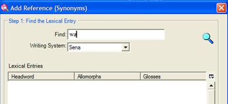

## Customising the Entry Pane

### 8 To see fields that are hidden{#8}
[**8 FLEx Showing Hidden Fields**](https://vimeo.com/showcase/3123523/video/111421271) (1:36)

*In the Lexicon area, lexicon edit view*

-  Click **Show Hidden fields** checkbox (at the top of the pane)
   *All the field are displayed*
-  Click on the desired field 
   *The context menu button is displayed.*
-   Click the menu button to left of the field 
-   Choose **Field Visibility** 
-   Choose as appropriate
-   Click the **Show Hidden fields** checkbox again

#### To hide fields

-  Click in the field
-  Click the button to left of the field,
-  Choose **Field Visibility** 
-  Choose as appropriate (either Normally hidden, unless non-empty or Normally hidden)

### 9 Fields to insert{#9}
[**9 FLEx Fields to insert**](https://vimeo.com/showcase/3123523/video/111421272) (0:23)

Some fields don’t display until you add an object. There are various items on the **Entry** menu (and the main **Insert** menu). For example pronunciation. 

### 10 Writing System Visibility{#10}
[**10 FLEx Writing System Visibility**](https://vimeo.com/showcase/3123523/video/111421275) (0:56)

If your project has more than one vernacular or analysis writing system, and you do not expect to fill in all the fields with all the writing systems, you can save vertical space by configuring the display of writing systems in fields.

For example, to only see English in a field,

- Click on the field
- Click the context menu at the left
- Choose writing systems
- Deselect a writing system (e.g. Portuguese) 
   * The writing system is removed from the field.*
:::tip
The choice was between always display the label and only display if there is data present. 

### 11 Add Custom Fields{#11}
[**11 FLEx Adding Custom Fields**](https://vimeo.com/showcase/3123523/video/111522255) (1:22)

You can add custom fields
-  From the **Tools** menu, choose **Configure** then **Custom Fields**
-  Click the **Add** button.
-  Give the new custom field a name
-  Choose section (eg sense)
-  Choose writing system(s).
  *The new field should be displayed at the bottom of the section.*
 
### 12 Adding an Entry{#12}
[**12 FLEx Adding a Lexical Entry** ](https://vimeo.com/showcase/3123523/video/111522254)(1:24)

*In the lexicon area, either*

-   Click the **add entry** button on the toolbar  
    *or*  
-   From the **Insert** menu, choose **Entry**.
-   Type the lexeme.   
    *As you type the lexeme the similar entries pane shows any similar entries*
-   Type the gloss (similar entries are also shown)
-    Choose a category.
-   Click **Create**.   
    *The entry is created and displayed.*

#### If the Entry already exists

-   Use the **Go to similar entry** link  
    *jumps to the entry so you can edit it*

### 13 Finding an entry{#13}
[**13 FLEx Find a Lexical Entry**](https://vimeo.com/showcase/3123523/video/111522253) (0:41)

To move to another entry that is not displayed on the screen use the find function:

#### Find an entry

*In the lexicon area, either*

-   Click the **Find** button on the toolbar  
    *or*  
-   From the **Edit** menu choose **Find lexical entry…**
-   Type all or part of the entry  
    *[Matches are displayed as you type]*.

#### If entry is displayed

-   Select the entry in the list
-   Click **go to**

#### If entry is not displayed

-   Click **Create**… to add the missing entry.

### 14 Adding Homograph entries, adding senses{#14}
[**14 FLEx Homographs and Senses**](https://vimeo.com/showcase/3123523/video/111522256) (1:51)

When two words have the same form for the lexeme, they should be added as **separate entries** (ie homographs) if their meanings are not related or as **different senses of the same entry** if their meanings are closely related.

#### To add a homograph entry

*In the lexicon area, lexicon edit view*

-   Add the new entry as normal (see add an entry above for more help)   
    *[a similar entry is displayed]*
-   Ignore the similar entry and go ahead and create the new entry.
-   Homograph numbers are added automatically

#### To add a sense

*In the lexicon area, lexicon edit view*

-   Click in the sense section
-   Click **Insert Sense**  
    *[a second sense is added]*
-   Fill in the details for the new sense

#### To reorder senses
- Click the menu button for the sense
- Choose Move Sense Up or Move sense Down

### 15 Add Grammatical Info [POS]{#15}
[**15 FLEx Add Grammatical Info**](https://vimeo.com/showcase/3123523/video/116262072) (1:16)

#### Select the grammatical info in the sense section
-  Scroll down to see the Sense section
-  Drop down the Grammatical Info list
-  Choose the desired category.

If you add another sense (by clicking on **Insert Sense** it will have the same grammatical category.

#### To change the category
- Drop down the list of Grammatical Info
- Choose as appropriate.

Grammatical Info. in a sense points to a group of fields at the bottom of the entry called Grammatical Info. Details.
- Click Show Hidden Fields to see other fields.

### 16 Specifying Gender using Inflection Features{#16}
[**16 FLEx Specifying Gender using Inflection Features**](https://vimeo.com/showcase/3123523/video/116262073) (1:56)

The Inflectional features field is where you can specify gender or noun class. You first add the features and once they are added you can then use the appropriate feature in the entry.

#### Insert a feature to the project

In any area,

-   From the **View** menu, choose **Grammar**, then **Inflection Features**.
-   From the **Insert** menu, choose **Feature**  
    *A special catalog is displayed.*
-   Click on the + beside noun-related
-   Click on the + beside noun agreement
-   Click on the + beside gender (or noun class) as appropriate
-   Click in the desired check boxes.
-   Click Add
-   Go back to the Lexicon.

#### Add a feature to an entry

In the lexicon area, lexical editor view

-   Display the noun entry
-   Click the drop down arrow in the Inflection features field
-   Choose the desired feature
-   Refresh the screen (F5)
  *The feature is displayed in the grammatical info field*.

### 17 Showing Inflection Features in Dictionary View{#17}
[**17 FLEx Showing Inflection Features in Dictionary View**](https://vimeo.com/showcase/3123523/video/116262074) (0:35)

- From the **Tools** menu, choose **Configure** then **Dictionary**y
- Click to expand the **Senses** section
- Expand **Grammatical Info** 
- Select **Inflection features**
-  Click **OK**
  *The feature is displayed in the dictionary display preview.*

### 18 Adding an Example Sentence{#18}
[**18 FLEx Adding an Example Sentence**](https://vimeo.com/showcase/3123523/video/116262081) (0:30)

#### To add an example sentence
- click on the Example field
- Type the example sentence
  *A translation and a reference field are also added.*
- Fill in those fields as needed.

### 19 Finding an Example Sentence{#19}
[**19 FLEx Finding an Example Sentence**](https://vimeo.com/showcase/3123523/video/116262082) (1:20)
Alternatively, you can use the concordance feature to find a suitable example sentence.
- Click in the Example field
- Click the blue context menu
- Choose **Find example sentence**
  *A concordance of the sense is displayed**
- Select the sentence(s) you wish to add.
-  Click **Add**
 *The sentence is added. If a free translation was provided it is added as well.*
 
:::tip
This tool is reliant on you having worked through the interlinear text and approved the analysis as using either sense 1 or 2 of the entry.
:::

### 20 Adding entries for affixes {#20}
[**20 FLEx Adding Affix Entries**](https://vimeo.com/showcase/3123523/video/116264098) (2:01)

#### Adding an entry for a derivational affix
*In the lexicon area, lexicon edit view*  
-   Create a new entry
-   Type a hyphen – then the affix  
    *[the morpheme type immediately changes to suffix]*
-   Fill-out the **affix type** (i.e. derivational)
-   Fill-out the **Attaches to category** as appropriate
-   Fill-out the **Changes to Category** as appropriate
-   Type in a gloss
-   Click **Create**

#### Adding an inflectional affix

*In the lexicon area, lexicon edit view*

-   Create a new entry
-   Type a hyphen – then the affix  
    [the morpheme type immediately changes to suffix]
-   Fill-out the affix type (i.e. inflectional)
-   Fill-out the attaches category as appropriate
-   Then use the **Inflectional Affix Gloss Builder**  to help with an appropriate gloss (see below)

#### Using the Inflectional Affix Gloss Builder
 
-   Click the **Inflectional Affix Gloss Builder** ** link
-   Click the **+** beside the appropriate section (e.g. *noun-related*)
-   Click the **+** beside the appropriate sub-section (e.g. *noun agreement*)
-   Click the **+** beside the appropriate sub-sub-section (e.g. *number*)
-   Click the **radio** **button** beside the appropriate item
-   Click the **Insert** button to add it to the selected gloss
-   Repeat as necessary
-   Click **Accept Gloss**
  *[the gloss is entered]*
-   Click **Create**  
    [the entry is created and displayed.]

:::tip
**Note** The advantage of using the glossing builder is that the glosses are consistent and the inflection features are added. See Grammatical Info. Details.
:::

### 21 Add an allomorph{#21}
[**21 FLEx Adding Allomorph**](https://vimeo.com/showcase/3123523/video/116264100) (1:09)

*In the lexicon area, lexicon edit view*

-   Click in the **Alternate Forms** section
-   Click on the **Insert Allomorph** link
   *New fields are added**.
-   Type in the form
-   Fill-out an environment to restrict the allomorph 
  *If there are existing environments you can click the ...  
  Otherwise type or use the context menu (to the left) to enter the environment*  
    (e.g. /x_\#)

:::tip
Using the context menu helps you get the Environment slash the right way around. The environment controls the allomorph for the morphological parsers.
:::

### 22 Adding Lexical Relations{#22}
[**22 FLEx Adding Lexical Relations**](https://vimeo.com/showcase/3123523/video/116264101) (2:11)

Language Explorer has some built-in lexical relations and you can add your own.

#### Use one of the built-in lexical relations

*From the Lexicon area, lexicon edit view*

-   Use the context menu button on the lexical relations field

    

-   Select the desired relation (e.g. Insert Synonyms Relation)

      
      *A dialog is displayed*.
-  Type the second entry in the **Find**
  *A list of entries is displayed*
-  Click on the desired entry.
-  Click **Add**
  *The lexical relation is added to both entries*.

    

:::tip
The link is maintained even if the other entry is edited. Some lexical relations allow you to add more than one entry to the relation.
:::

### 23 Specifying the Components of Complex Forms (Making Subentries){#23}
[**23 FLEx Specifying the Components of Complex Forms (Making Subentries)**](https://vimeo.com/showcase/3123523/video/116264102) (1:44)

In this version of FLEx, the way you specify complex forms and variants has changed. The new fields provide more flexibility but may seem slightly more complicated. Improvements are needed in the future.

#### How to specify a complex form
If a lexeme contains more than one morpheme you can specify what its components are.

#### Characteristics of the components of a complex form

In the lexicon area, the Edit lexicon view

- Show the entry to edit.
- In the components field, click the ellipsis button (far right) 
check 

- Search for one of the components.
- If the entry is found you can click **OK**.
- You can add another component by repeating the action.
- If the entry was not found, you can add it by clicking on **Create**

check 

   *More fields are added to the entry.*

- Click in the field **Complex form type**
- Check the desired type (or add as needed).
- Click **OK**

check 

:::tip **Note** 
You don't have to add an entry for all the derivatives that are possible, only those whose component meanings are not predictable.
:::

### 24 Add a Variant{#24}
[**24 FLEx Add a Variant**](https://vimeo.com/showcase/3123523/video/116264104) (1:07)

*In the lexicon area, lexicon edit view*
-  Go to the entry
-  Scroll down and click in the Variants section
  *The Insert Variant command is displayed*.
-  Click the Insert Variant link  
  *The Find Variant dialog is displayed*.

- Type in the form of the variant
  *Existing entries are listed*.
- Choose an existing entry or click **Create**
  *The variant is added*.
- Set the variant type(s).
- Turn off the "Show Minor Entry" as necessary.
:::tip
You can turn off the "Show Minor Entry" if the entries would be near each other in the dictionary.
::

### 25 Specifying a Complex Form is also a Variant (1:01){#25}
[**25 FLEx Specifying a Complex Form is also a Variant**](https://vimeo.com/showcase/3123523/video/116266119) (1:01)

The new way we specify variants and complex forms, allows us to have an entry marked up as both.

- Go to the entry which has been set up as a complex entry.
- Click on the **Entry** menu
- Choose **Lexeme Form is a variant**  
   *Several fields are added*.

- Click the ellipsis icon 
  *The Choose lexical sense or entry dialog is displayed*.
- Type the lexical entry
- Click **OK**

:::tip
In dictionary view it will be treated primarily as a variant.
:::

### 26 Displaying Complex Forms in Dictionary View{#26}
[**26 Displaying Complex Forms in Dictionary View**](https://vimeo.com/showcase/3123523/video/118855078) (1:48)

Entries which are complex forms have an additional field which allows you to reduce where the entry is displayed in dictionary views.
This field is called "Show Subentry under" since it controls which entry this appears under as a sub-entry in root-based view.

The entries in **Show Subentry under** have to be components.

#### Select a component
- Right-click on the component.
  *A menu is displayed*
- Select **Show subentry under this component**.

#### Alternatively
- Click on the button on the right
  *The choose where to show subentry" dialog is displayed*.

#### Configure dictionary

*In the lexicon area, lexicon edit view*

-   On the **Tools** menu choose **Configure Dictionary**
-   Select **Root-based**
-   Click **OK**

****

Stem-based = separate entries  
Root-based = sub-entries

### 27 Using Collect Words{#27}
[**27 Using Collect Words (Formerly Categorized Entry)**](https://vimeo.com/showcase/3123523/video/116266123) (3:11)

Using Collect Words (formerly Categorised entry) is a special tool for efficiently entering words which were elicited in semantic domains at a workshop. (see the Dictionary Development Process on the sil.org website).

#### Entering words by semantic domain

*In the lexicon area, Collect Words view*

-   Select the desired semantic domain in the centre pane (e.g. 2.1.1. Head)
-   In the upper right pane you can configure it to hide the questions and answers to save space
-   In the lower right pane enter words for the selected semantic domain.  
    *[While you enter them Language Explorer makes new entries]*
-   Using the keyboard, type enter for a new row
-   Then type the word then press tab then type the definition.

    

    *The new entry created contains the information entered: i.e. lexeme form, definition and semantic domain (as shown above).*

-   If a matching entry is found, Language explorer just adds the semantic domain to the entry.
-   If the definition does not match, then Language Explorer adds a second sense with the new domain.

:::tip
In this way Language Explorer does not add duplicates when you use categorised entry. You will still need to review the entries made after using Collect Words. But you should always check the entries made after using Collect Words. 
:::

