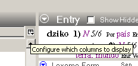
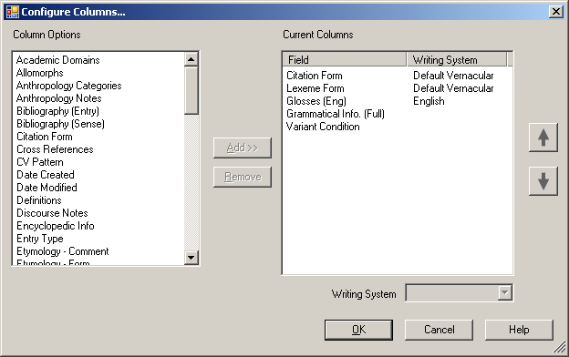
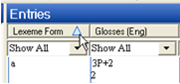
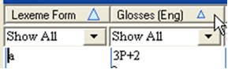

### 1 Quick tour{#01}
[**1 FLEx Quick Tour**](https://vimeo.com/showcase/3123523/video/111419885) (2:19)

The tools in Language Explorer are organised in **areas**. In each area there are a number of tools or views. This list changes depending on which area you are currently in.

| **Area**          | This is where you…                                                | Various Views/Tools for…                                                                                                      |
|-------------------|-------------------------------------------------------------------|-------------------------------------------------------------------------------------------------------------------------------|
| **Lexicon**       | maintain your lexical database.                                   | Built-in dictionary styled editor,  Bulk editing tools  Special view for entering in semantic domains.                        |
| **Text & words**  | enter and interlinearise texts.                                   | Concordance search tools, examine analyses.                                                                                   |
| **Grammar area**  | enter and organise grammar information and rules                  | Category edit - manage the list of grammatical categories. Add inflectional rules by creating templates. Compile into grammar sketch. |
| **Lists**         | maintains the various lists used to classify and categorise items | Add/Edit items in lists                                                                                                       |

### 2 Browse vs edit panes{#02}
[**2 FLEx Pane Layout**](https://vimeo.com/showcase/3123523/video/111419886) (0:52)

Many views contain both Browse and Edit panes. The browse pane shows many records whilst the edit pane allows you to work on one record in detail. 

Either pane can be **minimised** (by dragging the divider) and later easily **restored** (by clicking on the grey bar).

### 3 Customise the columns{#03}
[**3 FLEx Configure Columns** ](https://vimeo.com/showcase/3123523/video/111419888)(1:25)

*In Lexicon area, lexicon edit view*

-   Use the configure column **button** (to the right of the last browse column)

#### Reorder columns

*In Lexicon area, lexicon edit view*

-   **Reorder** the columns by dragging column headings

#### More options
-   From the **Tools** menu choose **Configure columns**, then
-   Add or remove columns as necessary
-   Reorder columns using the arrows buttons
-   Choose  systems as necessary
-   Click **OK**.

### 4 Filtering{#04}
[**4 FLEx Filtering** ](https://vimeo.com/showcase/3123523/video/111419890)(1:32)

Browse views have filter options provided in the chooser menu below the column headings.
 
#### Standard Filters

*In Lexicon area, lexicon edit view*

-   Use the drop-down menus below the column headings

|   |   |
| Show all | turns off filter | 
| Blanks | entries missing data |
| Non-Blanks | entries which contain data |
| Filter for… | custom filter |

#### Turn off filter

*In Lexicon area, lexicon edit view*

-   Choose the **“Show All”** filter   
    or  
- Click the **Turn off filter** button   
(useful if you have more than one filter set)

Is filter active?    Chooser is yellow and Status bar is also yellow telling results of filter.                                                                                      

### 5 Special Filters{#05} 
[**5 FLEx Special filters** ](https://vimeo.com/showcase/3123523/video/111419891)(1:55)

| In order to …                 | Choose … from the filter drop down list then …                                                                                                                                        |
|-------------------------------|--------------------------------------------------------------------------------------------------------------------------------------------------------------------------------------|
| To see empty fields           | Choose **Blanks**                                                                                                                                                                    |
| To specify custom filter      | Choose **Filter for** and fill in the dialog box                                                                                      |
| Is filter active?             | Chooser is yellow and Status bar is also yellow telling results of filter.                                                                                                           |
| Spelling errors               | If spelling dictionaries have been installed then there will be an additional filter “spelling errors” which shows the red squiggly lines below words that are not in the dictionary |
| For Items entered from a list | Choose the “**Choose**” filter and a list is displayed. In the chooser, click for individual items, or ctrl+click for it and all its sub-items.                                       |
| Date fields                   | Choose the date filter and then **Restrict**, use calender to choose date                                      |
| Pre-configured filters        | some fields have preconfigured filters,  eg Yes/No, or number fields greater \> 0…                                  |

### 6 Filtering with regular expressions{#06}
[**6 FLEx Filtering with Regular Expressions** ](https://vimeo.com/showcase/3123523/video/111421267)(2:09)

For more flexibility in filtering you can use what it called a **regular expression**. For example, to find all lexeme forms beginning (**\b**) with either mb or (**|**) mp or (|) mu.

#### Filter with regular expressions
*In the most areas, and most views (e.g. lexicon. Texts & Words)*

-   Choose **Filter for…**  from a browse filter menu
-   Click the **Match for regular expression** radio button
-   Either type in the desired regular expression or use the helper
-   Click **OK**

:::tip
It looks more complicated than it really is.  Use the **Regular Expression Help** link at the bottom of the helper menu to learn more or copy and paste examples. Also look on the web for more help. (Note FLEx uses the .NET variety of regular expressions).
:::

Some useful regular expressions:

| Expressions  |   to find |
| --------|-------------------------------------------------------------|
| \^(mb\|mp\|mu)            | find either mb or mp or mu at the start                     |
| \^(see\|saw\|seen)        | find the verb ‘see’ glossed in either past or present tense |
| I\|you\|she\|he\|we\|they | find a verb glossed with a person marker                    |
| yo\#                      | find all words ending with ‘yo’                             |
|                           |                                                             |
|                           |                                                             |
|                           |                                                             |
|                           |                                                             |
|                           |                                                             |

### 7 Sorting{#07}
[**7 FLEx Sorting**](https://vimeo.com/showcase/3123523/video/111421269) (1:05)

|           |                      |
|---------------------------|-------------------------------------------------------------|
| Primary order - Click on the column header |   | 
| Secondary order - Shift+click on another column header (Note: the arrow is smaller) |   |
| Sort from the end - Right-click on the column header  | select Sorted from End |

:::tip **Note**
When sorting on a field which can be repeated in an entry (e.g. glosses) then the number of rows (bottom right) changes to the number of **senses** and not the number of **entries**.  And  shown in status bar with green highlighted section.
:::
