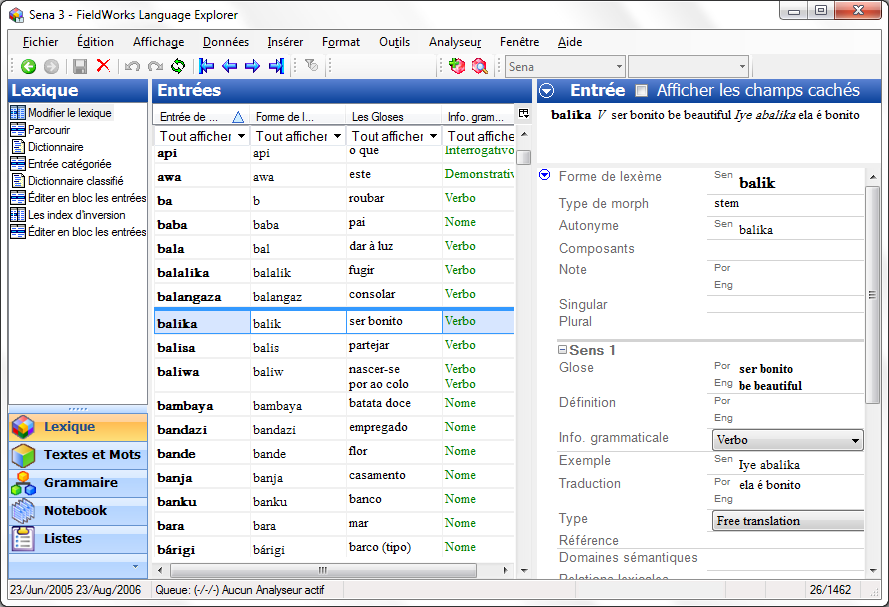

(1-quick tour of Fieldworks.mp4)

The tools in the language explorer (FLEx) are organised in **areas**. In each area there are several displays.

The list of displays changes according to the selected zone.

| Contains displays/tools for... |
|---------------------|---------------------------------------------------------------------------------|------------------------------------------------------------------------------------------------------------------------------------------|
| maintain your lexical database | edit the dictionary edit block entries add lexemes by semantic domains
| enter and interlinearise vernacular texts analyse interlinear texts examine word analyses search for words with a concordance
| write and organize grammar information and rules check list of grammatical categories create flexural rules based on patterns generate grammatical sketch
| maintain various lists used to classify and categorise data | add/edit items in lists
