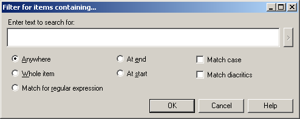
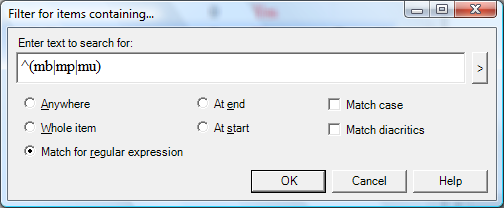
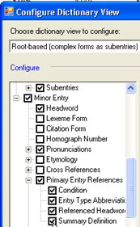
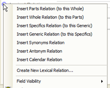
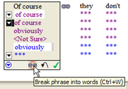
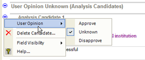
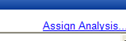
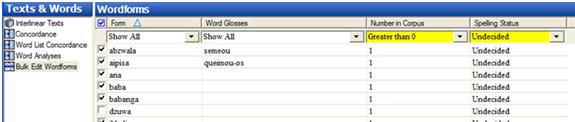

:::info
This file contains summaries of the original demo videos. It needs to be split up into either separate videos or groups of videos.
:::

# Introduction

#### 1 Introduction.swf

The tools in Language Explorer are organized in **areas**. In each area there are a number of tools or views. This list changes depending on which area you are currently in.

| **Area**          | This is where you…                                                | Various Views/Tools for…                                                                                                      |
|-------------------|-------------------------------------------------------------------|-------------------------------------------------------------------------------------------------------------------------------|
| **Lexicon**       | maintain your lexical database.                                   | Built-in dictionary styled editor,  Bulk editing tools  Special view for entering in semantic domains.                        |
| **Text & words**  | enter and interlinearise texts.                                   | Concordance search tools, examine analyses.                                                                                   |
| **Grammar area**  | enter and organize grammar information and rules                  | Category edit: manage the list of grammatical categories Inflectional rules by creating templates Compile into grammar sketch |
| **Lists**         | maintains the various lists used to classify and categorise items | Add/Edit items in lists                                                                                                       |

### Browse vs edit panes

Many views contain both Browse and Edit panes. The browse pane shows many records whilst the edit pane allows you to work on one record in detail. Either pane can be minimized and later easily restored.

# Browsing

## Customising the Browse pane

#### 2. browse.swf

### Customise the columns

*In Lexicon area, lexicon edit view*

-   Use the configure column **button** (to the right of the last browse column)

Or

-   From the **Tools** menu choose **Configure columns**, then
-   Add or remove columns as necessary
-   Reorder columns using the arrows buttons
-   Choose writing systems as necessary

### Reorder columns

*In Lexicon area, lexicon edit view*

-   **Reorder** the columns by dragging column headings

## Filtering

3 Filtering.swf

### Standard Filters

*In Lexicon area, lexicon edit view*

-   Use the drop-down menus below the column headings

Show all, Blanks, Non-Blanks, Filter for…

### Turn off filter

*In Lexicon area, lexicon edit view*

-   Choose the **“Show All”** filter   
    or

Click the **Turn off filter** button   
(good if you have more than one filter set)

### Various Filters examples

| In order to …                 | Choose … from the filter dropdown list then …                                                                                                                                        |
|-------------------------------|--------------------------------------------------------------------------------------------------------------------------------------------------------------------------------------|
| To see empty fields           | Choose **Blanks**                                                                                                                                                                    |
| To specify custom filter      | Choose **Filter for** and fill in the dialog box                                                                                      |
| Is filter active?             | Chooser is yellow and Status bar is also yellow telling results of filter.                                                                                                           |
| Spelling errors               | If spelling dictionaries have been installed then there will be an additional filter “spelling errors” which shows the red squiggly lines below words that are not in the dictionary |
| For Items entered from a list | Choose the “**Choose**” filter and a list is displayed. In the chooser, click for individual items, or ctrl+click for it and all its children.                                       |
| Date fields                   | Choose the date filter and …                                                                                                                                                         |
| Pre-configured filters        | some fields have preconfigured filters,  eg Yes/No, or number fields greater \> 0…                                                                                                   |

## Filtering with regular expressions

4 regex.swf

For more flexibility in filtering you can use what it called a regular expression.

For example, to find all lexeme forms beginning with either mb or mp or mu.

Turn on regular expressions and use the helper menu button to insert codes.

\\b(mp\|mb\|mu)

### Filter with regular expressions

*In the most areas, and most views (e.g. lexicon. Texts & Words)*

-   Choose **Filter for…**  from a browse filter menu
-   Click the **Match for regular expression** radio button
-   Either type in the desired regular expression or use the helper

It looks more complicated than it really is. See the help for example regular expressions that you can copy and paste. Also look on the web for more help. (Note FLEx uses the .NET variety of regular expressions).

Some useful regular expressions:

| \^(mb\|mp\|mu)            | find either mb or mp or mu at the start                     |
|---------------------------|-------------------------------------------------------------|
| \^(see\|saw\|seen)        | find the verb ‘see’ glossed in either past or present tense |
| I\|you\|she\|he\|we\|they | find a verb glossed with a person marker                    |
| yo\#                      | find all words ending with ‘yo’                             |
|                           |                                                             |
|                           |                                                             |
|                           |                                                             |
|                           |                                                             |
|                           |                                                             |

# Lexicon

## Customizing the Entry Pane

#### (6. Field visibility.swf)

### To see fields that are hidden

*In the Lexicon area, lexicon edit view*

Click **Show Hidden fields** checkbox

-   Click the button to left of field (i.e. the context menu button), choose as appropriate

Click the **Show Hidden fields** checkbox again

### To hide fields

-   Click the button to left of the field (as above),

Choose as appropriate (either Normally hidden, unless non-empty or Normally hidden)

### Notes:

Some fields don’t display until you add an object.

### Add Custom Fields

Tools-Custom Fields

## Adding an Entry

#### 7 add entry.swf

#### 

### To add entry

*In the lexicon area, either*

-   Click the **add entry** button on the toolbar

    *or*

-   Choose **Entry**… from the **Insert** menu.
-   Type the lexeme.   
    As you type the lexeme the similar entries pane show any similar entries
-   Type the gloss (similar entries are also shown)
-   Click **Create**.   
    The entry is created and displayed.

### If the Entry already exists

-   Use the **Go to similar entry** link  
    (jumps to the entry so you can edit it)

## Finding an entry

#### 8 find entry.swf

To move to another entry that is not displayed on the screen use the find function:

### Find an entry

*In the lexicon area, either*

-   Click the **Find** button on the toolbar

    *or*

-   From the **Edit** menu choose **Find lexical entry…**
-   Type all or part of the entry  
    [Matches are displayed as you type].

### If entry is displayed

-   Select the entry in the list
-   Click **GoTo**

### If entry is not displayed

-   Click **Create**… to add the missing entry.

## Adding Homograph entries, adding senses

#### 9 homographs.swf

When two words have the same form for the lexeme, they should be added as **separate entries** (ie homographs) if their meanings are not related or as **different senses of the same entry** if their meanings are closely related.

### To add a homograph entry

*In the lexicon area, lexicon edit view*

-   Add the new entry as normal (see add an entry above for more help)   
    [a similar entry is displayed]
-   Ignore the similar entry and go ahead and create the new entry.
-   Homograph numbers are added automatically

### To add a sense

*In the lexicon area, lexicon edit view*

-   Click in the sense section
-   Click **Insert Sense  
    **[a second sense is added]
-   Fill in the details for the new sense

## Adding entries for affixes

#### 10 affix entries.swf

### Adding an inflectional affix

*In the lexicon area, lexicon edit view*

-   Create a new entry
-   Type a hyphen – then the affix  
    [the morpheme type immediately changes to suffix]
-   Fill-out the affix type (i.e. inflectional)
-   Fill-out the attaches category as appropriate
-   Then use the glossing assistant to help with an appropriate gloss (see below)

### Using the glossing assistant

-   Click the **Assistant** button
-   Click the **+** beside the appropriate section (e.g. *noun-related*)
-   Click the **+** beside the appropriate sub-section (e.g. *noun agreement*)
-   Click the **+** beside the appropriate sub-sub-section (e.g. *number*)
-   Click the **radio** **button** beside the appropriate item
-   Click the **Insert** button to add it to the selected gloss
-   Repeat as necessary
-   Click **Accept Gloss**

    [the gloss is entered]

-   Click **Create**  
    [the entry is created and displayed.]

**Note** The advantage of using the glossing assistant is that the glosses are consistent and the inflection features are added.

### Add an allomorph

*In the lexicon area, lexicon edit view*

-   Click in the **Alternate Forms** section
-   Click on the **Insert Allomorph** link
-   Type in the form
-   Fill-out an environment to restrict the allomorph   
    (e.g. /x_\#)

    **Note**: You can either type in directly or use the context menu

### Adding an derivational affix

*In the lexicon area, lexicon edit view*

-   Create a new entry
-   Type a hyphen – then the affix  
    [the morpheme type immediately changes to suffix]
-   Fill-out the affix type (i.e. derivational)
-   Fill-out the attaches category as appropriate
-   Fill-out the changes to category
-   Click **Create**

## Adding a Derivative and displaying it as a Subentry

#### 11 complex forms.swf

A derivational affix like ‘–less’ can be quite productive and words only need to be added to the dictionary when the resulting gloss is not predictable from the separate parts. For example ‘priceless’.

### Adding a derivative entry

*In the lexicon area, lexicon edit view*

-   Create a lexical entry in the usual way. [e.g. Enter priceless, gloss, category]
-   Change the Entry type to **derivation  
    **[a primary entry reference field is added]
-   Click on the … button in the primary reference field
-   Select the entry for the primary reference.
-   Repeat as needed for other references.  
     [e.g. For the example of ‘priceless’ select ‘price’ then ‘-less’)

    

    [The dictionary preview pane is updated to show the linked entries of which priceless is composed of.]

### Jumping to a linked entry

*In the lexicon area, lexicon edit view*

-   Right-click on an item in the primary reference field
-   Choose “show entry in lexicon”

Note: In the entry of ‘price’ there is a new field which shows the link to ‘priceless’. Also in the dictionary preview pane there is a reference to priceless as a derivative of price.

### Configure dictionary

*In the lexicon area, lexicon edit view*

-   On the **Tools** menu choose **Configure Dictionary**
-   Select **Root-based**
-   Click **OK**

****

Stem-based = separate entries

Root-based = sub-entries

## Specifying Gender using Inflection Features

#### \_16_gender_infl_feature.mp4

The Inflectional features field is where you can specify gender or noun class. You first add the features and once they are added you can then use the appropriate feature in the entry.

### Insert a feature to the project

In any area,

-   From the **View** menu, choose **Grammar**, then **Inflection Features**.
-   From the **Insert** menu, choose **Feature**

    A special catalog is displayed.

-   Click on the + beside noun-related
-   Click on the + beside noun agreement
-   Click on the + beside gender (or noun class) as appropriate
-   Click in the desired check boxes.
-   Go back to the Lexicon.

### Add a feature to an entry

In the lexicon area, lexical editor view

-   Display the entry
-   Click the dropdown arrow in the Inflection features field
-   Choose the desired feature
-   Refresh the screen (F5)

    The feature is displayed in the grammatical info field.

## Specifying Complex forms

In FLEx 6.0 the way you specify complex forms and variants has changed. The new fields provide more flexibility but may seem slightly more complicated. More improvements are needed in future.

If a lexeme contains more than one morpheme (such as priceless) you can specify what its components are.

### Specifying components of a complex form

In the lexicon area, lexicon edit view

-   Display the entry to edit
-   In the components fields, click the ellipsis button (at the far right)
-   Search for one of the components.
-   If the entry is found you can use the OK button
-   You can add another component by repeating the action.
-   If the entry was not found you can add it using the Create button

    More fields are added to the entry.

-   Click in the complex form type field
-   Check the desired type (or add as needed).

    **Note**: you don’t have to add an entry for all derivatives that are possible, only those whose meaning is not predictable from its components.

## Adding a variant and enhancing its minor entry

#### 12 variant forms.swf

Variants (such as irregular inflected forms) can be added as minor entries. Language Explorer also allows you to specify the condition but does not come with any built-in conditions so you need to add you own.

### Add an irregular inflected form

*In the Lexicon area, lexicon edit view*

-   From the Insert menu choose New Entry to add a new entry for the irregular form (only add the form, no need to add gloss)
-   Change the entry type to “inflectional variant”  
    [Two new fields are added]

-   Click in “Primary Reference”
-   Click the and find the main entry

-   Click in the condition field  
    [The Choose condition dialog is displayed]
-   Choose the desired condition (or add a new condition: see below).

### Add a variant condition

*In the Lexicon area, lexicon edit view*

-   *If necessary, display the record and click in the Condition field to display the “Choose Variant Condition” dialog*
-   Click on the “Edit the Variant Conditions” link

[You are taken to the lists area]

-   From the **Insert** menu choose **Variant condition**

-   Type in at least a name and abbreviation
-   Return to the Lexicon area (using the back button)
-   Continue to specify the condition

### Jump to the linked entry

*In the Lexicon area, lexicon edit view*

-   Right-click on the primary reference field

    

-   Choose “Show Entry in Lexicon”

    Note: the new field called “Variant forms” in the entry which shows the link to the variant.

    

    Also in the dictionary preview there is a reference to the inflectional variant.

### Show summary definition in variant entries

*In the Lexicon area, lexicon edit view*

-   If the entry has many senses, fill-in the summary definition of the primary entry
-   Using Tools-configure dictionary, make sure that summary definitions are shown in minor entries.

-   Jump to the inflectional variant to confirm that the summary definition is displayed.

    **Important Note**: Although it is possible to delete the empty sense in the variant entry, at the moment it is necessary for an entry to contain a sense for it to be used in interlinear texts.

## Adding grammatical information (POS)

#### 13 grammatical info.swf

### Adding a part of speech

*In the lexicon area, select the desired lexeme then*

-   Click **Grammatical Info** in the sense section
-   Drop down the list of choices
-   Choose the desired part of speech

**Note**: If you add another sense it will default to the same as the previous but can be changed as necessary.

**Tip**: Turn on hidden fields to see more grammatical info. details. There are other fields that can be filled in too (see below).

## Using Inflection features to specify gender

#### 14 inflection features.swf

Inflection features field is where you can specify gender or noun classes etc. It is good to add the various features first so that they are available to choose when needed.

### Adding an inflection feature

*In the* **Grammar** *area*

-   Click **Features** view
-   From the **Insert** menu choose **Feature**
-   Choose the desired features from the catalog
-   Return to the lexicon area

### Use inflection feature

*In the lexicon area with the lexeme displayed*

-   Click in the Inflection features field  
    [the **inflection features** dialog is displayed]
-   Choose the desired feature
-   Click OK

## Adding Lexical Relations

#### 15 lexical relations.swf

Language Explorer has some built-in lexical relations and you can add your own.

### Use one of the built-in lexical relations

*From the Lexicon area, lexicon edit view*

-   Use the context menu button on the lexical relations field

    

-   Select the desired relation (e.g. Insert Synonyms Relation)

    

-   The lexical relation is added to both entries.

    

    The link is maintained even if the other entry is edited. Some lexical relations allow you to add more than one entry to the relation.

## Adding words collected by semantic domains

#### 16 1 categorized entry.swf

Categorized entry is a special tool for efficiently entering words which were elicited in semantic domains at a workshop. (see the Dictionary Development Process on the sil.org website).

### Entering words by semantic domain

*In the lexicon area, Categorized Entry view*

-   Select the desired semantic domain in the centre pane (e.g. 2.1.1. Head)
-   In the upper right pane you can configure it to hide the questions and answers to save space
-   In the lower right pane enter words for the selected semantic domain.  
    [While you enter them Language Explorer makes new entries ]
-   Using the keyboard, type enter for a new row
-   Then type the word then press tab then type the definition.

    

    The new entry created contains the information entered: i.e. lexeme form, definition and semantic domain (as shown above).

-   If a matching entry is found, Language explorer just adds the semantic domain to the entry.
-   If the definition does not match, then Language Explorer adds a second sense with the new domain.

    In this way Language Explorer does not add duplicates when you use categorized entry.

# Bulk Edit

## Bulk Edit: List Choice

#### 16 2a BE List Choice.swf

Bulk edit tools allow you to make changes to numerous records at the same time. There are several bulk edit tools in Language Explorer. Each one allows you to work on a different kind of field. In the lexicon there are three such views: one to work on entry level fields, one for sense level fields and one to work on reversals. Bulk edit views provide different editing options on tabs.

**List choice** is for fields where the data comes from a list or a fixed set of choices. For example, grammatical category, entry type and morph type.

### Bulk edit a field with list choice

*In the lexicon area*

-   Click the desired **bulk edit view** (eg Bulk Edit Senses)
-   Click on the **List choice** tab
-   Ensure the desired target field is displayed in one of the columns (if not configure columns)
-   Set a filter as necessary to display the desired records
-   Choose the **target field**
-   Choose the **Change to** value
-   Click **Preview**
-   Review the changes
-   Click **Apply** to make changes

## Bulk Edit: Copy

#### 16 2b BE Copy.swf

Bulk copy is for copying data from one field to another. For example, copy the one word definitions to the gloss field.

### Bulk edit a field with Bulk Copy

*In the lexicon area*

-   Click the desired **bulk edit view** (eg Bulk Edit Senses)
-   Click on the **Bulk copy** tab
-   Ensure the desired source and target fields are displayed in the columns   
    (if not configure columns)
-   Set a **filter** as necessary to display the desired records
-   Uncheck any records you don’t want copied
-   Choose the **Source field**
-   Choose the **Target field**
-   Click **Preview**
-   Review the changes and make further adjustments by deselecting any others don’t want copied
-   Click **Apply** to make the changes

## Bulk Edit: Click Copy

#### 16 2c BE Click Copy.swf

Click copy is an unusual tool in which anything you click is copied to a designated field. For example, you can set the reversal as the target and click on anything in the definition field to make reversal entries.

### Bulk edit a field with Click Copy

*In the lexicon area*

-   Click the desired **bulk edit view** (e.g. Bulk Edit Senses)
-   Click on the **Click copy** tab
-   Ensure the desired source and target fields are displayed in the columns   
    (if not configure columns)
-   Set a **filter** as necessary to display the desired records
-   Choose the **Target field**
-   Click **on any word in the source field** and the word will be added to the target field.
-   Note: if the target field isn’t empty it adds the word separated by commas. To change this set the options in the “If the Target field is not empty section.

## Bulk Edit: Process

#### 16 2d BE Process.swf

#### 

The Process tab allows you to apply a process to a field which is then saved into either the same or a different field.

Processes supported in this tool include encoding converters such as TECkit mappings and consistent changes tables.

### Bulk edit a field with Process

*In the lexicon area*

-   Click the desired **bulk edit view** (e.g. Bulk Edit Senses)
-   Click on the **Process** tab
-   Click the **setup** button
-   Click **Add**
-   Type the name of the new converter
-   Then select the **TECkit** file
-   Then select the converter type (e.g. Unicode to and from Unicode)
-   Ensure the desired source and target fields are displayed in the columns   
    (if not configure columns)
-   Choose the **Source field**
-   Choose the **Target field** (with correct writing system)
-   Click **Preview**
-   Review the results
-   Click **Apply**

# Interlinear Texts

## Interlinear Texts

#### 17 texts.swf

| **Tab**    | **Purpose**                                                                                                                                       |
|------------|---------------------------------------------------------------------------------------------------------------------------------------------------|
| Info       | allows you to record the meta data for the Text                                                                                                   |
| Baseline   | used to type/paste the text                                                                                                                       |
| Gloss      | preconfigured brief interlinear view to enter word glosses and word category                                                                      |
| Analyse    | preconfigured interlinear view, allows you to work on breaking words into morphemes and selecting and creating appropriate entries in the lexicon |
| Print view | interlinear view for printing text (configure if necessary)                                                                                       |
| Text chart | use for preparing a discourse chart                                                                                                               |

### Add a new text

*In the Text and Words area*

-   Click Insert menu and select the option New Text
-   Type in the title
-   Type or paste the text itself into the baseline tab

### Analyse a text

*In the Text and Words area, interlinear text view*

-   Click **Analyze** tab
-   Click in the word to analyze
-   Click the down arrow to the left of the LexEntries line
-   If there is no existing analysis then choose **Create new entry  
    **(otherwise choose an existing analysis)
-   Fill-out the **gloss**
-   Click on **category** drop-down list
-   Either: Choose from the list   
    or: click More to display the catalog,   
    choose the desired category as necessary then click **Add**
-   Click **Create**   
    [all the lines are filled in]
-   Adjust the word category if desired

## Interlinear Texts: Previous Analyses are Suggested

#### 18 suggested analyses.swf

You will notice that some words have been interlinearised before and they are highlighted in blue. For words that you have interlinearised in other texts for word words that the program finds in the lexicon Language Explorer displays the analysis as a suggestion. The blue colour indicates that you need to confirm this suggested analysis in this context.

### Confirm a suggested analysis

*In the Text and Words area*, *Interlinear view and analysis tab*

-   Click on the blue suggested analysis
-   Either: Click the green check mark  
    Or: use a shortcut key such as ENTER
-   Any changes are saved automatically   
    (use UNDO if don’t want it saved)

## Interlinear Texts: Breaking Words into Morphemes

#### 19 splitting morphemes.swf

### Break word into morphemes by directly typing

*In the Text and Words area*, *Interlinear view and analysis tab*

-   Click in the morphemes line of the word to be analysed
-   Type in a hyphen at the morpheme break  
      
    [The word is split into morphemes]

### Break word into morphemes using the dialog

*In the Text and Words area*, *Interlinear view and analysis tab*

-   Click in the morphemes line of the word to be analysed
-   Click on the menu button in the morphemes line of the word to be analysed

    ****

-   Separate the morphemes with spaces and appropriate break characters (eg hyphen)

### 

### Add morphemes to the lexicon as needed

*In the Text and Words area*, *Interlinear view and analysis tab*

-   Click in the menu button in the Lex. Entry line
-   Choose Create New Entry
-   Fill-in the information as appropriate
-   Click create

### Choosing a different morpheme (when multiple matches)

*In the Text and Words area*, *Interlinear view and analysis tab*

-   Click in the menu button in the Lex. Entry line

    ****

-   **Either:** Select the desired existing entry  
    **Or:** Add a new sense of Create a New Entry

## Interlinear Texts: Adding an allomorph

#### 20 allomorph.swf

It is sometimes necessary to add a morpheme as an allomorph of an existing lexeme.

### Add an allomorph to an existing entry

*In the Text and Words area*, *Interlinear view and analysis tab*

-   Click in the word to be analysed
-   Break the word into morphemes (see above)
-   Use the option in the lex entries menu which says **Allomorph of**
-   In the *Find Entry to add allomorph* dialog, search for the existing entry

    ****

-   Continue the analysis adding any missing entries as required.

## Interlinear Texts: Making a phrase

#### 21 phrase.swf

To join two words into one group for a single analysis we use the make phrase button. If you later change your mind about joining them you can split them up with the break phrase button.

### Add join two orthographic words for a single analysis

*In the Text and Words area*, *Interlinear view and analysis tab*

-   Click in the first word of the phrase
-   Click on the **make phrase** button

-   Now make a single lexical entry for them

### 

### Add split a phrase into two orthographic words

*In the Text and Words area*, *Interlinear view and analysis tab*

-   Click in the phrase
-   Click on the break phrase button

## Interlinear Texts: The Gloss Tab

#### 22 gloss tab.swf

Like the Analyse tab the Goss tab provides an interlinear view. But it is preconfigured for adding word glosses, word categories and free translations. You can change it by using the Tools-Configure Interlinear and make it either simpler or more complicated.

Unlike the Analyse tab the Gloss tab has a special option which allows you to add words into the lexicon as you add word glosses or categories. Since the lexicon usually contains morphemes this feature is intended for languages which have very little morphology.

### Turn on special mode to add words

*In the Text and Words area*, *Interlinear view and gloss tab*

-   Click in the word to be analysed
-   Click in the best beside “Add Words to Lexicon”

    ****

### Add words to the lexicon

*In the Text and Words area*, *Interlinear view and gloss tab*

-   Click in the word to be analysed
-   Type in the Word gloss and press enter  
    [entries are created in the lexicon with the word gloss as the lexical gloss as well]

## Interlinear Texts: Morphological Parser

#### 23 parser.swf

Language Explorer also has a morphological parser which is controlled by options in the parser menu. The parser attempts to suggest or predict analyses based on the entries in the lexicon and the rules and facts in the grammar area. If you don’t use the parser you will still see analyses that you have entered previously suggested for you in blue. These blue suggestions are limited to words you have analysed previously.

In contrast the morphological parser can suggest analyses for words you have not encountered before. And it can make a suggestion/prediction as long as it can find the morphemes in the lexicon and the grammar rules allow it.

### Start the parser

*In the Text and Words area*, *Interlinear view and analyse tab*

-   From the parser menu choose Parse words in text
-   You can follow the parser’s progress on the status bar
-   Press Refresh to see the results
-   Now you can see suggestions made by the parser highlighted in orange.

    ****

-   Parser suggestions do not include a word gloss or word category
-   You can edit and approve these suggestions as usual.

## Words Analyses view

#### 24 words analyses.swf

All the words that are in texts are listed in the Words Analyses view. There is a column which shows how many occurrences there are in the entire text corpus. You can also show other columns including the number of analyses you have approved for each word and the number of analyses that the parser has predicated for each word. This view is useful for reviewing the various analyses for each word.

Analyses that are suggested by the parser are first put in the user opinion unknown section since it is only an analysis candidate. I can state that I approve of this analysis.

### Approve an analysis candidate (as suggested by the parser)

*In the Text and Words area*, *Word analyses view*

-   Browse the word to be analysed
-   In the analysis pane find the analysis candidate
-   Click on the Analysis candidate menu button
-   Choose User Opinion, then approve

It is then moved up into the user approved analyses section.

## Adding an analysis

#### 25 add analysis.swf

You can also add new analyses in the word analyses view.

### Add new analysis

*In the Text and Words area*, *Word analyses view*

-   Browse for the word to be analysed
-   In the analyses pane, click on User approved (Analyses) section
-   Click on the Add Approved Analysis command
-   The Insert Morpheme Breaks dialog is displayed.

-   Indicate the morpheme breaks as appropriate and click OK

### 

-   Add or select lexical entries as appropriate (as in the text)
-   Add a word category using the chooser dropdown button
-   Type in a Word Gloss

## Assigning analyses

#### 26 assign analysis.swf

The Word Analyses view has a tool which allows you to assign analyses to any number of occurrences in texts. By using the assign analysis tool I can specify which analysis is the right one for these other occurrences that I haven’t worked on in the texts.

*In the Text and Words area*, *Word analyses view*

-   Browse for the word to be analysed
-   Click on the Assign Analysis command (at the top right of the window)

    

    The Analysis Usage dialog is displayed.

    

-   Select the occurrences that relate to one of the analysis.
-   Click on the word gloss for the desired analysis
-   Click the **Assign** button.
-   Select the occurrences that relate to the next analysis
-   Click on the word gloss for the analysis
-   Click the **Assign** button.
-   Click **Close**

## Adding an inflectional template

#### 27 template table.swf

If you are using the morphological parser, the analysis candidate that the parser produces can point to areas where your grammar rules need tightening up.

### Add a template

*In the Grammar area*, *Category Edit view*

-   Select the desired grammatical category
-   From the Insert menu choose Affix template
-   Type in a name for the template (e.g. Tense)
-   Use the context menu beside stem to insert slot after STEM

-   Choose whether the slot is optional or obligatory

-   Type a name for the slot

-   Then use the blue context menu to “Add inflectional morphemes to” this slot.
-   Click on the affixes that can fill the slot.
-   Click OK

-   Go back to the Text & Words, Analysis view and start the parser, then click refresh to see the results. The invalid parse should not be produced.

### 

*  
*

## Concordance tools

#### 29 concordance.swf

The concordance tool allows you to specify a string for the concordance tool to search on. You can also specify which line the string should occur in.

For more specific searches such as the specific entry or sense, use the jump commands which are on the right click menus on items you may want to concord on.

### Use concordance view

*In the Text & Words area*, *Concordance view*

-   Type in the text to search for
-   Specify the line to search in
-   Click **Search**

### Use the jump command

*In the Text & Words area*, *Concordance view*

-   Right-click an entry in the *Lex entry* line
-   Choose **Show concordance of**
-   Then choose **entry**

-   A concordance of just that entry is displayed, not a concordance of any occurrence of the specified string. Only occurrences that have been approved are shown (not proposed occurrences).

In other views of Language Explorer there are also jump commands. For example, in the Lexicon area, lexicon edit view, under the entry context menu. Also in the sense context menu.

## Find Example Sentence

#### 30 find example sentence.swf

A special concordance tool is provided to help find example sentences. Use the blue context menu button and choose Find example sentences.

### Find example sentence

*In the Lexicon area*, *Lexicon edit view*

-   Browse for the desired record
-   Click on the blue context menu of the example field, choose Find example sentence…

    ****

    The Find Example Sentence dialog is displayed.

-   Select the desired sentence
-   Click **Add**

-   The example sentence and any free translation are inserted into the entry.

## Discourse Chart

#### discourse.swf

The Text Chart tab allows you to chart discourse components. To provide more room for the chart I am going to minimize the texts pane and I am going to do the same with the areas bar.

### Add words to chart

-   Click **a word or words** of the text as displayed below chart
-   Click on the buttons which correspond to column heading

### Add new row to chart

-   Choose a column which is to the left of the word already charted.

### Move contents of cell

-   Click on the cell menu button
-   Choose Move Word or Move Cell
-   Choose Forward or Back

### Mark a speech clause

-   Select the place where the speech is marked from
-   Click the cell button
-   Select “make speech clause out of” then “next clause”.

### Mark item is not in usual place

-   Choose “Mark as Postposed from”
-   Choose “Outer” or “Inner”

### Designate where the sentence breaks come

so that the line numbering is appropriate.

### Changing chart headings and built-in markers

-   From the View menu, choose Lists,   
    then either Text Chart Markers (or Text Constituent Chart Templates

## Help and training resources

#### help.swf

For finding more comprehensive and detailed help when using Language Explorer a help file has been provided. There is a help topic written for every field.

Click on the blue context menu which is displayed whenever the cursor is in a field. Choose the Help option and the help file will open showing the relevant page for the current field.

Every dialog box also has a designated help button displayed which brings up context specific help.

Alternatively you can use the help menu, select the top option Language Explorer. This opens the help file. One of the fastest ways to find a help topic is to use the Search or Index tabs. [Use the F5 key to remove the highlighting.]

The Help menu also contains some other materials you might find helpful. The student manual is a step by step walkthrough of some basic features of Language Explorer. The material listed under Resources are indepth guides and technical notes on specific topics. There is a Google group called Flex List in which you can join. You can participate merely through email if you prefer or you can look at it on the web. You can even browse all the discussions without joining the group. This is mainly used for asking questions, discussing new features and finding out other information like that.

## Check Spelling

#### spelling.swf

Language Explorer supports checking spelling. For languages of wider communication we recommend that you download a spelling dictionary for example from the Open Office website. Full instructions on how to do this are found in the Language Explorer Help files. Once the spelling dictionary is in place Language Explorer highlights misspelled words. Various options are provided in the right-click menu. You can also filter for misspelled words.

### Install spell check dictionary for LWC

-   Download OpenOffice spell-checker
-   Copy to the appropriate folder as follows:  
    for XP - c:\\documents and setting\\**user**\\Application data\\enchant

    for Vista - C:\\Users\\\<username\>\\ AppData\\Roaming\\enchant\\myspell

-   Restart FLEx

### Correct Misspelled words

-   Right-click a word highlighted with red squiggly lines.
-   Choose an appropriate option

### Filter for misspelled words

*In the Lexicon area, Lexicon edit view*

-   Click **filter** drop down menu
-   Choose **Spelling Errors.**

### Spell check for minority languages (setup)

-   From the Tools menu, choose Spelling-Show Vernacular Spelling Errors.

### Spell check for minority languages

*In the Lexicon area, Lexicon edit view*

-   Click **filter** drop down menu
-   Choose **Spelling Errors.**

### Populate the new spelling dictionary

*In the Text & Words area, Words analyses view*

-   Change the “Spelling Status” to “Correct “

### Change spelling status using Bulk Edit

-   From the **Tools** menu,
-   choose **Spelling**-**Edit** **Spelling Status…**

    Bulk edit wordforms view is displayed and filtered to show undecided wordsl

    

-   Set a filter as appropriate.
-   Deselected those that are incorrect
-   Perform a bulk edit on the wordforms as shown below:

    

-   View a text to see any remaining incorrect or undecided results.
-   Right-click on any incorrect word
-   Either use the suggestions   
    or add to the spelling dictionary.
