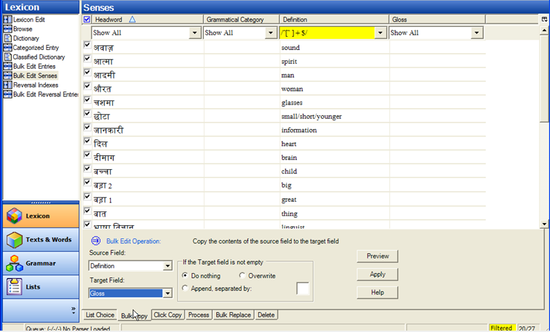
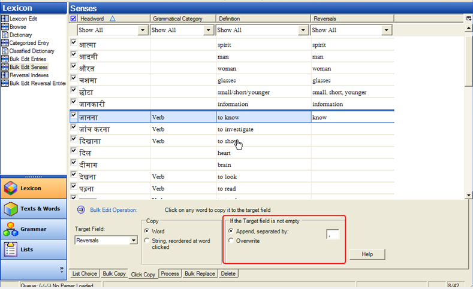

Bulk edit tools allow you to make changes to numerous selected records at the same time. There are several bulk edit views. It is now possible to use the Bulk Edit Entries tool to work on entry level fields, sense level fields, Example sentences, Allomorphs and Pronunciation. There is also a bulk edit view for reversal entries, and one in the texts and words area for bulk edition of wordforms. Bulk edit views provide different editing options on tabs.

### 28 Bulk Edit: List Choice {#28}
[**28 Bulk Edit: List Choice**](https://vimeo.com/showcase/3123523/video/116266128) (2:01)

**List choice** is for fields where the data comes from a list or a fixed set of choices. For example, grammatical category, entry type and morph type.

#### Bulk edit a field with list choice

*In the lexicon area*

-   Click the  **Bulk Edit Entries view**
-   Click on the **List choice** tab
-   Ensure the desired target field is displayed in one of the columns (if not configure columns)
-   Set a filter as necessary to display the desired records
-   Choose the **target field**
-   Choose the **Change to** value
-   Click **Preview**
-   Review the changes
-   Click **Apply** to make changes

:::tip **Note**

It is useful to have a preview before you make any changes. It is also a good idea to make a backup first.
:::

### 29 Bulk Edit: Copy{#29}
[**29 Bulk Edit: Bulk Copy**](https://vimeo.com/showcase/3123523/video/116266132) (1:02)

Bulk copy is for copying data from one field to another. For example, copy the one word definitions to the gloss field.

#### Bulk edit a field with Bulk Copy

*In the lexicon area*

-   Click the  **Bulk Edit Entries view**
-   Click on the **Bulk copy** tab
-   Ensure the desired source and target fields are displayed in the columns   
  (if not configure columns)
-   Set a **filter** as necessary to display the desired records
-   Uncheck any records you don’t want copied

-   Choose the **Source field**
-   Choose the **Target field**
-   Click **Preview**
-   Review the changes and make further adjustments by deselecting any others don’t want copied
-   Click **Apply** to make the changes

### 30 Bulk Edit: Click Copy{#30}
[**30 Bulk Edit: Click Copy**](https://vimeo.com/showcase/3123523/video/116326033) (1:18)

Click copy is an unusual tool in which anything you click is copied to a designated field. For example, you can set the reversal as the target and click on anything in the definition field to make reversal entries.

#### Bulk edit a field with Click Copy

*In the lexicon area*
-   Click the  **Bulk Edit Entries** view
-   Click on the **Click copy** tab
-   Ensure the desired source and target fields are displayed in the columns   
  *(if not configure columns)*
-   Set a **filter** as necessary to display the desired records
-   Choose the **Target field**
-   Click *on any word in the source field* and the word will be added to the target field.

:::tip  Note

If the target field isn’t empty it adds the word separated by commas. To change this set the options in the *If the Target field is not empty* section.
:::

#### String, reordered at word Clicked
Another option is under "Copy", instead of just copying the Word you can choose "String, reordered at word clicked".

*In the lexicon area, Bulk Edit Entries view*
-   Click on the **Click copy** tab
-   Ensure the desired source and target fields are displayed in the columns   
  (if not configure columns)
-   Set a **filter** as necessary to display the desired records
-   Choose the **Target field**
-   Click *on any word in the source field*  
  *The word clicked on is added first followed by a comma and the rest of the definition.*

:::tip

Keep in mind that anything you click on will be added. In this view the check boxes don't have any value.
:::

### 31 Bulk Edit: Process{#31}
[**31 Bulk Edit: Process**](https://vimeo.com/showcase/3123523/video/116326034) (1:48)

The Process tab allows you to apply a process to a field which is then saved into either the same or a different field.

Processes supported in this tool include encoding converters such as TECkit mappings and consistent changes tables.

#### Bulk edit a field with a Process
Prepare the TECkit or changes table, add a column (and writing system) as needed.

*In the lexicon area, Bulk Edit Entries view*

-   Click on the **Process** tab
-   Select the added column as the target field

#### Setup the process
-   Click the **Setup** button
-   Click **Add**
-   Type a name for the new converter
-   Then select the **TECkit** file
-   Then select the converter type (e.g. Unicode to and from Unicode)
-   Click **Close**

#### Apply the process
-   Ensure the desired source and target fields are displayed in the columns   
  (if not configure columns)
-   Choose the **Source field**
-   Choose the **Target field** (with correct writing system)
-   Click **Preview**
-   Review the results
-   Click **Apply**

### 32 Bulk Edit Replace{#32}
[**32 Bulk Edit Replace**](https://vimeo.com/showcase/3123523/video/191684691) (1:05)

Bulk replace allows you to search for a certain string and replace it in a selected field. For example replace "to" in verb definition.

- Choose the **Replace** tab
- Select the target field.

*Setup the search/replace*
- Click **Setup**
- Type the find text (e.g. to)
- Type the replace text (or leave empty to delete)
- Click **OK**

*Replace*
- Click **Preview**
- Carefully review the results.

:::tip

It is usually a good idea to use a filter when doing one of these bulk operations to be carefully but it is not entirely necessary.
:::

### 33 Bulk Edit: Delete{#33}
[**33 Bulk Edit: Delete**](https://vimeo.com/showcase/3123523/video/116326036) (1:13)

Bulk Delete allows you to delete the contents of a field in the selected entries. It can also delete entire entries or entire senses. If you have a field selected it will delete the contents in that field.

*In the lexicon area*, **Bulk Edit Entries** *view*

*To delete the contents of a field*
-   Click on the **Delete** tab
- Select the field.
- Remove (uncheck) rows you don't to affect.
-   Click **Preview**

*To delete the actual entry*
-   In the item to deleted, choose **Entries (row)**
-  Click **Delete**  
  *A message is displayed warning that it delete the selected items*.

:::tip

This can be a useful way to delete records that you imported that didn't import correctly and then reimport etc.
:::