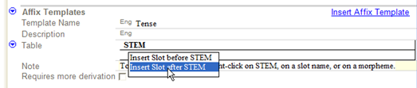
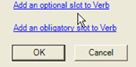
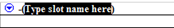
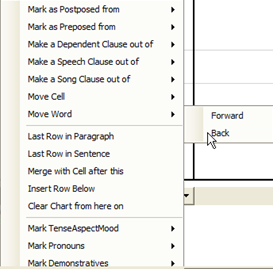
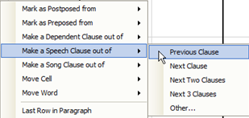

### 34 Panorama de los textos interlineales (1:39) {#34}
[**34 Interlinear Texts Overview**](https://vimeo.com/showcase/3123523/video/116326037) (1:39)
#### Add a new text

*In the Text & Words area*

- Click on the **Insert** menu and choose the **New Text** option
- Type the title
- Type or paste the text itself into the baseline tab

There are several other tabs

| **Labels** | **Purpose**                                                                                                                                  |
| ---------- | -------------------------------------------------------------------------------------------------------------------------------------------- |
| Info       | this allows you to record the metadata for the text                                                                                          |
| Baseline   | used to type/paste text                                                                                                                      |
| Gloss      | Display preconfigured interlinear to write glosses and save it as a category                                                                 |
| Analyse    | The preconfigured analysis allows you to work on dividing words into morphemes, to select and create the appropriate entries in the lexicon. |
| Tagging    | The interlinear view allows you to add basic tags at the clause level for a word or set of words.                                            |
| Print      | Interlinear view for print text (configure as needed)                                                                                        |
| Text Table | use to prepare a discourse chart                                                                                                             |

### 35 Texts Interlinearizing (1:49) {#35}
[**35 Interlinearizing**](https://vimeo.com/showcase/3123523/video/117592920) (1:49)

### Analyse a text

*In the Text and Words area, interlinear text view*

-   Click **Analyze** tab *The words which have already been analysed are highlighted in blue and need to be approved.*

#### Approver the words highlighted in blue
-   Click in the word to approver
- Click the tick or press **Enter** *The blue highlighting is removed*.

#### Analyse a word
-   Click in the word to analyse
-   Click the down arrow to the left of the **LexEntries** line
-   If there is no existing analysis then choose **Create new entry**  
  (otherwise choose an existing analysis)
-   Fill-out the **gloss**

#### Add an existing grammatical category
-   Click on **category** drop-down list
-   Either: Choose from the list

*Add a new category*
-  If the category is not on the list
-  Click **More** *A catalog is displayed*.
-   choose the desired category as necessary
-  click **Add**

*Create the new lexical entry*
-   Click **Create**   
  [all the lines are filled in]
- Approve the analysis by clicking one of the check marks. :::tip

You can approve wordforms individually by clicking on the check mark, or all the same wordforms by clicking the  check mark with a plus sign.
:::

#### Confirm a suggested analysis

*In the Text and Words area*, *Interlinear view and analysis tab*

-   Click on the blue suggested analysis
-   Either: Click the green check mark  
  Or: use a shortcut key such as ENTER
-   Any changes are saved automatically   
  (use UNDO if don’t want it saved)

### 36 Breaking Words into Morphemes (Interlinearizing){#36}
[**36 Breaking Words into Morphemes (Interlinearizing)**](https://vimeo.com/showcase/3123523/video/129897276) (1:29)

#### Break word into morphemes by directly typing

*In the Text and Words area*, *Interlinear view and analysis tab*

-   Click in the morpheme line of the word to be analysed
-   Type in a hyphen at the morpheme break  
  
-  Click **OK**

#### Add morphemes to the lexicon as needed

*In the Text and Words area*, *Interlinear view and analysis tab*

-   Click the menu button in the Lex. Entry line
-   Choose Create New Entry
-   Fill-in the information as appropriate
-   Click Create

#### Choosing a different morpheme (when multiple matches)

*In the Text and Words area*, *Interlinear view and analysis tab*

-   Click in the menu button in the Lex. Entry line

    ****

-   **Either:** Select the desired existing entry  
  **Or:** Add a new sense by clicking Create a New Entry or sense

#### Complete the analysis
- Modifier the word gloss as needed.
- Approve the analysis

### 37 Adding an Allomorph (Interlinearizing) (0:50) {#37}
[**37 Adding an Allomorph (Interlinearizing)**](https://vimeo.com/showcase/3123523/video/129897283) (0:50

It is sometimes necessary to add a morpheme as an allomorph of an existing lexeme.

#### Add an allomorph to an existing entry

*In the Text and Words area*, *Interlinear view and analysis tab*

-   Click in the word to be analysed
-   Break the word into morphemes (see above)
-   Use the option in the lex entries menu which says **Allomorph of**
-   In the *Find Entry to add allomorph* dialog, search for the existing entry

    

-   Continue the analysis adding any missing entries as required.

### 38 Analyzing a Variant (Interlinearizing) (0:47) {#38}
[38 Analyzing a Variant (Interlinearizing)**](https://vimeo.com/showcase/3123523/video/129897288) (0:47)

- Click on the word to analyze
- Click on the menu button in the **Lex.Entry**
- Choose **Variant of** *The Find entry to add a variant appears*.
- Type the lexeme

*If the entry is found*
- Click on the **Variant Type** list.
- Choose the type of variant (for example, irregular inflected form, "Past").
- Click on **Add a variant**.

*If the entry is not found*
- Click on the **Create Entry** button.

### 39  Analyzing a Phrase (Interlinearizing){#39}
[**39 Analyzing a Phrase (Interlinearizing)**](https://vimeo.com/showcase/3123523/video/129897290) (0:54)

To join two words into one group for a single analysis we use the make phrase button. If you later change your mind about joining them you can split them up with the break phrase button.

#### Add join two orthographic words for a single analysis

*In the Text and Words area*, *Interlinear view and analysis tab*

-   Click in the first word of the phrase
-   Click on the **make phrase** button

-   Now make a single lexical entry for them

### Add split a phrase into two orthographic words

*In the Text and Words area*, *Interlinear view and analysis tab*

-   Click in the phrase
-   Click on the break phrase button

### 40 Interlinear Texts Update to match Lexicon (0:53) {#40}
[40 Interlinear Texts Update to match Lexicon**](https://vimeo.com/showcase/3123523/video/129897292) (0:53)

If you edit a lexical entry that is referenced by a word analysis, the interlinear text is automatically updated with the change.

*Editing a lexical entry*
- Right-click on the parse.
- Choose **View lexicon entry**. *The lexicon entry is displayed*.
- Make a change to the entry
- Click **Text and Words** to return to the text.  
  *The text is updated with the change*.

### 42 Using the Gloss Tab and Configuring Interlinear (:57) {#42}
[**42 Using the Gloss Tab and Configuring Interlinear**](https://vimeo.com/showcase/3123523/video/191684692) (:57)

Like the Analyse tab the Gloss tab provides an interlinear view. But it is preconfigured for adding word glosses, word categories and free translations. You can change it by using the Tools-Configure Interlinear and make it either simpler or more complicated.

In the Gloss or Analysis tab, you can change the line spacing configuration.

#### Modify the configuration
- In the **Tools** menu, choose **Configure** and then ***Interlinear**. *The Interlinear configuration dialog box is displayed.

#### Delete lines
- Click on the line in the list of displayed lines.
- Click **Delete**.
- Click **OK**.

#### Show rows
- Click on the row in the list of available rows.
- Click **Add**.
- Click **OK**.

The gloss tab works exactly the same as the analysis tab, but with fewer lines displayed. :::tip

You can also use the **Enter** key to move from word to word.
:::

:::caution

In FLEx 9.1 the dialog has changed. Use the check boxes in the various rows and columns to display a row in a particular writing system. To hide a row that uses a particular writing system, uncheck the checkbox in that column.
:::

### 43 Add Words to Lexicon Option (1:23) {#43}
[**43 Add Words to Lexicon Option**](https://vimeo.com/showcase/3123523/video/191684693) (1:23)

#### Turn on special mode to add words

*In the Text and Words area*, *Interlinear view and gloss tab*

-   Click in the word to be analysed
-   Click in the box beside “Add Words to Lexicon”

    ****

### Add words to the lexicon

*In the Text and Words area*, *Interlinear view and gloss tab*

-   Click in the word to be analysed
-   Type in the Word gloss and press **Enter**  
  [entries are created in the lexicon with the word gloss as the lexical gloss as well]

### 44 Using the parser (3:27) {#44}
[**44 Using Parser**](https://vimeo.com/showcase/3123523/video/191684687) (3:27)

Language Explorer also has a morphological parser which is controlled by options in the parser menu. The parser attempts to suggest or predict analyses based on the entries in the lexicon and the rules and **facts??** in the grammar area. If you don’t use the parser you will still see analyses that you have entered previously suggested for you in blue. These blue suggestions are limited to words you have analysed previously.

In contrast the morphological parser can suggest analyses for words you have not encountered before. And it can make a suggestion/prediction as long as it can find the morphemes in the lexicon and the grammar rules allow it.

### Start the parser

*In the Text and Words area*, *Interlinear view and analyse tab*

-   From the parser menu choose Parse all words
-   You can follow the parser’s progress on the status bar
-   *The screen does not update*. *So go to the list area and return*.
-   Now you can see suggestions made by the parser highlighted in orange.

    ****

-   Parser suggestions do not include a word gloss or word category
-   You can edit and approve these suggestions as usual.

:::tip

The quality and quantity of the parser's suggestions depend entirely on your lexicon and grammar.
:::

### 45 Words Analyses View{#45}
[**45 Word Analyses View**](https://vimeo.com/showcase/3123523/video/191684686) (1:08)

All the words that are in texts are listed in the Words Analyses view. There is a column which shows how many occurrences there are in the entire text corpus. You can also show other columns including the number of analyses you have approved for each word and the number of analyses that the parser has predicated for each word. This view is useful for reviewing the various analyses for each word.

Analyses that are suggested by the parser are first put in the user opinion unknown section since it is only an analysis candidate. You can state that you approve this analysis.

#### Approve an analysis candidate (as suggested by the parser)

*In the Text and Words area*, *Word analyses view*

-   Browse the word to be analysed
-   In the analysis pane find the analysis candidate
-   Click on the Analysis candidate menu button
-   Choose User Opinion, then approve

  *It is then moved up into the user approved analyses section*.

### 46 Assigning analyses{#46}
[**46 Assign Analyses**](https://vimeo.com/showcase/3123523/video/118855079) (1:03)

The Word Analyses view has a tool which allows you to assign analyses to any number of occurrences in texts. By using the assign analysis tool I can specify which analysis is the right one for these other occurrences that I haven’t worked on in the texts.

*In the Text and Words area*, *Word analyses view*

-   Browse for the word to be analysed
-   Click on the Assign Analysis command (at the top right of the window)

    

    *The Analysis Usage dialog is displayed*.

    

-   Select the occurrences that relate to one of the analysis.
-   Click on the word gloss for the desired analysis
-   Click the **Assign** button.

-   Select the occurrences that relate to the next analysis
-   Click on the word gloss for the analysis
-   Click the **Assign** button.
-   Click **Close**

:::tip

This can help you work efficiently.
:::

### Adding an inflectional template
[**47 Adding an Inflection Template**](https://vimeo.com/showcase/3123523/video/191684690) (3:23)

If you use the morphological analyser, you should see predicted or suggested analyses. These suggested parses reveal what your lexicon and grammar currently allow for that word. If a suggested parse is wrong, it tells us that the grammatical area rules and lexicon need to be tightened up. The parser is only the engine, the accuracy of its results depends entirely on the content of your grammar and lexicon.

### Add a template

*In the Grammar area*, *Category Edit view*

-   Select the desired grammatical category
-   From the Insert menu choose Affix template
-   Type in a name for the template (e.g. Tense)
-   Use the context menu beside stem to insert slot after STEM

-   Choose whether the slot is optional or obligatory

-   Type a name for the slot

-   Then use the blue context menu to “Add inflectional morphemes to” this slot.
-   Click on the affixes that can fill the slot.
-   Click OK

#### Start the parser
- Return to the Text & Words area,
- Choose the Word Analysis view
- From the Analyzer menu, choose **Analyze Current Word**. *The parser may take a few seconds to update*.

-   Go back to the Text & Words, Analysis view and start the parser, then click refresh to see the results. The invalid parse should not be produced.

::tip The invalid parse should not be produced because the new template excludes this particular combination of affixes.
:::

### 48 Try A Word (Testing Parser Output) (2:14) {#48}
[48 Try A Word (Testing Parser Output)**](https://vimeo.com/showcase/3123523/video/191684689) (2:14)

In the previous video, we saw that unconstrained allomorphs were part of the reason why invalid parses were suggested. Although adding the template stopped the invalid analysis, we did not prevent the two time affixes from being freely interchangeable with their normal forms. The Parser menu has a **Try Word** tool that lets you see how the grammar rules and lexicon parse words.

*In the Text and Words area*, *Word analyses view*.

#### Try a word
- From the Parser menu, choose Try a Word.
- Type the word you want to check
- Click **Try**. *The results show whether grammar rules prevent affixes from being parsed*.

#### Constrain the affix with environments
- Click on the affix (in the results)
- Drag the box out of view. *The allomorph is selected*.

#### Add an environment
**Either** type the environment in the field. **Or** click on the ellipsis button to see the existing environments. *The environment selection dialog box appears*. **Either** Click on the environments you need. **Click in front of Environment and choose **Check All**).
- Click **OK**.

#### Retest the word
- Return to the **Try Word** window,
- if necessary, type the word
- Click on **Try Word**. *The results are displayed. If successful, the analyses are not incorrect*.
- Try other words.

### 49 Concordance tools{#49}
[**49 Concordance**](https://vimeo.com/showcase/3123523/video/191683746) (1:42)

The concordance tool allows you to specify a string for the concordance tool to search on. You can also specify which line the string should occur in.

For more specific searches such as the specific entry or sense, use the show concordance commands which are on the right click menus on items you may want to concord on.

### Use concordance view

*In the Text & Words area*, *Concordance view*

-   Type in the text to search for
-   Specify the line to search in
-   Click **Search** *A concordance is displayed for any occurrence of the specified string.*

### Use the "show concordance" command

*In the Text & Words area*, *Concordance view*

-   Right-click an entry in the *Lex entry* line
-   Choose **Show concordance of**
-   Then choose **Entry**

   *A concordance of just that entry is displayed, not a concordance of any occurrence of the specified string*.

:::tip

Only occurrences that have been approved are shown (not proposed occurrences).
:::

:::info

In other views of Language Explorer there are also jump commands. For example, in the Lexicon area, lexicon edit view, under the entry context menu. Also in the sense context menu.
:::

### 50 Text Chart (Discourse Analysis){#50}
[**50 Text Chart (Discourse Analysis)**](https://vimeo.com/showcase/3123523/video/191684720) (3:50)

The Text Chart tab allows you to chart discourse constituents. To provide more room for the chart I suggest you minimise the texts pane and the areas bar by dragging the dividing lines. The text is displayed along to button of the window along with glosses if they are available.

#### Move words to chart

-   Click **a word or words** of the text as displayed below chart
-   Click on the buttons which correspond to column heading *The word(s) are move to the chart and the next word is selected.*

:::tip

To move more than one word into a single cell by clicking on the right most word then click the column heading button. Or simply click the button many times.
:::

#### Add new row to chart

- Choose a column which is to the left of the word previously charted word.

#### Move contents of cell to another cell

-   Click on the cell menu button 
-   Choose **Move Word** or **Move Cell**
-   Choose **Forward** or **Back**

:::tip

Use CTRL+← to repeat the move.
:::

#### Mark a speech clause

-   Select the place where the speech is the object of the sentence.
-   Click the cell button
-   Select “make speech clause out of”
-    Click “next clause” as appropriate.

#### Mark item is not in usual place

-   Click the cell button
-   Choose “Mark as Postposed from”
-   Choose “Outer” or “Inner”

#### Designate where the sentence breaks come
so that the line numbering is appropriate.
-  Click on the first column
-   Click the cell button
-  Choose **Last Row in Sentence**   or **Last Row in Paragraph** as appropriate. 

#### Changing chart headings and built-in markers
(If this is necessary, change these before you start the table.)

-   From the View menu, choose Lists,
-  Choose **Text Chart Markers** or
-  Choose  **Text Constituent Chart Templates** to change the chart headings

### 51 Edit Chart Template (Discourse Analysis){#51}
[**51 Edit Chart Template (Discourse Analysis)**](https://vimeo.com/showcase/3123523/video/191684719) (1:32)

In the lists "Text Constituent Chart Template." you can edit the default template. You can't at this time add new template.

#### Rearrange columns in a section
- click on a column name
- right-click and select Move Up (or Move Down) *This will change the order of the columns in your discourse chart*.

#### Add a column to the chart
- Choose the section in which you want to add the column
- From the Insert menu choose Sub item (or use the toolbar)
-  Type a name for the column (in the right pane)

#### You can also rename columns
- Click on the item in the list
- Edit the Name in the right pane.

:::caution

The most important thing to bear in mind is that you **should not reorder or delete** columns **after** you have started charting!
:::

:::tip

However, you can **rename or insert columns** without damaging the charted text.
:::

### 53 Enabling Spell Checking for the Vernacular Language{#53}
[**53 Enabling Spell Checking for the Vernacular Language**](https://vimeo.com/showcase/3123523/video/191684739) (2:09)

To use the spell checker function for a minority vernacular language,
- From the Tools menu, choose Spelling
- Choose **Show Vernacular Spelling Errors** *This creates the folder and files needed to do spell checking*.

#### Populate the new spelling dictionary

**Either** *In the Text & Words area, Words analyses view*

-   Change the “Spelling Status” to “Correct “ 

**Or**
#### Change spelling status using Bulk Edit

-   From the **Tools** menu,
-   choose **Spelling**-**Edit spelling Status…** *Bulk edit wordforms view is displayed and filtered to show undecided words* 

- Filter for undecided words
- Deselect any you don't want to mark as incorrect
- In Change to, choose **Correct** 
- Click Preview
- Click Apply

- Go back and check a text *Fewer words will be marked as incorrect*.

#### Add word to dictionary
  - Right-click on a word with a red squiggly line
  - Choose **Add to spelling dictionary** *The spelling status for that word is also marked as correct*.

### 54 Help training {#54}
[**54-help training**](https://vimeo.com/showcase/3123523/video/191684737) (2:13)

To find more complete and comprehensive help on using the language explorer, a help file has been provided. Unfortunately all of it is in English.

**Fields**: Help is available on every Blue context menu. Every **dialog box** has a Help button

#### Using the Help file
- From the **Help** menu, choose **Language Explorer**

- Click on **Search**
- Type in what you want help on
- Click **List topics**

- Click on **Index**
- Type in what you want help on
- Find a topic in the list
- Click **Display**

- Click on **Contents**
- Expand **Using Tools**
- Expand the book for the area
- Expand the book for the view

#### Help menu > Training
- student manual (step by step to the basic features)
- instructor guide (guide instructors in using book in class)

#### Help menu > Resources
- in depth guide on various technical topics.

### 55 User Group (:24) {#55}
[**55 User Group**](https://vimeo.com/showcase/3123523/video/191684738) (:24)

#### Google Group
- There is a Google Group called FLEx list. You can participate through n this group by email or you can look at the discussion on the web. You can look at all the discussion without joining the group.

The group is good if you have questions or suggestions for future development.  