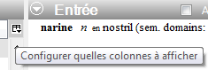
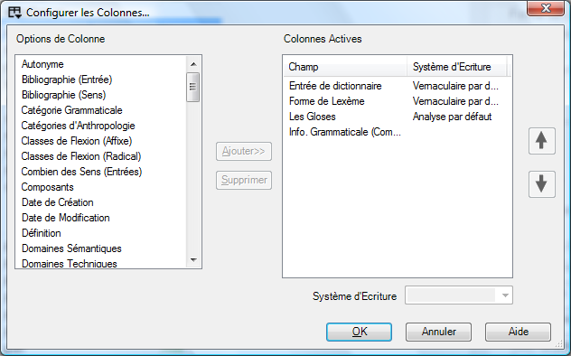
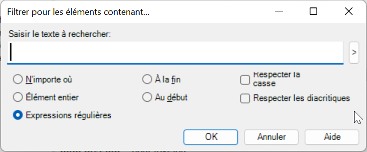
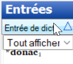
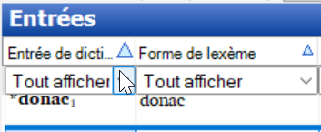

## 1 Visite rapide de FLEx (2:19)  
[**1 FLEx Quick Tour**](https://vimeo.com/showcase/3123523/video/111419885) (2:19)

Les outils dans l'explorateur de langue sont organisés en des **zones**. Dans chaque zone il y a un certain nombre d'outils ou d’affichages. Cette liste change selon la zone où vous êtes actuellement.

| **Zone**               | C’est où vous…                                                                                 | Diverses vues/outils pour…                                                                                                                              |
|------------------------|------------------------------------------------------------------------------------------------|---------------------------------------------------------------------------------------------------------------------------------------------------------|
| **Lexique** | maintenir votre base de données lexicale.                                   | L'éditeur intégré de style dictionnaire, les outils d'édition en bloque, la vue spéciale pour la saisie dans les domaines sémantiques.                        |
| **Texte & mots** | saisir et interlinéariser des textes.                                   | Outils de recherche de concordance, examen des analyses.                                                                                   |
| **Zone grammaire** | Saisir et organiser les informations et les règles grammaticales | Edition des catégories - gérer la liste des catégories grammaticales. Ajoutez des règles flexionnelles en créant des modèles. Compilez dans un esquisse grammatical. |
| **Listes** | gère les différentes listes utilisées pour classer et catégoriser les éléments | Ajouter/Modifier des éléments dans les listes |

## 2 Parcourir et éditer des volets
[**2 FLEx Pane Layout**](https://vimeo.com/showcase/3123523/video/111419886) (0:52)

De nombreuses vues contiennent à la fois des volets de navigation et de modification. Le volet de navigation affiche de nombreux entrées tandis que le volet d'édition vous permet de travailler en détail sur une entrée. 

L'un ou l'autre volet peut être **minimisé** (en faisant glisser le séparateur) et facilement **rétabli** par la suite (en cliquant sur la barre grise).

## 3 Personnalisation du volets de parcourir
[**3 FLEx Configure Columns** ](https://vimeo.com/showcase/3123523/video/111419888)(1:25)

*Dans la zone de « Lexique », Affichage « Éditer lexique »*

-   Utilisez le **bouton** de colonne de configuration (à la droite de la dernière colonne)

#### Mettre les colonnes dans l’ordre

*Dans la zone de « Lexique », affichage « Éditer lexique »*

-   Mettre les colonnes dans l’ordre en glissant les en-têtes de colonne.

#### Plus d'options
-   Cliquez sur le menu **Outils** puis choisir **Configurer**, puis **colonnes...**, puis
-   Ajoutez ou enlevez les colonnes selon les besoins
-   Réorganisez les colonnes à l'aide des boutons fléchés
-   Choisissez les systèmes d'écriture selon les besoins.
-   Cliquez sur **OK**.  
    

## 4 Filtrage (Filtering)
[**4 FLEx Filtering** ](https://vimeo.com/showcase/3123523/video/111419890)(1:32)

Les vues de parcourir ont des options de filtre fournies dans le menu déroulant sous les en-têtes de colonne.

#### Filtres Standard

*Dans la zone de « Lexique », affichage « Éditer lexique »*

-   Utilisez les menus déroulants au-dessous des en-têtes de colonne

|  |  |
|--|--|
| Afficher tout | Désactiver le filtre | 
| Vides | entrées manquant de données |
| Non-vides | entrées contiennent des données.
| Filtre pour... | Filtre personnalisé |

#### Arrêtez le filtre

*Dans la zone de « Lexique », affichage « Éditer lexique »*

-   Choisissez le « Tout Afficher » filtre   
    \- ou -  
-   Cliquez sur le **Arrêtez le filtre** bouton   
(c’est utile si vous avez plus d'un ensemble de filtres)

Le filtre est-il actif ?    Le sélecteur est jaune et la barre d'état est également jaune pour indiquer les résultats du filtre.  

## 5 Filtres spéciaux
[**5 FLEx Special filters** ](https://vimeo.com/showcase/3123523/video/111419891)(1:55)

| **Pour…**                                       | **Choisissez… de la liste déroulant du filtre puis…**                                                                                                                                                                  |
|-------------------------------------------------|------------------------------------------------------------------------------------------------------------------------------------------------------------------------------------------------------------------------|
| Pour voir les champs vides                      | Choisissez les **Vides**                                                                                                                                                                                       |
| Pour spécifier un filtre personnalisé      | Choisissez le **Filtre pour...** et complétez la boîte de dialogue                                                                                                      |
| Le filtre est-il en activité ?                  | Le Choisir est jaune  et la barre de statut indique également les résultats en couleur jaune.                                                                                                                          |
| Erreurs d'orthographe                           | Si des dictionnaires orthographiques ont été installés alors il y aura un filtre additionnel « **Erreurs d'orthographe** » qui montre par des vagues rouges au-dessous des mots ceux qui ne sont pas dans le dictionnaire  |
| Pour des élémentsS inscrits d'une liste          | Choisissez le filtre « **Choisir** » et une liste apparaît. Dans la choisir, cliquez sur différents éléments, ou ctrl+ctrl pour l'élément et tous ses sous-éléments.                                    |
| Champs de date                                  | Choisissez le filtre de **Limiter** et utiliser le calendrier pour choisir la date                         |
| Filtres préconfigurés                           | quelques champs ont préconfiguré des filtres, par exemple : oui/non, ou le nombre de champs plus grand \> 0…                                                                                                           |

## 6 Filtrage avec des expressions régulières
[**6 FLEx Filtering with Regular Expressions** ](https://vimeo.com/showcase/3123523/video/111421267)(2:09)

Pour plus de flexibilité dans le filtrage vous pouvez utiliser ce qui est appelé une expression régulière. Par exemple, trouver tous les lexèmes commençant (**\b**) avec mb- ou (**|**) mp ou mu. 

Lancer les expressions régulières et utiliser le bouton de menu d'aide pour insérer des codes. 

#### Filtre avec des expressions régulières
*Dans la plupart des zones, et la plupart des affichages   
(par exemple lexique. & des textes ; Mots)*

-   Choisissez le **Filtre pour…** d'un menu de filtre 
-   Cliquez sur le bouton radio **Expressions régulières**.
-   Tapez l'expression régulière désirée ou utilisez l'aide
-   Cliquez sur **OK**

:::tip
Cela semble plus compliqué que cela ne l'est en réalité.  Utilisez le lien **Aide pour les expressions régulières** en bas du menu d'aide pour en savoir plus ou copier-coller des exemples.  Vous pouvez également consulter le site Web pour obtenir davantage d'aide. (Notez que FLEx utilise la variété .NET des expressions régulières).
:::

Quelques expressions régulières utiles :

| Expressions  |   pour trouver |
| --------|-------------------------------------------------------------|
| \^(mb\|mp\|mu)            | trouver soit **mb** soit **mp** soit **mu** au début      |
| \^(vois\|vu)        | trouver le verbe "voir" glosé au passé ou au présent. |
| je\|tu\|elle\|il\|nous\|elles | trouvez un verbe annoté avec un marqueur de personne      |
| yo\#                      | trouvez tous les mots finir avec ‘yo’                     |
|                           |                                                           |
|                           |                                                           |
|                           |                                                           |

## 7 Mettre dans l’ordre
[**7 FLEx Sorting**](https://vimeo.com/showcase/3123523/video/111421269) (1:05)

|   |   |
|---|---|
| L’ordre primaire  -   Cliquez sur l'en-tête de colonne |   |
| L’ordre Secondaire -   Maj+Cliquez sur l'en-tête de colonne (Note: la flèche est plus petite) | 
| Arranger à partir de la fin  -   Cliquez avec le bouton droit sur l’en-tête de colonne | Arranger à partir de la fin

:::tip
Lorsque l'on effectue un tri sur un champ qui peut être répété dans une entrée (par exemple les glosses), le nombre de lignes (en bas à droite) devient le nombre de **sens** et non le nombre d'**entrées**.  Il est affiché dans la barre d'état avec une section surlignée en vert.
:::
