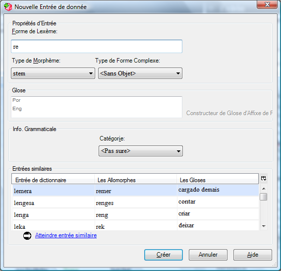

## Personnalisation du volet d'entrée

### 8 Afficher les champs cachés
[**8 FLEx Showing Hidden Fields**](https://vimeo.com/showcase/3123523/video/111421271) (1:36)

*Dans la zone de lexique, l’affichage "Modifier le lexique"

-   Cliquez sur la case à cocher **Afficher les champs cachés** (en haut du panneau)
   *Tous les champs sont affichées*
-   Cliquez sur le champ désiré
   *Le menu du contexte est affiché*
-   Cliquez sur le bouton du menu,
-   Choisissez **Visibilité du Champ** puis choisissez ce qui est approprié
-   Cliquez sur la case à cocher « **Afficher les champs cachés** »

#### Pour cacher des champs

-   Cliquez sur le champ
-   Cliquez sur le bouton vers la gauche du champ,
-   Choisissez **Visibilité du champ**
-   Choisissez ce qui convient (soit Toujours visible, Normalement caché, sauf si non vide, soit Normalement caché).

:::tip Note
Quelques champs ne se montrent pas jusqu'à ce que vous ajoutiez un objet.
:::

### 9 Champs à insérer (0:23)  
[**9 FLEx Fields to insert**](https://vimeo.com/showcase/3123523/video/111421272) (0:23)

Certains champs ne s'affichent pas tant que vous n'avez pas ajouté un objet. Il existe différents éléments dans le menu **Entrée** (et le menu principal **Insérer**). Par exemple, la prononciation. 

### 10 Visibilité du système d'écriture (0:56)  
[**10 FLEx Writing System Visibility**](https://vimeo.com/showcase/3123523/video/111421275) (0:56)

Si votre projet comporte plus d'un système d'écriture vernaculaire ou d'analyse, et que vous ne prévoyez pas de remplir tous les champs avec tous les systèmes d'écriture, vous pouvez gagner de la place verticale en configurant l'affichage des systèmes d'écriture dans les champs.

Par exemple, pour ne voir que l'anglais dans un champ,

- Cliquez sur le champ
- Cliquez sur le menu contextuel à gauche
- Choisissez les **systèmes d'écriture**
- Désélectionnez un système d'écriture (par exemple, le portugais). 
   * Le système d'écriture est supprimé du champ.
:::tip
Le choix était entre afficher toujours l'étiquette et afficher seulement s'il y a des données présentes. 
:::

### 11 Ajouter des champs personnalisé
[**11 FLEx Adding Custom Fields**](https://vimeo.com/showcase/3123523/video/111522255) (1:22)

-   Outils-Configurer-Champs Personnalisé
-   Cliquez sur **Ajouter**
-   Tapez un nom
-   Choisissez l’**Emplacement**
-   Choisissez le **système d’écriture**
-   Cliquez sur **OK**
  *Le nouveau champ doit être affiché en bas de la section.*

### 12 Ajouter une entrée
[**12 FLEx Adding a Lexical Entry** ](https://vimeo.com/showcase/3123523/video/111522254)(1:24)

*Dans la zone lexique,*

-   Cliquez le bouton **Ajouter entrée** sur la barre d’outils
-   *ou -*  
-    Dans le menu **Insérer**, choisissez **l'entrée**…

-   Tapez le lexème.   
    *Comme vous tapez le lexème, les entrées semblables sont montrées en bas.*
-   Tapez la glose (des entrées semblables sont également montrées)
-   Cliquez **Créer**.   
    *L’entrée est créée et montrée.*

#### Si l'entrée existe déjà

-   Utilisez le lien « **Atteindre entrée similaire** »   
   *(il saut à l'entrée pour que vous puissiez l'éditer)*

### 13 Trouver l’entrée lexical
[**13 FLEx Find a Lexical Entry**](https://vimeo.com/showcase/3123523/video/111522253) (0:41)

Pour arriver à une autre entrée qui n'est pas montrée sur l'écran, utilisez la fonction de « trouver » :

#### Trouvez une entrée

Dans la zone de lexique, quel que soit l’affichage

-   Cliquez sur le bouton de trouvaille dans la barre-outils   
    \- ou -
-    Dans le menu **d'Édition** choisissez **Trouver l'entrée lexicale…**
-   Tapez l'ensemble ou une partie de l'entrée 
   *[Les résultats sont montrés lorsque vous tapez].*

#### Si l'entrée est affichée

-   Choisissez l'entrée dans la liste
-   Cliquez sur **Atteindre**

#### Si l'entrée n'est pas affichée

-   Cliquez sur **Créer**… pour ajouter l'entrée absente.

### 14 Ajouter des entrées d'homographe, ajouter des sens
[**14 FLEx Homographs and Senses**](https://vimeo.com/showcase/3123523/video/111522256) (1:51)

Quand deux mots ont la même forme de lexème, ils devraient être ajoutés en tant **qu'entrées séparées** (c.à.d. homographes) si leurs significations ne sont pas connexes ou en tant que **différents sens de la même entrée** si leurs significations sont étroitement liées.

#### Pour ajouter une entrée d'homographe

*Dans la zone de lexique, l’affichage "Modifier le lexique"*

-   Ajoutez la nouvelle entrée comme d’habitude (voir « ajouter une entrée » ci-dessus pour plus d'aide) 
  *[une entrée semblable est montrée]*
-    Ignorez l'entrée similaire et allez-y et  **Créer** la nouvelle entrée.

-   Des nombres d'homographe sont ajoutés automatiquement

#### Pour ajouter un sens

*Dans la zone de lexique, l’affichage "Modifier le lexique"*

-   Cliquez dans la section de sens
-   Cliquez sur **Insérer le Sens** 
  *[un deuxième sens est ajouté]*
-   Complétez les détails pour le nouveau sens.

#### Pour changer l'ordre des sens
- Cliquez sur le bouton de menu pour le sens
- Choisissez **Déplacer le sens vers le haut** ou **Déplacer le sens vers le bas**.

### 15 FLEx Ajouter une information grammaticale (1:16)  
[**15 FLEx Add Grammatical Info**](https://vimeo.com/showcase/3123523/video/116262072) (1:16)

Sélectionnez l'info grammaticale dans la section sens
- Faites défiler vers le bas pour voir la section Sens
- Déroulez la liste des Infos grammaticales
- Choisissez la catégorie souhaitée.

Si vous ajoutez un autre sens (en cliquant sur **Insérer un sens**), il aura la même catégorie grammaticale.

Pour changer de catégorie
- Déroulez la liste des Infos grammaticales
- Choisissez ce qui convient.

Les informations grammaticales d'un sens renvoient à un groupe de champs situés au bas de l'entrée et appelés Informations grammaticales. Détails.
- Cliquez sur Afficher les champs cachés pour voir les autres champs.

### 16 Précision du genre utilisant les champs de flexion

#### \_16_gender_infl_feature.mp4

Le champ Traits de flexion vous permet de spécifier le genre ou la classe du nom. Vous ajoutez d'abord les caractéristiques et une fois qu'elles sont ajoutées, vous pouvez ensuite utiliser la traits appropriée dans l'entrée.

#### Insérez un trait au projet

Quelle que soit la zone

-   Dans le menu d’**affichage**, choisissez la **grammaire**, puis **traits de flexion**.
-   Dans le menu **d'Insérer**, choisissez le **trait d'flexion**  
     *Un catalogue est affichée*.
-   Cliquez sur **+,** près de noun-related
-   Cliquez sur **+,** près de noun agreement (l'accord de nom)
-   Cliquez sur **+,** près du gender (genre) (ou de la classe de nom) comme approprié
-   Cliquez sur les cases à cocher désirées.
-   Cliquez sur **Ajouter**
-   Retournez au lexique.

#### 

#### Ajouter un trait de flexion à une entrée

*Dans la zone de lexique, l’affichage Modifier le lexique*

-   Affichez l'entrée
-   Cliquez sur le bouton ... pour le champ de traits de flexion
-   Choisissez le trait désiré
-   Cliquez sur **OK**
-   Réactualisez l'écran en tapant sur (F5).

    Le trait est montré dans le champ d’info. grammaticale.

   

### 17 FLEx Afficher les traits d'inflexion dans la vue Dictionnaire (0:35)  
[**17 FLEx Showing Inflection Features in Dictionary View**](https://vimeo.com/showcase/3123523/video/116262074) (0:35)

- Dans le menu **Outils**, choisissez **Configuration** puis **Dictionnaire**y
- Cliquez pour développer la section **Sens**.
- Développez la section **Infos grammaticales**. 
- Sélectionnez **Formes de réflexion**.
- Cliquez sur **OK**
  *La trait est affichée dans l'aperçu de l'affichage du dictionnaire.*

### 18 Ajouter une phrase d'exemple
[**18 FLEx Adding an example sentence**](https://vimeo.com/showcase/3123523/video/116262081) (0:30)

Pour ajouter une phrase d'exemple
- cliquez sur le champ Exemple
- Tapez la phrase d'exemple
  *Un champ de traduction et un champ de référence sont également ajoutés.*
- Remplissez ces champs selon vos besoins.

### 19 Recherche d'une phrase d'exemple**.
[**19 FLEx  Finding an Example Sentence**](https://vimeo.com/showcase/3123523/video/116262082) (1:20)
Vous pouvez également utiliser la fonction de concordance pour trouver une phrase d'exemple appropriée.
- Cliquez dans le champ Exemple
- Cliquez sur le menu contextuel bleu
- Choisissez **Trouver une phrase d'exemple**.
  *Une concordance du sens s'affiche**.
- Sélectionnez la ou les phrases que vous souhaitez ajouter.
- Cliquez sur **Ajouter**
 *La phrase est ajoutée. Si une traduction libre a été fournie, elle est également ajoutée.*
 
:::tip
Pour utiliser cet outil, vous devez avoir travaillé sur le texte interlinéaire et approuvé l'analyse comme utilisant le sens 1 ou 2 de l'entrée.
:::
  
### 20 Ajout d'entrées d'affixes (2:01)  
[**20 FLEx Adding Affix Entries**](https://vimeo.com/showcase/3123523/video/116264098) (2:01)

#### Ajouter une entrée pour un affixe dérivatif

*Dans la zone de lexique, l’affichage Modifier le lexique*  
-   Créez une nouvelle entrée
-   Tapez un trait d'union - puis la forme de l'affixe   
    *[le type de morphème change immédiatement au suffixe]*
-   Choisissez le **Type d'affixe** (c.-à-d. dérivationnel)
-   Choisissez **S’attache à la catégorie :** comme appropriée
-    Tapez un glose
-   Cliquez sur **Créer**

#### Ajouter un affixe flexionnel

*Dans la zone de lexique, l’affichage Modifier le lexique*  
-   Créez une nouvelle entrée
-   Tapez un trait d'union - puis l'affixe   
   *[le type de morphème change immédiatement au suffixe]*
-   Choisissez le type d’affixe (c.à.d. flexionnel)
-   Choisissez la Catégorie à laquelle il s’attache comme appropriée
-   Puis utilisez alors l'aide d’annotation pour aider avec une glose appropriée (voir ci-dessous)

#### Constructeur de glose d’affixe flexionnel

-   Cliquez sur le lien  **Constructeur de glose d’affixe flexionnel**
-   Cliquez sur **+,** près de la section appropriée (p.ex. *noun-related*)
-   Cliquez sur **+,** près de la section appropriée sous-section (p.e. *noun agreement*)
-   Cliquez sur **+,** près de la section appropriée sous-sous-section (p.e. *number*)
-   Cliquez sur le bouton radio près du choix approprié
-   Cliquez sur le bouton **Insérer** pour l’ajouter à la glose
-   Continuez si nécessaire.
-   Cliquez sur **Accepter la Gloss**  
    *[la glose est entrée]*
-   Clique sur **Créer**  
    *[l’entrée est créé est affichée.]*

:::tip Notez
L'avantage d'utiliser l'aide d’annotation est que les gloses sont conformés et les traits de flexion sont ajoutés. Voir les champs **Détails d'info. grammaticale**.
:::

### 21 FLEx Ajout d'un allomorphe (1:09)  
[**21 FLEx Adding Allomorph**](https://vimeo.com/showcase/3123523/video/116264100) (1:09)

#### Ajouter un allomorphe

*Dans la zone de lexique, l’affichage Modifier le lexique*

-   Cliquez dans la section **Les allomorphes**
-   Cliquez sur le lien **Insérer l’allomorphe**
   *Les nouveaux champs sont ajoutés.*
-   Tapez la forme
-   Remplissez l’environnement pour limiter l’allomorphe   
  *S'il y a des environnements existants, vous pouvez cliquer sur le bouton ...  
  Sinon, tapez ou utilisez le menu contextuel (à gauche) pour entrer l'environnement*.  
      (p.e. /x_\#)

:::tip **Notez**
L'utilisation du menu contextuel vous permet d'obtenir la barre oblique Environnement dans le bon sens. L'environnement contrôle l'allomorphe pour les analyseurs morphologiques.
:::

### 22 FLEx Ajout de relations lexicales (2:11)  
[**22 FLEx Adding Lexical Relations**](https://vimeo.com/showcase/3123523/video/116264101) (2:11)

L'explorateur de langue a quelques relations lexicologiques intégrées et vous pouvez ajouter vos propres.

#### Utiliser une des relations lexicales intégrées

Dans la zone de lexique, l’affichage Modifier le lexique

-   Utilisez le bouton de menu de contexte sur le champ lexicologique de relations 
-   Choisissez la relation désirée (par exemple Insérer un relation 'synonymes')

      
      *Une boîte de dialogue s'affiche*.
- Tapez la deuxième entrée dans le champ **Rechercher**.
  *Une liste d'entrées s'affiche.
- Cliquez sur l'entrée souhaitée.
- Cliquez sur **Ajouter**.
    *La relation lexicale est ajoutée aux deux entrées.*  
    

:::tip
Le lien est maintenu même si l'autre entrée est modifiée. Certaines relations lexicales vous permettent d'ajouter plus d'une entrée à la relation.
:::

### 23 Spécification des composants de formes complexes (création de sous-entrées) (1:44)  
[**23 FLEx Specifying the Components of Complex Forms (Making Subentries)**](https://vimeo.com/showcase/3123523/video/116264102) (1:44)

Dans cette version de FLEx, la manière dont vous spécifiez les formes complexes et les variantes ont changé. Les nouveaux champs fournissent plus de flexibilité mais peuvent sembler légèrement plus compliqués. Des améliorations sont nécessaires à l'avenir.

#### Comment specifier un forme complexe
Si un lexème contient plus d'un morphème vous pouvez spécifier quels sont ses composantes.

#### Caractéristiques des composantes d'une forme complexe

Dans la zone de lexique, l’affichage Modifier le lexique

-   Montrez l’entrée pour éditer.
-   Dans le champe de composantes, cliquez sur le bouton de points de suspension (à l'extrême droite) 

-   Recherchez une des composantes.
-   Si l'entrée est trouvée vous pouvez cliquez sur **OK**
-   Vous pouvez ajouter une autre composante en répétant l'action.
-   Si l'entrée n'était pas trouvée, vous pouvez l'ajouter en cliquant sur **Créer**

#### 

  *Plus de champs sont ajoutés à l'entrée*.  
-   Cliquez dans le champ « Type de forme complexe »
-   Vérifiez le type désiré (ou ajoutez comme nécessaire).
-   Cliquez sur **OK**

#### 

:::tip **Notez** 
Il n'est pas nécessaire d'ajouter une entrée pour tous les dérivés possibles, mais seulement pour ceux dont la signification des composants n'est pas prévisible.
:::

### 24 Ajouter une variante
[**24 FLEx Add a Variant**](https://vimeo.com/showcase/3123523/video/116264104) (1:07)

*Dans la zone du lexique, Modifier le lexique*.
- Allez à l'entrée
- Faites défiler vers le bas et cliquez dans la section **Variantes**.
  *La commande Insérer une variante s'affiche*.
- Cliquez sur le lien **Insérer variante**  
  *La boîte de dialogue Rechercher une variante s'affiche*.
- Tapez la forme de la variante
  *Les entrées existantes sont listées*.
- Choisissez une entrée existante ou cliquez sur **Créer**.
  *La variante est ajoutée*.
- Définissez le(s) type(s) de variante.
- Désactivez l'option "Afficher l'entrée mineure" si nécessaire.

:::tip
Vous pouvez désactiver la fonction "Afficher l'entrée mineure" si les entrées sont proches les unes des autres dans le dictionnaire.
:::

### 25 FLEx Spécifier une forme complexe est aussi une variante (1:01)  
[**25 FLEx Specifying a Complex Form is also a Variant**](https://vimeo.com/showcase/3123523/video/116266119) (1:01)

La nouvelle façon de spécifier les variantes et les formes complexes nous permet d'avoir une entrée marquée comme les deux.

- Allez à l'entrée qui a été configurée comme une entrée complexe.
- Cliquez sur le menu **Entrée**.
- Choisissez **Lexeme Form est une variante**.  
   *Plusieurs champs sont ajoutés*.  
- Cliquez sur l'icône représentant une ellipse   
   *La boîte de dialogue Choisir le sens lexical ou l'entrée s'affiche*.
- Tapez l'entrée lexicale
- Cliquez sur **OK**

:::tip
Dans la vue du dictionnaire, elle sera traitée principalement comme une variante.
:::

### 26 Affichage des formes complexes dans la vue Dictionnaire (1:48)  
[**26 Displaying Complex Forms in Dictionary View**](https://vimeo.com/showcase/3123523/video/118855078) (1:48)

Les entrées qui sont des formes complexes ont un champ supplémentaire qui vous permet de réduire l'endroit où l'entrée est affichée dans les vues du dictionnaire.

Ce champ s'appelle "Afficher la sous-entrée sous" car il contrôle l'entrée sous laquelle elle apparaît en tant que sous-entrée dans la vue basée sur la racine.

Les entrées dans **Show Subentry under** doivent être des composants.

Sélectionnez un composant
- Cliquez avec le bouton droit de la souris sur le composant.
  *Un menu s'affiche*.
- Sélectionnez **Afficher la sous-entrée sous ce composant**.

Autre possibilité :
- Cliquez sur le bouton à droite
  *La boîte de dialogue "Choisir où afficher la sous-entrée" s'affiche.

#### Configurer le dictionnaire

*Dans la zone du lexique, vue d'édition du lexique.

- Dans le menu **Outils**, choisissez **Configurer le dictionnaire**.
- Sélectionnez **Root-based**.
- Cliquez sur **OK**

****

Basé sur la tige = entrées séparées  
Basé sur la racine = sous-entrées

### 27 Utilisation Collecte de mots (anciennement entrée catégorisée) (3:11)  
[**27 Using Collect Words (Formerly Categorized Entry)**](https://vimeo.com/showcase/3123523/video/116266123) (3:11)

Collecte de Mots est un outil spécial pour introduire efficacement les mots qui ont été obtenus dans des domaines sémantiques à un atelier. (Voir le processus de développement de dictionnaire sur le site Web de sil.org).

#### Mots entrants par domaine sémantique

Dans la zone de **lexique**, l’affichage **Collecte de mots**

-   Choisissez le domaine sémantique désiré dans le carreau de centre (par exemple 2.1.1. Tête)
-   Dans le carreau droit supérieur vous pouvez le configurer pour montrer ou cacher les questions et réponses pour récupérer de l'espace
-   Dans le carreau droit inférieur, introduisez les mots pour le domaine sémantique choisi. 
  *[Pendant que vous les entrez dans FLEx faites de nouvelles entrées]*
-   Utilisant le clavier, appuyez sur entrée pour une nouvelle rangée
-   Alors, tapez le mot puis appuyer TAB et tapez alors la définition.

    

  *La nouvelle entrée créée contient l'information écrite : c.-à-d. forme de lexème, définition et domaine sémantique (comme montré ci-dessus)**.

-   Si une entrée correspondante est trouvée, FLEx ajoute juste le domaine sémantique à l'entrée.
-   Si la définition ne correspond pas, alors FLEx ajoute un deuxième sens avec le nouveau domaine.

:::tip
De cette façon, Language Explorer n'ajoute pas de doublons lorsque vous utilisez Collecte de mots. Mais vous devrez toujours revoir les entrées effectuées après avoir utilisé Collecte de Mots.
:::
