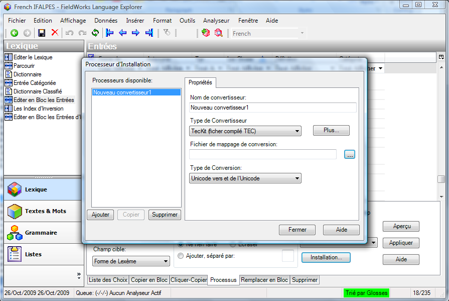

Les outils d'éditer en bloc vous permettent d'apporter des modifications à de nombreux enregistrements sélectionnés en même temps. Il existe plusieurs vues d'éditer en bloc. Il est maintenant possible d'utiliser l'outil d'éditer en bloc les entrées pour travailler sur les champs de niveau d'entrée, les champs de niveau de sens, les phrases d'exemple, les allomorphes et la prononciation. Il existe également une vue d'éditen bloc pour les entres inversées, et une autre dans la zone des textes et des mots pour éditer en bloc les formes de mots. Les vues d'éditer en bloc offrent différentes options d'édition sur les onglets.

## 28 Édition en bloc : Choix de liste  
[**28 Bulk Edit: List Choice**](https://vimeo.com/showcase/3123523/video/116266128) (2:01)

Le choix de liste est réservé aux champs où les données viennent d'une liste ou d'un ensemble fixe de choix. Par exemple, la catégorie grammaticale, et le type de morphe.

### Éditer en bloc les entrées avec le liste des choix

*Dans la zone de lexique*

-  Cliquez sur l’affichage **Éditer en bloc les entrées**
-  Cliquez sur l’onglet **Liste des choix**
-  Assurez-vous que le champ désiré de cible est montré dans une des colonnes (sinon configurez les colonnes)
-  Definissez un filtre selon les besoins pour afficher les entrées désirés
-  Choisissez le champ de cible
-  Faites le choix dans « Changer pour »
-  Cliquez sur **Aperçu**
-  Passez en revue les changements (cochez ce que vous ne voulez pas changer)
-  Cliquez sur **Appliquer** pour apporter des modifications

:::tip **Notez**
Il est utile d’avoir un aperçu avant que vous apportiez des modifications. C'est également une bonne idée de faire une sauvegarde d'abord.
:::

## 29 Édition en bloc : Copie en bloc 
[**29 Bulk Edit: Bulk Copy**](https://vimeo.com/showcase/3123523/video/116266132) (1:02)

La copie en bloc est pour copier des données d'un champ à l'autre. Par exemple, copiez les définitions d'un mot au champ de glose.

### Éditer en bloc en utilisant « Copier en bloc »

*Dans la zone de lexique*

-  Cliquez sur l’affichage **Éditer en bloc les entrées**
-  Cliquez sur l’onglet **Copier en bloc**
-  Assurez-vous que les champs désirés de source et de cible sont montrés dans les colonnes (sinon configurez les colonnes)
-  Définissez un filtre selon les besoins pour afficher les entrées désirées.
-  Cochez toutes les entrées que vous ne voulez pas copier.
-  Choisissez le champ **Source**
-  Choisissez le champ **Cible**
-  Cliquez sur **Aperçu**
-  Passez en revue les changements et faites d'autres ajustements pour ne pas sélectionner tous les autres entrées qu’on ne veut pas copier
-  Cliquez sur **Appliquer** pour apporter les modifications.

## 30 Édition en bloc : Cliquer-copier 
[**30 Bulk Edit: Click Copy**](https://vimeo.com/showcase/3123523/video/116326033) (1:18)

La cliquer-copier est un outil peu commun avec lequel quelque chose sur laquelle vous cliquez est copier dans un champ indiqué. Par exemple, vous pouvez placer l'inversion comme cible et cliquez sur n'importe quoi dans le champ de définition pour faire des entrées d'inversion.

#### Éditer en bloc un champ avec cliquer-copier

*Dans la zone de lexique*

-  Cliquez sur **Éditer en bloc les entrées**
-  Cliquez sur l’onglet **Cliquer-copier**
-  Assurez-vous que le champ désiré de cible est affichée dans les colonnes   
  *(sinon configurez les colonnes)*
-  Définissez un filtre selon les besoins pour afficher les entrées désirés.
-  Choisissez le champ de **Cible**
-  Cliquez sur n'importe quel mot dans le domaine de source et le mot sera ajouté au champ de cible.

:::tip Notez
Si le champ cible n'est pas vide, il ajoute les mots séparés par des virgules. Pour changer cela, définissez les options dans la section *Si le champ cible n'est pas vide*.
:::

#### Chaîne, réordonnée au mot cliqué
Une autre option est sous "Copier", au lieu de simplement copier le mot, vous pouvez choisir "Chaîne, rassortie au mot cliqué".
 
*Dans la zone du lexique, vue Édition en bloc des entrées*.
- Cliquez sur l'onglet **Cliquer-Copier**.
- Assurez-vous que les champs source et cible souhaités sont affichés dans les colonnes   
    (si ce n'est pas le cas, configurez les colonnes)
-  Configurez un **filtre** si nécessaire pour afficher les enregistrements souhaités
- Choisissez le **Champ cible**.
- Cliquez *sur n'importe quel mot dans le champ source*.  
   *Le mot sur lequel vous avez cliqué est ajouté en premier, suivi d'une virgule et du reste de la définition*. 
   
:::tip
Gardez à l'esprit que tout ce sur quoi vous cliquez sera ajouté. Dans cette vue, les cases à cocher n'ont pas de valeur.
:::

## 31 Édition en bloc : Process  
[**31 Bulk Edit: Process**](https://vimeo.com/showcase/3123523/video/116326034) (1:48)

L'onglet de processus vous permet de l'appliquer à un champ qui est alors enregistré dans le même champ ou dans un champ différent.

Les processus soutenus dans cet outil incluent des convertisseurs de codage tels que TECkit et des tables conformes aux changements régulier (CCT).

#### Éditer en bloc : un champ avec un processus

Préparez le TECkit ou CCT, ajoutez une colonne (et un système d'écriture) si nécessaire.

*Dans la zone du lexique, vue Éditer en bloc les  Entrées*.

- Cliquez sur l'onglet **Processus**.
- Sélectionnez la colonne ajoutée comme champ cible

*Configurer le processus*
- Cliquez sur le bouton **Configuration**.
- Cliquez sur **Ajouter**.
- Tapez le nom pour le nouveau convertisseur
- Sélectionnez  le fichier **TECkit**.
- Sélectionnez  le type de convertisseur (par exemple, Unicode vers et de l'Unicode).
- Cliquez sur **Fermer**.

*Appliquer le processus*
- Assurez-vous que les champs source et cible souhaités sont affichés dans les colonnes.   
    (si ce n'est pas le cas, configurez les colonnes)
- Choisissez le **champ source**.
- Choisissez le **champ cible** (avec le système d'écriture correct).
- Cliquez sur **Aperçu**.
- Examinez les résultats
- Cliquez sur **Appliquer**.

## 32 Édition en bloc : Remplacer 
[**32 Bulk Edit Replace**](https://vimeo.com/showcase/3123523/video/191684691) (1:05)

Le remplacer en bloc vous permet de rechercher une certaine chaîne de caractères et de la remplacer dans le champ sélectionné. Par exemple, remplacez "à" dans la définition d'un verbe.

- Choisissez l'onglet **Remplacer en bloc**.
- Sélectionnez le champ cible.

*Configurer la recherche/remplacement*
- Cliquez sur **Configuration**.
- Tapez le texte à rechercher (par exemple, "à").
- Saisissez le texte de remplacement (ou laissez-le vide pour supprimer).
- Cliquez sur **OK**

*Remplacer*
- Cliquez sur **Aperçu**.
- Examinez attentivement les résultats.

:::tip
C'est généralement une bonne idée d'utiliser un filtre lorsque vous effectuez l'une de ces opérations en bloc pour être prudent, mais ce n'est pas entièrement nécessaire.
:::

## 33 Édition en bloc : Supprimer 
[**33 Bulk Edit: Delete**](https://vimeo.com/showcase/3123523/video/116326036) (1:13)

La suppression en bloc vous permet de supprimer le contenu d'un champ dans les entrées sélectionnées. Elle peut également supprimer des entrées ou des sens entiers. Si vous avez un champ sélectionné, le contenu de ce champ sera supprimé.

*Dans la zone du lexique, vue* **Éditier en bloc les entrées**.

*Pour supprimer le contenu d'un champ*  
- Cliquez sur l'onglet **Suppression en bloc**.
- Sélectionnez le champ dans "Élément à supprimer".
- Décochez les lignes que vous ne voulez pas affecter.
- Cliquez sur **Aperçu**.

*Pour supprimer l'entrée réelle*  
- Dans l'élément à supprimer, choisissez **Entrées (Lignes)**. 
- Cliquez sur **Supprimer**.
    *Un message s'affiche pour vous avertir que vous allez supprimer les éléments sélectionnés*.

:::tip
Cela peut être un moyen utile de supprimer les enregistrements que vous avez importés et qui n'ont pas été correctement importés, puis réimporter, etc.
:::