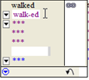
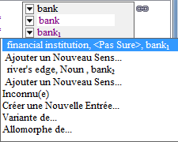
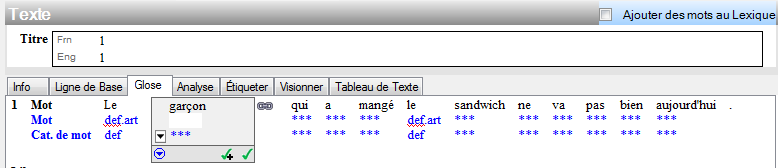
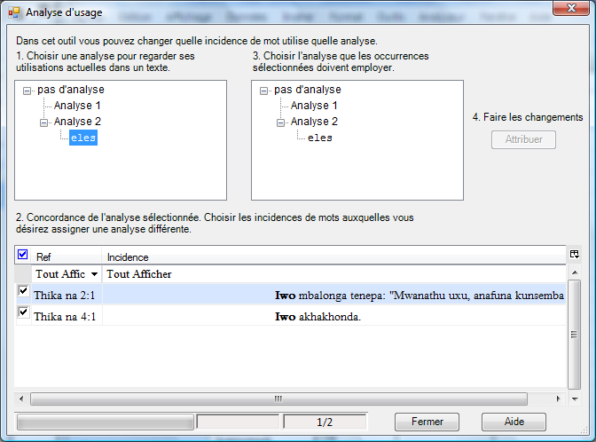

## 34 Aperçu des textes interlinéaires (1:39)  
[**34 Interlinear Texts Overview**](https://vimeo.com/showcase/3123523/video/116326037) (1:39)

#### Ajoutez un nouveau texte

*Dans la zone de Textes & Mots*

• Cliquez sur le menu **Insérer** et choisissez l'option  **Nouveau texte**
• Tapez le titre
• Tapez ou collez le texte lui-même dans l'onglet de ligne de base

Il existe plusieurs autres onglets

| **Étiquettes**   | **But**                                                                                                                                   |
|------------------|-------------------------------------------------------------------------------------------------------------------------------------------|
| Info             | cela te permet d'enregistrer les métadonnées pour le texte                                                                                |
| Ligne de base    | utilisé au saisir/coller le texte                                                                                                         |
| Glose            | affichage d’interlinéaire préconfiguré pour écrire des gloses du mot et sa catégorie                                                      |
| Analyse          | préconfigurée, te permet de travailler pour diviser des mots en morphèmes, pour choisir et créer les entrées appropriées dans le lexique  |
| Étiqueter        | | La vue interlinéaire permet d'ajouter des balises de base au niveau de la clause pour un mot ou un ensemble de mots.                             |
| Imprimmer        | l’affichage interlinéaire pour le texte d'impression (configurez au besoin)                                                               |
| Tableau de texte | utilisation pour préparer un diagramme de discours                                                                                        |

## 35 Textes interlinéaires (1:49)  
[**35 Interlineaerizing**](https://vimeo.com/showcase/3123523/video/117592920) (1:49)

#### Analyser un texte

*Dans la zone des Textes et de mots, l’affichage Textes interlinéaires*
- Cliquez sur l'onglet **Analyser**.  
  *Les mots qui ont déjà été analysés sont surlignés en bleu et doivent être confirmés*.

*Approuver les mots surlignés en bleu*.  
- Cliquez sur la forme du mot
- Cliquez sur la coche ou appuyez sur Entrée
  *La couleur bleue disparaît*.
  
*Analyser un mot*.
- Cliquez sur le mot à analyser
- Cliquez sur la flèche vers le bas à gauche de la ligne **Entrées lex.**
- S'il n'y a pas d'analyse existante, choisissez **Créer une nouvelle entrée**.  
    (sinon choisissez une analyse existante)
- Remplissez la **glose**.

*Ajouter une catégorie grammaticale existante*  
- Cliquez sur la liste déroulante **Categorie**.
- Choisissez dans la liste 

*Ajouter une nouvelle catégorie*  
- Si la catégorie n'est pas dans la liste
- Cliquez sur **Plus**   
  *Un catalogue s'affiche*.   
- Choisissez la catégorie souhaitée si nécessaire 
- Cliquez sur **Ajouter**

*Créer la nouvelle entrée lexicale*.
- Cliquez sur **Créer**   
    [Toutes les lignes sont remplies]
- Approuvez l'anlyse en cliquant sur l'une ou l'autre des cases à cocher.

:::tip
Vous pouvez approuver les mots individuellement en cochant la case, ou toutes les formes de mots du texte en cochant la case avec un signe plus.
:::

## 36 Séparer  les mots en morphèmes (Interlinéarisation) (1:29)  
[**36 Breaking Words into Morphemes (Interlinearizing)**](https://vimeo.com/showcase/3123523/video/129897276) (1:29)

#### Séparer le mot en morphèmes en saisissant directement

Dans la zone des textes et de mots, l’affichage interlinéaire et l'onglet d'analyse

-  Cliquez sur la ligne de morphèmes du mot à analyser
-  Tapez un trait d'union à la séparation de morphème  
        
-  [Le mot est séparer en morphèmes]

#### Séparer le mot en morphèmes utilisant le dialogue
:::tip
Ce dialogue fournit plus d'informations sur ce que sont les caractères de séparation de morphème.
:::

Dans la zone de textes & mots, l’affichage interlinéaire et l'onglet d'analyse

-  Cliquez sur la ligne de morphèmes du mot à analyser
-  Cliquez sur le bouton de menu dans la ligne de morphèmes du mot à analyser

     

-  Séparez les morphèmes avec les espaces et ajouter les caractères appropriés (par exemple le trait d'union).
-  Cliquez sur **OK**

#### Ajouter les morphèmes au lexique comme nécessaire

Dans la zone des textes et mots, l’affichage interlinéaire et l'onglet d'analyse

-  Cliquez sur le bouton de menu dans la ligne d'Entrée Lex.
-  Choisissez « Créer un Nouvelle Entrée »
-  Remplir l'information comme approprié
-  Cliquez sur **Créer**

#### Choisissant un morphème différent (quand il y en a multiples)

Dans la zone des textes et de mots, l’affichage interlinéaire et l'onglet d'analyse

-  Cliquez sur le bouton de menu dans la ligne d'Entrée Lex.

    

-  Choisissez l'entrée existante désirée   
    - ou -  
    **Ajoutez un Nouveau Entry or Sens**

#### Compléter l'analyse
- Ajustez la glose du mot si nécessaire
- Approuvez l'analyse.

## 37 Ajout d'un allomorphe (Interlinéarisation) (0:50)  
[**37 Adding an Allomorph (Interlinearizing)**](https://vimeo.com/showcase/3123523/video/129897283) (0:50

Il est parfois nécessaire d'ajouter un morphème comme allomorphe d'un lexème existant.

#### Ajouter un allomorphe à une entrée existante

Dans la zone des textes & mots, l’affichage interlinéaire et l'onglet d'analyse

-  Cliquez dans le mot à analyser
-  Divisez le mot en morphèmes (voir ci-dessus)
-  Cliquez sur le bouton de menu dans la ligne d'Entrée Lex.
-  Choisissez « l'allomorphe de ... »

    

-  Dans l'attendre tapez l'entrée existante
-  Puis cliquer « **Ajouter un Allomorphe...** »
-  Continuez l'analyse ajoutant toutes les entrées absentes au besoin.

## 38 Analyse d'une variante (Interlinéarisation) (0:47)  
[**38 Analyzing a Variant (Interlinearizing)**](https://vimeo.com/showcase/3123523/video/129897288) (0:47)

- Cliquez sur le mot à analyser
- Cliquez sur le bouton de menu dans la **Lex. Entrée**
- Choisissez **Variante de**
  *L'entrée Rechercher pour ajouter une variante s'affiche*.
- Tapez le lexème

Si l'entrée est trouvée
- Cliquez sur la liste **Type de variante**.
- Choisissez le type de variante (par exemple, irregular inflected form, "Past").
- Cliquez sur **Ajouter une variante**.

Si l'entrée n'est pas trouvée
- Cliquez sur le bouton **Créer une entrée**. 

## 39 Textes interlinéaires : Faire une locution
[**39 Analyzing a Phrase (Interlinearizing)**](https://vimeo.com/showcase/3123523/video/129897290) (0:54)

Pour joindre deux mots dans un groupe pour une analyse simple nous employons le bouton de locution. Si vous décidez ultérieurement vous pouvez décomposer la phrase en mots.

#### Faire une locution avec le prochain mot (pour une analyse simple)

Dans la zone des textes et de mots, l’affichage interlinéaire et l'onglet d'analyse

-  Cliquez sur le premier mot de l'expression
-  Cliquez sur le bouton de « faire une locution avec la prochaine mot »   
      
  

-  Ajoutez maintenant une entrée lexicale simple pour eux  
   

#### Diviser la phrase en mots

Dans la zone des textes & mots, l’affichage interlinéaire et l'onglet d'analyse

-  Cliquez dans l'expression
-  Cliquez sur le bouton **Décomposez la location en mots**

## 40 Mise à jour des textes interlinéaires pour qu'ils correspondent au lexique (0:53)  
[**40 Interlinear Texts Update to match Lexicon**](https://vimeo.com/showcase/3123523/video/129897292) (0:53)

Si vous modifiez une entrée lexicale qui est référencée par une analyse de mots, le texte interlinéaire est mis à jour automatiquement avec la modification.

Modifier une entrée lexicale
- Cliquez avec le bouton droit de la souris sur l'analyze.  
- Choisissez **Afficher l'entrée au lexique**.
  *L'entrée du lexique s'affiche.
- Effectuer une modification dans l'entrée
- Cliquez sur **Textes et mots** pour revenir au texte.  
    *Le texte est mis à jour avec la modification.

## 42 Utilisation de l'onglet Glose et configuration d'Interlinéaire (:57)  
[**42 Using the Gloss Tab and Configuring Interlinear**](https://vimeo.com/showcase/3123523/video/191684692) (:57)

Comme l'onglet Analyse, l'onglet Gose offre une vue interlinéaire. Mais il est préconfiguré pour ajouter des glosses, des catégories de mots et des traductions libres. Vous pouvez la modifier en utilisant l'option Outils-Configurer l'interligne et la rendre plus simple ou plus compliquée.

Dans l'onglet Gloss ou Analyse, vous pouvez modifier la configuration de l'interligne.

Modifier la configuration
- Dans le menu **Outils**, choisissez **Configurer** puis ***Interlinéaire**.
  *La boîte de dialogue de configuration des lignes s'affiche.

Supprimer des lignes 
- Cliquez sur la ligne dans la liste des lignes affichées.
- Cliquez sur **Supprimer**.
- Cliquez sur **OK**.

Afficher les lignes 
- Cliquez sur la ligne dans la liste des lignes disponibles.
- Cliquez sur **Ajouter**.
- Cliquez sur **OK**.

L'onglet gloss fonctionne exactement de la même manière que l'onglet analyse, mais avec moins de lignes affichées. 
:::tip
Vous pouvez également utiliser la touche **Entrée** pour vous déplacer de mot en mot.
:::

:::caution
Dans FLEx 9.1, le dialogue a changé. Utilisez les cases à cocher dans les différentes lignes et colonnes pour afficher une ligne dans un système d'écriture particulier. 
Pour masquer une ligne qui utilise un système d'écriture particulier, décochez la case de la colonne en question.
:::

## 43 Option d'ajout de mots au lexique (1:23)  
[**43 Add Words to Lexicon Option**](https://vimeo.com/showcase/3123523/video/191684693) (1:23)

À la différence de l'onglet d'analyse, l'onglet de glose a une option spéciale qui te permet d'ajouter des mots dans le lexique pendant que vous ajoutez des gloses ou des catégories de mot. Puisque le lexique contient habituellement des morphèmes ce dispositif est prévu pour les langues qui ont la morphologie très peu.

#### Lancer le mode spécial pour ajouter des mots

Dans la zone des textes & mots, l’affichage interlinéaire et l'onglet de glose

-  Cliquez dans le mot à analyser
-  Cochez « Ajouter des mots au Lexique »

    

#### Ajouter les mots au lexique

Dans la zone des textes & mots, l’affichage interlinéaire et l'onglet de glose

-  Cliquez dans le mot à analyser
-  Tapez le glose de mot et appuyez **Entrée** 
  *[des entrées sont aussi bien créées dans le lexique utilisant le glose de mot comme le glose lexicologique]*

## 44 Utilisation de l'analyseur syntaxique (3:27)  
[**44 Using Parser**](https://vimeo.com/showcase/3123523/video/191684687) (3:27)

L'explorateur de langue a également un analyseur morphologique qui est commandé par des options dans le menu d'analyseur. L'analyseur essaye de suggérer ou prévoir des analyses basées sur les entrées dans le lexique et les règles et des faits dans la zone de grammaire. Si vous n'utilisez pas l'analyseur vous verrez toujours les analyses que vous avez écrites précédemment suggéré pour vous dans le bleu. Ces suggestions bleues sont limitées aux mots que vous avez analysés précédemment. 

En revanche, l'analyseur morphologique peut suggérer des analyses pour des mots que vous n'avez pas rencontrés avant. Et il peut faire une suggestion/prévision tant qu’il peut trouver les morphèmes dans le lexique et les règles de grammaire pour le permettre.

#### Commencer l'analyseur

Dans la zone des textes et de mots, l’affichage interlinéaire et analyse l'onglet

-  Dans le menu **Analyseur** choisissez **Analyser tout les mots**
-  Vous pouvez suivre le progrès de l'analyseur sur la barre de statut
  *L'écran ne se met pas à jour*. *Aller dans la zone de liste et revenir*.
-  Maintenant vous pouvez voir des suggestions faites par l'analyseur accentué dans l'orange.  
  ****
-  Les suggestions d'analyseur n'incluent pas une glose de mot ou une catégorie de mot
-  Vous pouvez éditer et approuver ces suggestions comme d'habitude.

:::tip
La qualité et la quantité des suggestions de l'analyseur dépendent entièrement de votre lexique et de votre grammaire.
:::

## 45 Vue des analyses de mots (1:08)  
[**45 Word Analyses View**](https://vimeo.com/showcase/3123523/video/191684686) (1:08)

Tous les mots qui sont en textes sont énumérés dans l’affichage d'analyses de mots. Il y a une colonne qui montre combien d'occurrences là sont dans le corpus entier des textes. Vous pouvez également affichage d'autres colonnes comprenant le nombre d'analyses que vous avez approuvées pour chaque mot et le nombre d'analyses que l'analyseur a affirmées pour chaque mot basé sur la grammaire et le lexique. Cet affichage est utile pour passer en revue les diverses analyses pour chaque mot.

Des analyses qui sont suggérées par l'analyseur sont d'abord mises dans la section **Opinion d'utilisateur pas connue** puisque c'est seulement un candidat d'analyse. On peut déclarer qu’on approuve cette analyse. Il est alors déplacé dans la section approuvée par l'utilisateur. 

#### Approuvez un candidat d'analyse (comme suggéré par l'analyseur)

Dans la zone des textes & mots, l’affichage d'analyses de mot

-  Naviguez pour le mot à être analysé
-  Dans le paneau d'analyse trouvez le candidat d'analyse
-  Cliquez sur le bouton de menu de **candidat pour l'analyse**
-  Choisissez l'opinion d'utilisateur, puis **approuver**

    

  - *Elle est alors montée dans la section d'analyses approuvée par utilisateur.*

## 46 Attribution des analyses (1:03)  
[**46 Assign Analyses**](https://vimeo.com/showcase/3123523/video/118855079) (1:03)

L’affichage d'analyses de mot a un outil qui te permet d'assigner des analyses à tout nombre d'occurrences en textes. Par à l'aide de l'outil d'analyse d'attribution je peux spécifier quelle analyse est bonne pour ces autres occurrences que je n'ai pas encore travaillées dessus dans les textes.

*Dans le texte & mots zone, l’affichage d'analyses de mot*

-  Naviguez pour le mot à être analysé
-  Cliquez sur la commande d'analyse d'attribution (à la droite supérieure de la fenêtre)   
    
    - *Le dialogue d'utilisation d'analyse est montré*.  
      
-  Choisissez les occurrences qui se rapportent à une de l'analyse (2.)
-  Cliquez sur la glose de mot pour l'analyse désirée (3.)
-  Cliquez sur le bouton d'**Attribuer** (4.)
-  Choisissez les occurrences qui se rapportent à la prochaine analyse (2.)
-  Cliquez sur la glose de mot pour l'analyse (3.)
-  Cliquez sur le bouton d'**Attribuer** (4.)
-  Cliquez sur **Fermer.**

:::tip
Cela peut vous aider à travailler efficacement.
:::

## 47 Ajout d'un modèle d'inflexion (3:23)  
[**47 Adding an Inflection Template**](https://vimeo.com/showcase/3123523/video/191684690) (3:23)

Si vous utilisez l'analyseur morphologique, vous devriez voir des analyses prédites ou suggérées. Ces analyses suggérées révèlent ce que votre lexique et votre grammaire permettent actuellement pour ce mot. Si une analyse suggérée est erronée, cela nous indique que les règles de la zone grammaticale et le lexique doivent être affinées. L'analyseur syntaxique n'est que le moteur, l'exactitude de ses résultats dépend entièrement du contenu de votre grammaire et de votre lexique. 

#### Ajoutez un modèle

Dans la zone de grammaire, l’affichage éditer la catégorie

-  Choisissez la catégorie grammaticale désirée
-  Dans le menu d'**insertion,** choisissez **Modèle d'Affixe**
-  Tapez un nom pour le modèle (par exemple le temps)
-  Cliquez sur BASE
-  Utilisez le menu de contexte près de mot **BASE** pour insérer la case (slot) soit après soit avant BASE
-  Choisissez si la case (slot) est facultative ou obligatoire
-  Tapez un nom pour la case (slot)
-  Utilisez alors le menu bleu de contexte « ajoutent des morphèmes flexionnels » à cette case (slot).
-  Cochez sur les affixes qui peuvent remplir la case.
-  Cliquez sur **OK**  
   

Démarrer l'analyseur
- Retournez à la zone Texte & Mots, 
- Choisissez la vue Analyse des mots
- Dans le menu Analyseur, choisissez **Analyser le mot actuel**.
  *La mise à jour de l'analyseur peut prendre quelques secondes.

:::tip
La parse invalide ne devrait pas être produite car le nouveau modèle exclut cette combinaison particulière d'affixes.
:::

## 48 Essayer un mot (tester la sortie de l'analyseur) (2:14)  
[**48 Try A Word (Testing Parser Output)**](https://vimeo.com/showcase/3123523/video/191684689) (2:14)

Dans la vidéo précédente, nous avons vu que les allomorphes non contraints étaient en partie la raison pour laquelle l'analyse invalide a été suggérée. Bien que l'ajout du modèle ait arrêté l'analyse invalide, nous n'avons pas empêché les deux affixes de temps d'être librement interchangeables avec leurs formes normales. Le menu Parser possède un outil **essayer un mot** qui vous permet de voir comment les règles de grammaire et le lexique permettent d'analyser les mots. 

*Dans la zone Texte et mots*, *Vue des analyses de mots*.

Essayer un mot
- Dans le menu Analyseur, choisissez Essayer un mot.
- Tapez le mot que vous voulez vérifier
- Cliquez sur **Essayer**.
  *Les résultats montrent si les règles de grammaire empêchent l'analyse des affixes*.
  
Contraindre l'affixe avec des environnements
- Cliquez sur l'affixe (dans les résultats)
- Faites glisser la boîte hors du vu.
  *L'allomorphe est sélectionné*.
  
Ajoutez un environnement
**Soit** tapez l'environnement dans le champ.
**Ou** cliquez sur le bouton elipsis pour voir les environnements existants.
  *La boîte de dialogue de choix des environnements s'affiche*.
**Soit** Cliquez sur les environnements dont vous avez besoin. 
**Ou** Cliquez devant Environment et choisissez **Cocher tout**).
- Cliquez sur **OK**.

Retester le mot
- Retournez à la fenêtre **Essayer un mot**, 
- si nécessaire, tapez le mot
- Cliquez sur **Essayer un mot**
  *Les résultats s'affichent. Si on a réussi, l'analyse ne soit pas erronée*. 
- Essayez d'autres mots.

## 49 Concordance (1:42)  
[**49 Concordance**](https://vimeo.com/showcase/3123523/video/191683746) (1:42)

L'outil de concordance vous permet de spécifier une chaîne de caractères sur laquelle l'outil de concordance effectuera une recherche. Vous pouvez également spécifier dans quelle ligne la chaîne doit apparaître.

Pour des recherches plus spécifiques telles que l'entrée ou le sens spécifique, utilisez les commandes *afficher concordance de* qui se trouvent dans les menus de clic droit sur les éléments que vous souhaitez concorder.

#### Utilisez l’affichage de concordance

Dans la zone de Textes & Mots ; l’affichage de concordance

-  Tapez le texte pour rechercher
-  Spécifiez la ligne pour rechercher dedans
-  Cliquez sur la **recherche**  
  *Une concordance est affichée pour toute occurrence de la chaîne de caractères spécifiée.* 

#### Utilisez la commande de saut

Dans la zone de Textes & Mots ; l’affichage de concordance

-  Cliquez avec le bouton droit sur une entrée dans la ligne *Entrées Lex*
-  Choisissez **Afficher concordance de**
-  Puis choisissez **Entrée**

  
  *Une concordance de cette seule entrée est affichée, et non une concordance de toutes les occurrences de la chaîne spécifiée*. 
  
:::tip 
Seules les occurrences qui ont été approuvées sont affichées (pas les occurrences proposées).
:::

:::info
Dans d'autres vues de Language Explorer, il existe également des commandes de recherche de concordance. Par exemple, dans la zone Lexique, vue d'édition du lexique, sous le menu contextuel de l'entrée. Également dans le menu contextuel du sens.
:::

## 50 Tableau de Texte (Discourse Chart)
[**50 Text Chart (Discourse Analysis)**](https://vimeo.com/showcase/3123523/video/191684720) (3:50
L'onglet de tableau de texte te permet de faire une carte des composants de discours. Pour fournir plus de place pour le diagramme c’est bon de réduire au minimum les textes paneau et faire la même chose avec la barre de zones.

#### Déplacer les mots au diagramme

-  Cliquez sur un mot du texte en tant que ci-dessous montré tableau
-  Cliquez sur les boutons qui correspondent à l'en-tête de colonne
 *Le ou les mots sont déplacés vers le tableau et le mot suivant est sélectionné.*

:::tip
Pour déplacer plus d'un mot dans une seule cellule, cliquez sur le mot le plus à droite, puis sur le bouton d'en-tête de colonne. Ou cliquez simplement sur le bouton plusieurs fois.
:::
 
#### Ajouter la nouvelle rangée au tableau

-  Choisissez une colonne qui est à la gauche du mot déjà dressé dans le tableau. Une nouvelle rangée est insérée.

#### Déplacez le contenu de la cellule

-  Cliquez sur le bouton de menu de cellules
-  Choisissez **Déplacez cellule** ou **Déplacer mot**
-  Choisissez **Avancer** ou **Précédent**

:::tip
Utilisez CTRL+← pour répéter le déplacement.
:::

#### Marquez une clause de la parole

-  Choisissez l'endroit d'où le discours est marqué
-  Cliquez sur le bouton de cellule
-  Choisissez « En faire un proposition de discours » puis de la « Proposition suivante » (ou comme approprié).

#### Marquer que l'élément n'est pas dans l'endroit habituel

-  Cliquez sur le bouton de cellules
-  Choisissez la « Indiquer postposé de » ou « Indiquer antéposé de »
-  Choisissez « Outer » ou « Inner »

#### Indiquez où les séparations de phrase viennent
(de sorte que la ligne numérotation soit appropriée).

-  Cliquez sur la première colonne
-  Cliquez sur le bouton de cellules
-  Choisissez « **Dernier linge du paragraphe** » ou « **dernière linge dans la Phrase** » comme approprié.

#### Changer les titres de tableau et marqueurs intégrés
  (si c’est nécessaire le fait avant de commencer le tableau)

-  Dans le menu **Affichage**, choisissez les **listes**
-  Puis choisissez « éttiquetes de tableau de texte »   
    (ou « Modèles pour Tableaux des Constituants d’un Texte »  
    

## 51 Modifier le modèle de tableau (Analyse du discours) (1:32)  
[**51 Edit Chart Template (Discourse Analysis)**](https://vimeo.com/showcase/3123523/video/191684719) (1:32)

Dans les listes "Modèle de tableau des constituants d'une texte", vous pouvez modifier le modèle par défaut. Vous ne pouvez pas pour l'instant ajouter un nouveau modèle. 

Réorganiser les colonnes dans une section
- cliquez sur l'une d'elles éléments
- faites un clic droit et sélectionnez Déplacer haut (ou Déplacer bas)
  *Cela changera l'ordre des colonnes dans votre tableau de discours*.

Ajouter une colonne au tableau
- Choisissez la section dans laquelle vous souhaitez ajouter la colonne.
- Dans le menu Insertion, choisissez Sous-élément (ou utilisez la barre d'outils).
- Saisissez un nom pour la colonne (au panneau de droite).

Vous pouvez également renommer les colonnes
- Cliquez sur l'élément dans la liste
- Modifiez le nom dans le panneau de droite.

:::caution
La chose la plus importante à garder à l'esprit est que vous **ne devez pas réorganiser ou supprimer** des colonnes **après** avoir commencé à tracer des graphiques !
:::

:::tip
Vous pouvez renommer ou insérer des colonnes sans endommager le texte du graphique.
::: 

## 53 Activation de la vérification orthographique pour la langue vernaculaire (2:09)
[**53 Enabling Spell Checking for the Vernacular Language**](https://vimeo.com/showcase/3123523/video/191684739) (2:09)

Pour utiliser la fonction de vérification orthographique pour une langue vernaculaire minoritaire, 
- Dans le menu Outils, choisissez Orthographe
- Choisissez **Montrer les erreurs d'orthographe vernaculaire**.
  *Ceci crée le dossier et les fichiers nécessaires à la vérification orthographique*.

#### Remplir le nouveau dictionnaire orthographique

**Soit**
*Dans la zone Texte & Mots, vue Analyses des mots.

- Changez le "Statut orthographique" en "Correct".
  

**Soit**
#### Modifier l'état de l'orthographe en utilisant l'édition en masse

- Dans le menu **Outils**,
- choisissez **Orthographe**-**Modifier l'état de l'orthographe...**.
  *La vue des formes de mots de l'édition en bloc est affichée et filtrée pour montrer les mots indécis*.
    
- Filtre pour les mots indécis 
- Désélectionnez ceux que vous ne voulez pas marquer comme incorrects.
- Dans **Changer pour**, choisissez **Correct**.  
   
- Cliquez sur Aperçu
- Cliquez sur Appliquer
- Revenez en arrière et vérifiez un texte
  - *Moins de mots seront marqués comme incorrects*.

Ajouter un mot au dictionnaire
  - Cliquez avec le bouton droit de la souris sur un mot marqué d'une ligne ondulée rouge.
  - Choisissez **Ajouter au dictionnaire d'orthographe**.
   *L'état orthographique de ce mot est également marqué comme correct.
   

## 54 Formation à l'aide (2:13)  
[**54-help training**](https://vimeo.com/showcase/3123523/video/191684737) (2:13)

Pour trouver une aide plus complète et détaillée sur l'utilisation de l'explorateur de langues, un fichier d'aide a été fourni. Malheureusement, il est entièrement en anglais.

**Champs** : L'aide est disponible sur chaque menu contextuel de Bleu. 
Chaque **boîte de dialogue** a un bouton d'aide

Utilisation du fichier d'aide
- Dans le menu **Aide**, choisissez **Explorateur de langue**.
- Cliquez sur **Recherche**.
- Tapez ce sur quoi vous voulez de l'aide
- Cliquez sur **List topics** (Liste des sujets)
- Cliquez sur **Index**.
- Saisissez le sujet sur lequel vous souhaitez obtenir de l'aide
- Trouvez un sujet dans la liste
- Cliquez sur **Affichage**.
- Cliquez sur **Contenu**.
- Développez **Utilisation des outils**.
- Développez le livre pour la zone
- Développez le livre pour la vue

Menu Aide > Formation
- manuel de l'étudiant (pas à pas vers les fonctionnalités de base)
- Guide de l'instructeur (guide de l'instructeur pour l'utilisation du livre en classe)

Menu Aide > Ressources
- guides approfondis sur divers sujets techniques. 

## 55 Groupe d'utilisateurs (:24)  
[**55 User Group**](https://vimeo.com/showcase/3123523/video/191684738) (:24)

Groupe Google
- Il existe un groupe Google appelé **FLEx list**. Vous pouvez participer à ce groupe par **courriel** ou consulter les discussions sur le Web.
Vous pouvez consulter toutes les discussions sans vous joindre au groupe.
 
Le groupe est utile si vous avez des questions ou des suggestions pour le développement futur.  