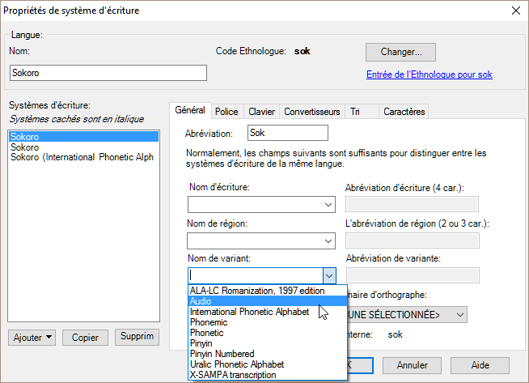
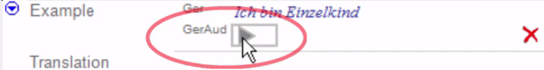

Ajouter un système d'écriture audio
-   **Format** \> **Systèmes d’écriture**
-   Dans la section "Systèmes d’écriture vernaculaire" cliquez sur **Ajouter**
-   Sélectionnez **Système d’écriture de** *la langue* dans laquelle vous travaillez actuellement,

    

    La boîte de dialogue des "propriétés de système d’écriture" s’affiche avec le nouveau système d’écriture a été ajouté.

    

-   Dans la liste déroulante **Nom de variant**, sélectionnez **Audio**
-   Ajuster l’abréviation (p.ex. SokA) pour distinguer ce système des autres.
-   Cliquez sur **OK**.
-   Cliquez sur **OK** dans la boîte de dialogue suivante.

    L’écran est mis à jour pour afficher le nouveau système d’écriture.

-   Appuyez sur **Actualiser** 

    Le système d’écriture est activé. Vous pouvez voir que le nouveau système d’écriture vernaculaire est affiché.

### Pour enregistrer quelque chose

-   Cliquez et maintenez le bouton d’enregistrement rouge comme décrit dans l’Infobulle long.

    Une fois l’enregistrement est effectué, il y a un bouton de lecture (triangle) au lieu du bouton d’enregistrement (cercle).

### Supprimer un audio

-   Cliquez sur le un bouton de suppression.

    L’enregistrement est supprimé.

### Enregistrer (direct) une version audio d’exemples de phrases

-   Cliquez sur le bouton rouge et maintenir ce bouton.
-   Dites la phrase.
-   Relâchez le bouton.

    Le bouton de lecture s’affiche.

    

### Ajouter un fichier existant

-   Appuyez sur **Maj** et cliquez le cercle.

    Une boîte de dialogue s’affiche.

-   Naviguez où vous avez enregistré le fichier.
-   Cliquez sur **Ouvrir**.

    Le bouton de lecture s’affiche.
:::tip
Vous ppuvez donc soit enregistrer en direct en maintenant le bouton d'enregistrement enfoncé, soit maintenir la touche "Maj" enfoncée et ouvrir un fichier que j'ai préenregistré.
:::
