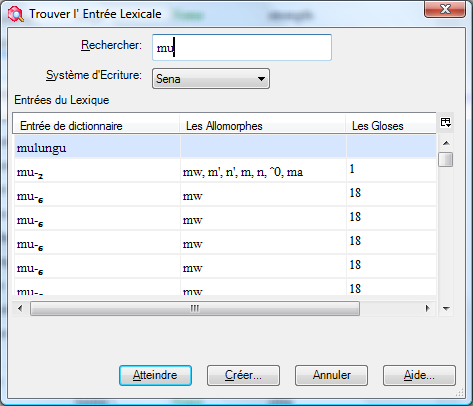
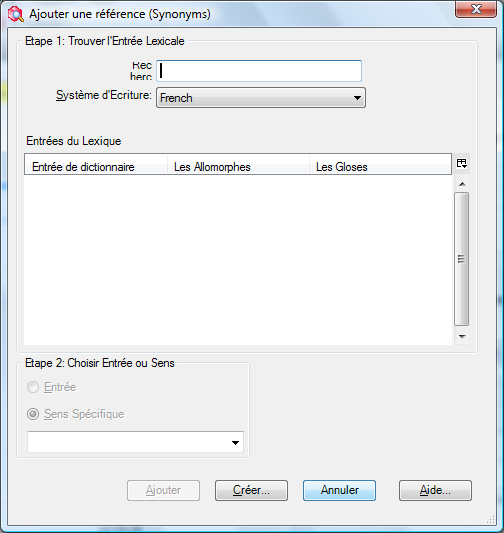

:::tip Info
This files contains summaries of all the original videos. It needs to be split up either by individual video or groups of videos. Some images that were inserted into tables did not convert to markdown. See the Word doc for those pictures.
:::
# Introduction

### 1 Introduction.swf

Les outils dans l'explorateur de langue sont organisés en des **zones**. Dans chaque zone il y a un certain nombre d'outils ou d’affichages. Cette liste change selon la zone où vous êtes actuellement.

| **Zone**               | C’est où vous…                                                                                 | Diverses vues/outils pour…                                                                                                                              |
|------------------------|------------------------------------------------------------------------------------------------|---------------------------------------------------------------------------------------------------------------------------------------------------------|
| **Lexique**            | maintenez votre base de données lexicale.                                                      | Le dictionnaire intégré a dénommé le rédacteur Outils d’édition en bloc  Vue spéciale pour entrer dans des domaines sémantiques.                        |
| **Textes & mots**      | entrez et interlinéarisez les textes                                                           | Les outils de recherche de concordance examinent les analyses.                                                                                          |
| **Zone de grammaire**  | écrivez et organisez l'information et les règles de grammaire                                  | La catégorie édite : contrôlez la liste de catégories grammaticales  Règles flexionnelles en créant des modèles  Compilez dans le croquis de grammaire  |
| **Listes**             | maintenez les diverses listes utilisées pour classifier et classer des articles par catégorie  | Ajoutez/éditez les articles dans les listes                                                                                                             |

#### 

#### Parcourir et éditer des carreaux

### 2_pane_layout.mp4

Beaucoup d’affichages contiennent « parcourir » et « éditer les carreaux ». Le carreau de lecture rapide (parcourir) montre beaucoup d’entrées tandis que le carreau d'édition permet de travailler dans une entrée en détail. L'un ou l'autre carreau peut être réduit au minimum et, plus tard être facilement reconstitué.

# Parcourir / Lecture rapide “Browsing”

## Personnalisation du carreau de parcourir

### 2. browse.swf/3_configure_columns.mp4

#### Adapter les colonnes

*Dans la zone de « Lexique », Affichage « Éditer lexique »*

-   Utilisez le bouton de colonne de configuration (à la droite de la dernière colonne)

\- ou -

-   Cliquez sur le menu **Outils** puis choisir **Configurer**, puis **colonnes...**, puis
-   Ajoutez ou enlevez les colonnes selon les besoins
-   Mettre dans l’ordre les colonnes utilisant les boutons de flèches.
-   Choisissez les systèmes d'écriture selon les besoins.

#### Mettre les colonnes dans l’ordre

*Dans la zone de « Lexique », affichage « Éditer lexique »*

-   Mettre les colonnes dans l’ordre en glissant les en-têtes de colonne.

## Filtrage (Filtering)

### 3 Filtering.swf/4_filtering.mp4

#### Filtres Standard

*Dans la zone de « Lexique », affichage « Éditer lexique »*

-   Utilisez les menus déroulants au-dessous des en-têtes de colonne

#### Arrêtez le filtre

*Dans la zone de « Lexique », affichage « Éditer lexique »*

-   Choisissez le « Tout Afficher » filtre   
    \- ou -

Cliquez sur le **Arrêtez le filtre** bouton   
(c’est bon si vous faites placer plus d'un filtre)

#### Divers exemples de filtres

| **Pour…**                                       | **Choisissez… de la liste déroulant du filtre puis…**                                                                                                                                                                  |
|-------------------------------------------------|------------------------------------------------------------------------------------------------------------------------------------------------------------------------------------------------------------------------|
| Pour voir les champs vides                      | Choisissez les **Espaces Vides**                                                                                                                                                                                       |
| Pour spécifier le filtre fait sur commande      | Choisissez le **Filtre pour...** et complétez la boîte de dialogue                                                                                                      |
| Le filtre est-il en activité ?                  | Le Choisir est jaune  et la barre de statut indique également les résultats en couleur jaune.                                                                                                                          |
| Erreurs d'orthographe                           | Si des dictionnaires orthographiques ont été installés alors il y aura un filtre additionnel « erreurs d'orthographe » qui montre par des vagues rouges au-dessous des mots ceux qui ne sont pas dans le dictionnaire  |
| Pour des articles inscrits d'une liste          | Choisissez le filtre « **choisir** » et une liste apparaît. Dans la choisir, cliquez sur différents articles, ou ctrl+click pour lui et tous ses enfants.                                                              |
| Champs de date                                  | Choisissez le filtre de **Limiter** et…                                                                                                                                                                                |
| Filtres préconfigurés                           | quelques champs ont préconfiguré des filtres, par exemple : oui/non, ou le nombre de champs plus grand \> 0…                                                                                                           |

## Filtrage avec des expressions régulières

### 4 regex.swf/6_filtering_regex.mp4

Pour plus de flexibilité dans le filtrage vous pouvez utiliser ce qui est appelé une expression régulière.

Par exemple, trouver tous les lexèmes commençant avec mb- ou mp ou mu. Lancer les expressions régulières et utiliser le bouton de menu d'aide pour insérer des codes.   
**\\ b (mp\|mb\|mu)**

#### Filtre avec des expressions régulières

*Dans la plupart des zones, et la plupart des affichages   
(par exemple lexique. & des textes ; Mots)*

-   Choisissez le **Filtre pour…** d'un menu de filtre de lecture rapide
-   Cliquez sur 
-   Tapez l'expression régulière désirée ou utilisez l'aide

Elle a l’air plus compliquée que ce qu'elle est vraiment. Voyez les expressions régulières d'aide par exemple que vous pouvez copier et coller. Regardez également sur Internet pour plus d'aide. (Note : FLEx emploie la variété de .NET d'expressions régulières).

Quelques expressions régulières utiles :

| \^(mb\|mp\|mu)            | trouver soit **mb** soit **mp** soit **mu** au début      |
|---------------------------|-----------------------------------------------------------|
| \^(see\|saw\|seen)        | trouver le verbe ‘see’ annoté au présent passé ou présent |
| I\|you\|she\|he\|we\|they | trouvez un verbe annoté avec un marqueur de personne      |
| yo\#                      | trouvez tous les mots finir avec ‘yo’                     |
|                           |                                                           |
|                           |                                                           |
|                           |                                                           |
|                           |                                                           |
|                           |                                                           |

## Mettre dans l’ordre

### 5. sorting.swf

|---|---|
| L’ordre primaire | -   Cliquez sur l'en-tête de colonne |
| L’ordre Secondaire | -   Shift+Cliquez sur l'en-tête de colonne (Note: la flèche est plus petite) |
| Arranger à partir de la fin | -   Cliquez avec le bouton droit sur l’en-tête de colonne |

:::tip
**Noteez**: tri sur les champs répétés. Si on trie sur un champ avec des enregistrements répété alors le nombre (droite inférieure) est le nombre de **sens** et n’est pas le nombre d’**entrées**.
:::

# Lexique

## Personnalisation du carreau d'entrée

### (6. Field visibility.swf/8_show_hidden.mp4/9_inserted_fields.mp4)

#### Pour voir les champs qui sont cachés

Dans la zone de lexique, l’affichage éditer (le) lexique

-   Cliquez sur la case à cocher **Afficher les champs cachés**
-   Cliquez sur le bouton vers la gauche du champ (c.-à-d. le bouton du menu de contexte),
-   Choisissez **Visibilité du Champ** puis choisissez ce qui est approprié
-   Cliquez sur la case à cocher « afficher les champs cachés »

#### Pour cacher des champs

-   Cliquez sur le bouton vers la gauche du champ (comme ci-dessus),
-   Choisissez Visibilité du champ
-   Choisissez comme approprié (l'un ou l'autre toujours visible, normalement caché s’il n’est pas vide, ou normalement caché)

#### Note:

Quelques champs ne se montrent pas jusqu'à ce que vous ajoutiez un objet. Ajoutez les champs sur commande

#### Ajouter des champs personnalisé

-   Outils-Configurer-Champs Personnalisé
-   Cliquez sur **Ajouter**
-   Tapez un nom
-   Choisissez l’**Emplacement**
-   Choisissez le **système d’écriture**
-   Cliquez sur **OK**

# Ajouter une entrée

### 7 add entry.swf/11_create_entry.mp4

#### Ajouter une entrée

*Dans la zone lexique,*

-   Cliquez le bouton **Ajouter entrée** sur la barre d’outils
-   *ou -*

    Dans le menu **Insérer**, choisissez **l'entrée**…

-   Tapez le lexème.   
    Comme vous tapez le lexème, les entrées semblables sont montrées en bas.
-   Tapez la glose (des entrées semblables sont également montrées)
-   Cliquez **Créer**.   
    L’entrée est créée et montrée.

#### Si l'entrée existe déjà

-   Utilisez le lien « **Atteindre entrée similaire** » (il saut à l'entrée pour que vous puissiez l'éditer)

## Trouver l’entrée lexical

### 8 find entry.swf/12_create_entry.mp4

Pour arriver à une autre entrée qui n'est pas montrée sur l'écran, utilisez la fonction de « trouver » :

#### Trouvez une entrée

Dans la zone de lexique, quel que soit l’affichage

-   Cliquez sur le bouton de trouvaille dans la barre-outils   
    \- ou -

    Dans le menu **d'édition** choisissez **Trouver l'entrée lexicale…**

-   Tapez l'ensemble ou une partie de l'entrée [Les résultats sont montrés lorsque vous tapez].

#### Si l'entrée est montrée

-   Choisissez l'entrée dans la liste
-   Cliquez sur **Atteindre**

#### Si l'entrée n'est pas montrée

-   Cliquez sur **Créer**… pour ajouter l'entrée absente.

## Ajouter des entrées d'homographe, ajouter des sens

### 9 homographs.swf/14_homographs_senses.mp4

Quand deux mots ont la même forme de lexème, ils devraient être ajoutés en tant **qu'entrées séparées** (c.à.d. homographes) si leurs significations ne sont pas connexes ou en tant que **différents sens de la même entrée** si leurs significations sont étroitement liées.

#### Pour ajouter une entrée d'homographe

*Dans la zone de lexique, l’affichage éditer (le) lexique*

-   Ajoutez la nouvelle entrée comme d’habitude (voyez « ajouter une entrée » ci-dessus pour plus d'aide) [une entrée semblable est montrée]
-   Ignorez l'entrée semblable et avancez et **Créer** la nouvelle entrée.

-   Des nombres d'homographe sont ajoutés automatiquement

#### Pour ajouter un sens

*Dans la zone de lexique, l’affichage éditer (le) lexique*

-   Cliquez dans la section de sens
-   Cliquez sur **Insérer le Sens** [un deuxième sens est ajouté]
-   Complétez les détails pour le nouveau sens.

## Ajouter des entrées pour des affixes

### 10 affix entries.swf

#### Ajouter un affixe flexionnel

*Dans la zone de lexique, l’affichage éditer (le) lexique*

-   Créez une nouvelle entrée
-   Tapez un trait d'union - puis l'affixe [le type de morphème change immédiatement au suffixe]
-   Choisissez le type d’affixe (c.à.d. flexionnel)
-   Choisissez la Catégorie à laquelle il s’attache comme appropriée
-   Puis utilisez alors l'aide d’annotation pour aider avec une glose appropriée (voir ci-dessous)

#### Constructeur de glose d’affixe flexionnel

[Malheureusement cela ne marche pas en français dans FLEx 6.0. Il faut changer la langue en anglais]

-   Cliquez sur le bouton **Assistant**
-   Cliquez sur **+,** près de la section appropriée (p.ex. *noun-related*)
-   Cliquez sur **+,** près de la section appropriée sous-section (p.e. *noun agreement*)
-   Cliquez sur **+,** près de la section appropriée sous-sous-section (p.e. *number*)
-   Cliquez sur le **bouton** **radio** près du choix approprié
-   Cliquez sur le bouton **Insert** pour l’ajouter à la glose
-   Continuez si nécessaire.
-   Cliquez sur **Accept Gloss**

    [la glose est entrée]

-   Clique sur **Créer**  
    [l’entrée est créé est montrée.]

**Notez** : L'avantage d'utiliser l'aide d’annotation est que les gloses sont conformés et les traits de flexion sont ajoutés.

#### Ajouter un allomorphe

*Dans la zone de lexique, l’affichage éditer (le) lexique*

-   Cliquez dans la section **Les allomorphes**
-   Cliquez sur le lien **Insérer l’allomorphe**
-   Tapez la forme
-   Remplissez l’environnement pour limiter l’allomorphe   
    (p.e. /x_\#)

    **Note**: Vous pouvez taper directement ou utiliser le menu de contexte.

#### Ajouter un affixe dérivatif

*Dans la zone de lexique, l’affichage éditer (le) lexique*

-   Créez une nouvelle entrée
-   Tapez un trait d'union - puis la forme de l'affixe   
    [le type de morphème change immédiatement au suffixe]
-   Choisissez le **type d'affixe** (c.-à-d. dérivationnel)
-   Choisissez **S’attache à la catégorie :** catégorie d'attachée comme appropriée
-   Cliquez sur **Créer**

## Spécification des formes complexes

Dans FLEx 6.0 la manière dont vous spécifiez les formes complexes et les variantes ont changé. Les nouveaux champs fournissent plus de flexibilité mais peuvent sembler légèrement plus compliqués. Des améliorations sont nécessaires à l'avenir.

Si un lexème contient plus d'un morphème vous pouvez spécifier quels sont ses composantes.

#### Caractéristiques des composantes d'une forme complexe

Dans la zone de lexique, l’affichage éditer (le) lexique

-   Montrez l’entrée pour éditer.
-   Dans les domaines de composantes, cliquez sur le bouton de points de suspension (à l'extrême droite) 

#### 

#### 

-   Recherchez une des composantes.
-   Si l'entrée est trouvée vous pouvez cliquez sur **OK**
-   Vous pouvez ajouter une autre composante en répétant l'action.
-   Si l'entrée n'était pas trouvée, vous pouvez l'ajouter en cliquant sur **Créer**

#### 

Plus de champs sont ajoutés à l'entrée.

-   Cliquez dans le champ « Type de forme complexe »
-   Vérifiez le type désiré (ou ajoutez comme nécessaire).
-   Cliquez sur **OK**

#### 

**Note** : Vous ne devez pas ajouter une entrée pour tous les dérivés qui sont possibles, seulement ceux dont la signification des composantes n'est pas prévisible.

## Ajouter l'information grammaticale

### 13 grammatical info.swf

#### Ajouter une partie du discours

*Dans la zone de lexique, l’affichage éditer (le) lexique*

-   Choisissez l’entrée
-   Dans la section de sens, cliquez sur **Info. grammatical**
-   Cliquez sur le bouton pour montre les choix
-   Choisissez comme approprié.

**Note**: Si vous ajoutez un autre sens, la même Info. grammaticale se transférera sur le nouvelle sens mais on peut le changer selon les besoins.

**Tuyau** : Choisissez **Afficher les champs cachés** pour voir plus de détails d’informations grammaticales. Il y a d'autres champs qui peuvent être affichés aussi (voir au-dessous).

## Précision du genre utilisant les champs de flexion

#### \_16_gender_infl_feature.mp4

Le champ flexionnel de dispositifs est où vous pouvez préciser la classe de genre ou de nom. Vous ajoutez d'abord les traits et une fois qu'ils sont ajoutés, vous pouvez alors utiliser le trait approprié dans l'entrée.

#### Insérez un trait au projet

Quelle que soit la zone

-   Dans le menu d’**affichage**, choisissez la **grammaire**, puis **traits de flexion**.
-   Dans le menu **d'insertion**, choisissez le **trait**

    Un catalogue est montré.

-   Cliquez sur **+,** près de noun-related
-   Cliquez sur **+,** près de noun agreement (l'accord de nom)
-   Cliquez sur **+,** près du gender (genre) (ou de la classe de nom) comme approprié
-   Cliquez sur les cases à cocher désirées.
-   Retournez au lexique.

#### 

#### Ajouter un trait de flexion à une entrée

*Dans la zone de lexique, l’affichage éditer (le) lexique*

-   Montrez l'entrée
-   Cliquez sur le bouton ... pour le champ de traits de flexion
-   Choisissez le trait désiré
-   Cliquez sur **OK**
-   Réactualisez l'écran en tapant sur (F5).

    Le trait est montré dans le champ d’info. grammaticale.

   

## Ajouter des relations lexicologiques

### 15 lexical relations.swf

L'explorateur de langue a quelques relations lexicologiques intégrées et vous pouvez ajouter vos propres.

#### Utiliser une des relations lexicologiques intégrées

Dans la zone de lexique, l’affichage éditer (le) lexique

-   Utilisez le bouton de menu de contexte sur le champ lexicologique de relations 
-   Choisissez la relation désirée (par exemple la relation de synonymes d'insertion)

    

    La relation lexicologique est ajoutée aux deux entrées. 

    Le lien est maintenu même si l'autre entrée est éditée. Quelques relations lexicologiques permettent d'ajouter plus d'une entrée à la relation.

## Ajouter des mots groupés par domaines sémantiques

### 16 1 categorized entry.swf

L'entrée classée par catégorie est un outil spécial pour introduire efficacement les mots qui ont été obtenus dans des domaines sémantiques à un atelier. (Voir le processus de développement de dictionnaire sur le site Web de sil.org).

#### Mots entrants par domaine sémantique

Dans la zone de lexique, l’affichage d'entrée catégorie

-   Choisissez le domaine sémantique désiré dans le carreau de centre (par exemple 2.1.1. Tête)
-   Dans le carreau droit supérieur vous pouvez le configurer pour montrer ou cacher les questions et réponses pour récupérer de l'espace
-   Dans le carreau droit inférieur, introduisez les mots pour le domaine sémantique choisi. [Pendant que vous les entrez dans l'explorateur de langue, faites de nouvelles entrées]
-   Utilisant le clavier, appuyez sur entrée pour une nouvelle rangée
-   Alors, tapez le mot puis appuyer TAB et tapez alors la définition.

    

La nouvelle entrée créée contient l'information écrite : c.-à-d. forme de lexème, définition et domaine sémantique (comme montré ci-dessus).

-   Si une entrée assortie est trouvée, l'explorateur de langue ajoute juste le domaine sémantique à l'entrée.
-   Si la définition ne correspond pas, alors l'explorateur de langue ajoute un deuxième sens avec le nouveau domaine. De cette façon l'explorateur de langue n'ajoute pas des reproductions quand vous utilisez l'entrée classée par catégorie.

# Éditer en bloc

## Éditer en bloc : Liste des choix

### 16 2a BE List Choice.swf

Les outils d’éditer en bloc vous permettent d'apporter des modifications à de nombreuses entrées choisies en même temps. Il y a plusieurs outils d’éditeurs en bloc dans l'explorateur de langue. Chacun vous permet de travailler dans différents genres de champs. Dans le lexique, il y a deux pareils affichages : un pour travailler sur les entrées lexicales et un sur des inversions. Il y a également un affichage « éditer en bloc » dans la zone de textes & mots pour éditer des formes de mots. Les affichages d’éditer en bloc fournissent différentes options d’édition sur des onglets.

Le choix de liste est réservé aux champs où les données viennent d'une liste ou d'un ensemble fixe de choix. Par exemple, la catégorie grammaticale, et le type de morphe.

#### Éditer en bloc les entrées avec le liste des choix

*Dans la zone de lexique*

-   Cliquez sur l’affichage **Éditer en bloc les entrées**
-   Cliquez sur l’onglet **Liste des choix**
-   Assurez-vous que le champ désiré de cible est montré dans une des colonnes (sinon configurez les colonnes)
-   Placez un filtre selon les besoins pour montrer les entrées désirés
-   Choisissez le champ de cible
-   Faites le choix dans « Changer pour »
-   Cliquez sur **Aperçu**
-   Passez en revue les changements (cochez ce que vous ne voulez pas changer)
-   Cliquez sur **Appliquer** pour apporter des modifications

**Note** : Il est utile d’avoir un aperçu avant que vous apportiez des modifications. C'est également une bonne idée de faire un support (sauvegarde) d'abord.

## Éditer en bloc: Copie

### 16 2b BE Copy.swf

La copie en bloc est pour copier des données d'un champ à l'autre. Par exemple, copiez les définitions d'un mot au champ de glose.

#### Éditer en bloc en utilisant « Copier en bloc »

*Dans la zone de lexique*

-   Cliquez sur l’affichage **Éditer en bloc entrées**
-   Cliquez sur l’onglet **Copier en bloc**
-   Assurez-vous que les champs désirés de source et de cible sont montrés dans les colonnes (sinon configurez les colonnes)
-   Placez un filtre selon les besoins pour montrer les entrées désirées.
-   Cochez toutes les entrées que vous ne voulez pas copier.
-   Choisissez le champ **Source**
-   Choisissez le champ **Cible**
-   Cliquez sur **Aperçu**
-   Passez en revue les changements et faites d'autres ajustements pour ne pas sélectionner tous les autres entrées qu’on ne veut pas copier
-   Cliquez sur **Appliquer** pour apporter les modifications.

## Éditer en bloc : Cliquer-Copier

### 16 2c BE Click Copy.swf

La cliquer-copier est un outil peu commun avec lequel quelque chose sur laquelle vous cliquez est copier dans un champ indiqué. Par exemple, vous pouvez placer l'inversion comme cible et cliquez sur n'importe quoi dans le champ de définition pour faire des entrées d'inversion.

#### Éditer en bloc un champ avec cliquer-copier

*Dans la zone de lexique*

-   Cliquez sur **Éditer en bloc entrées**
-   Cliquez sur l’onglet **Cliquer-copier**
-   Assurez-vous que le champ désiré de cible est montré dans les colonnes (sinon configurez les colonnes)
-   Placez un filtre selon les besoins pour montrer les entrées désirés.
-   Choisissez le champ de **Cible**
-   Cliquez sur n'importe quel mot dans le domaine de source et le mot sera ajouté au champ de cible.

    Note : si le champ de cible n'est pas vide il ajoute le mot séparé par des virgules. Pour changer voir les options dans « si le champ de cible n'est pas section vide. »

## Éditer en bloc: Processus

### 16 2d BE Process.swf

### 

L'onglet de processus vous permet de l'appliquer à un champ qui est alors enregistré dans le même champ ou dans un champ différent.

Les processus soutenus dans cet outil incluent des convertisseurs de codage tels que TECkit et des tables conformes aux changements régulier.

#### Éditer en bloc : un champ avec un processus

*Dans la zone de Lexique*

-   Cliquez sur **Éditer en bloc entrées**
-   Cliquez sur l’onglet **Processus**
-   Cliquez sur le bouton **Installation**
-   Cliquez sur **Ajouter**
-   Tapez un nom pour le nouveau convertisseur
-   Choisissez le type de Convertisseur
-   Choisissez alors le dossier et de fichier de **TECkit**
-   Choisissez alors le type de convertisseur (p.e. Unicode vers et de Unicode)
-   Assurez que les champs désirés de sources et de cible sont montrées dans les colonnes (sinon configurez les colonnes)
-   Choisissez le champ de **Source**
-   Choisissez le champ de **Cible** (avec le système d’écriture correct)
-   Cliquez sur **Aperçu**
-   Réexaminez les résultats
-   Cliquez sur **Appliquer**

# Textes interlinéaires

## Textes interlinéaires

### 17 texts.swf

| **Étiquettes**   | **But**                                                                                                                                   |
|------------------|-------------------------------------------------------------------------------------------------------------------------------------------|
| Info             | cela te permet d'enregistrer les métadonnées pour le texte                                                                                |
| Ligne de base    | utilisé au saisir/coller le texte                                                                                                         |
| Glose            | affichage d’interlinéaire préconfiguré pour écrire des gloses du mot et sa catégorie                                                      |
| Analyse          | préconfigurée, te permet de travailler pour diviser des mots en morphèmes, pour choisir et créer les entrées appropriées dans le lexique  |
| Étiqueter        | l’affichage interlinéaire pour indiquer un phénomène de mots multiples.                                                                   |
| Visionner        | l’affichage interlinéaire pour le texte d'impression (configurez au besoin)                                                               |
| Tableau de texte | utilisation pour préparer un diagramme de discours                                                                                        |

#### Ajoutez un nouveau texte

*Dans la zone de textes & mots*

• Cliquez sur le menu d'insertion et choisissez le nouveau texte d'option

• Tapez le titre

• Tapez ou collez le texte lui-même dans l'onglet de ligne de base

#### Analysez un texte

*Dans la zone des textes et de mots, l’affichage interlinéaire des textes*

-   Cliquez sur l'onglet **Analyse**
-   Cliquer sur le mot à analyser
-   Cliquez sur la flèche bas à la gauche de la ligne de **Entrées Lex.**
-   S'il n'y a aucune analyse existante alors choisissez créer la nouvelle entrée (autrement choisissez une analyse existante)
-   Remplissez la glose
-   Cliquez sur le menu déroulant de la liste de catégorie
-   Choisissez de la liste

    \- ou -  
    Cliquez sur **Plus...** pour montrer le catalogue,   
    Choisissez et cliquez sur la catégorie désirée selon les besoins   
    puis cliquez sur **Ajouter**

-   Cliquez sur **Créer**   
    [toutes les lignes sont complétées]
-   Modifiez la **Cat. de mot** si nécessaire.

## Textes interlinéaires : Des analyses précédentes sont suggérées

### 18 suggested analyses.swf

Vous noterez que quelques mots qui étaient interlinéaires avant sont accentués dans le bleu. Les mots que vous avez interlinéaires en d'autres textes, et pour les mots qui sont trouvés dans le lexique sont montrés l'analyse comme suggestion. La couleur bleue indique que vous devez confirmer cette analyse suggérée dans ce contexte.

#### Confirmer une analyse suggérée

*Dans la zone des textes et de mots, l’affichage interlinéaire et l'onglet d'analyse*

-   Cliquez sur l'analyse suggérée bleue
-   Cliquez sur la marque de contrôle verte   
    \- ou -

    Utilisez une touche de raccourci comme ENTREE

-   Tous les changements sont sauvés automatiquement (l'utilisation **Annuler** si vous ne voulez pas enregistre)

## Textes interlinéaires : Diviser des mots en morphèmes

### 19 splitting morphemes.swf

#### Divisez le mot en morphèmes en saisissant directement

Dans la zone des textes et de mots, l’affichage interlinéaire et l'onglet d'analyse

-   Cliquez sur la ligne de morphèmes du mot à analyser
-   Tapez un trait d'union à la coupure de morphème

#### 

-   [Le mot est coupé en morphèmes]

#### Diviser le mot en morphèmes utilisant le dialogue

Dans la zone de textes & mots, l’affichage interlinéaire et l'onglet d'analyse

-   Cliquez sur la ligne de morphèmes du mot à analyser
-   Cliquez sur le bouton de menu dans la ligne de morphèmes du mot à analyser

#### 

#### 

-   Séparez les morphèmes avec les espaces et les caractères appropriés (par exemple le trait d'union).
-   Cliquez sur **OK**

#### Ajouter les morphèmes au lexique comme nécessaire

Dans la zone des textes et mots, l’affichage interlinéaire et l'onglet d'analyse

-   Cliquez sur le bouton de menu dans la ligne d'Entrée Lex.
-   Choisissez « Créer un Nouvelle Entrée »
-   Remplir l'information comme approprié
-   Cliquez sur **Créer**

#### Choisissant un morphème différent (quand il y en a multiples)

Dans la zone des textes et de mots, l’affichage interlinéaire et l'onglet d'analyse

-   Cliquez sur le bouton de menu dans la ligne d'Entrée Lex.

    ****

-   Choisissez l'entrée existante désirée   
    **- ou -  
    **Ajoutez un Nouveau Sens

## Textes interlinéaires : Ajouter un allomorphe

### 20 allomorph.swf

Il est parfois nécessaire d'ajouter un morphème comme allomorphe d'un lexème existant.

#### Ajouter un allomorphe à une entrée existante

Dans la zone des textes & mots, l’affichage interlinéaire et l'onglet d'analyse

-   Cliquez dans le mot à analyser
-   Divisez le mot en morphèmes (voir ci-dessus)
-   Cliquez sur le bouton de menu dans la ligne d'Entrée Lex.
-   Choisissez « l'allomorphe de ... »

    

-   Dans l'attendre tapez l'entrée existante
-   Puis cliquer « **Ajouter un Allomorphe...** »
-   Continuez l'analyse ajoutant toutes les entrées absentes au besoin.

## Textes interlinéaires : Faire une locution

### 21 phrase.swf

Pour joindre deux mots dans un groupe pour une analyse simple nous employons le bouton de locution. Si vous décidez ultérieurement vous pouvez décomposer la phrase en mots.

#### Faire une locution avec le prochain mot (pour une analyse simple)

Dans la zone des textes et de mots, l’affichage interlinéaire et l'onglet d'analyse

-   Cliquez sur le premier mot de l'expression
-   Cliquez sur le bouton de « faire une locution avec la prochaine mot »   
    

-   Ajoutez maintenant une entrée lexicologique simple pour eux

#### Décomposer la phrase en mots

Dans la zone des textes & mots, l’affichage interlinéaire et l'onglet d'analyse

-   Cliquez dans l'expression
-   Cliquez sur le bouton **Décomposez la phrase en mots**

## Textes interlinéaires : L'onglet de glose

### 22 gloss tab.swf

Comme l'onglet d'analyse l'onglet de Glose fournit un affichage interlinéaire. Mais elle est préconfigurée pour ajouter des gloses de mot, des catégories de mot et des traductions libres. Vous pouvez la changer en employant l'Outil-Configuration interlinéaire et la rendre plus simple ou plus compliquée. À la différence de l'onglet d'analyse l'onglet de glose a une option spéciale qui te permet d'ajouter des mots dans le lexique pendant que vous ajoutez des gloses ou des catégories de mot. Puisque le lexique contient habituellement des morphèmes ce dispositif est prévu pour les langues qui ont la morphologie très peu.

#### Lancer le mode spécial pour ajouter des mots

Dans la zone des textes & mots, l’affichage interlinéaire et l'onglet de glose

-   Cliquez dans le mot à analyser
-   Cochez « Ajouter des mots au Lexique »

    ****

#### Ajouter les mots au lexique

Dans la zone des textes & mots, l’affichage interlinéaire et l'onglet de glose

-   Cliquez dans le mot à analyser
-   Tapez le glose de mot et appuyez **entrée** [des entrées sont aussi bien créées dans le lexique utilisant le glose de mot comme le glose lexicologique]

## Textes interlinéaires : Analyseur morphologique

### 23 parser.swf

L'explorateur de langue a également un analyseur morphologique qui est commandé par des options dans le menu d'analyseur. L'analyseur essaye de suggérer ou prévoir des analyses basées sur les entrées dans le lexique et les règles et des faits dans la zone de grammaire. Si vous n'utilisez pas l'analyseur vous verrez toujours les analyses que vous avez écrites précédemment suggéré pour vous dans le bleu. Ces suggestions bleues sont limitées aux mots que vous avez analysés précédemment. En revanche, l'analyseur morphologique peut suggérer des analyses pour des mots que vous n'avez pas rencontrés avant. Et il peut faire une suggestion/prévision tant qu’il peut trouver les morphèmes dans le lexique et les règles de grammaire pour le permettre.

#### Commencer l'analyseur

Dans la zone des textes et de mots, l’affichage interlinéaire et analyse l'onglet

-   Dans le menu d'analyseur choisissez **analyser tout les mots**
-   Vous pouvez suivre le progrès de l'analyseur sur la barre de statut
-   Appuyez sur **Actualiser** pour voir les résultats
-   Maintenant vous pouvez voir des suggestions faites par l'analyseur accentué dans l'orange.

****

-   Les suggestions d'analyseur n'incluent pas une glose de mot ou une catégorie de mot
-   Vous pouvez éditer et approuver ces suggestions comme d'habitude.

## L’affichage d'analyses de mots

### 24 words analyses.swf

Tous les mots qui sont en textes sont énumérés dans l’affichage d'analyses de mots. Il y a une colonne qui montre combien d'occurrences là sont dans le corpus entier des textes. Vous pouvez également affichage d'autres colonnes comprenant le nombre d'analyses que vous avez approuvées pour chaque mot et le nombre d'analyses que l'analyseur a affirmées pour chaque mot. Cet affichage est utile pour passer en revue les diverses analyses pour chaque mot.

Des analyses qui sont suggérées par l'analyseur sont d'abord mises dans la section **Opinion d'utilisateur pas connue** puisque c'est seulement un candidat d'analyse. On peut déclarer qu’on approuve cette analyse.

#### Approuvez un candidat d'analyse (comme suggéré par l'analyseur)

Dans la zone des textes & mots, l’affichage d'analyses de mot

-   Naviguez pour le mot à être analysé
-   Dans le carreau d'analyse trouvez le candidat d'analyse
-   Cliquez sur le bouton de menu de **candidat pour l'analyse**
-   Choisissez l'opinion d'utilisateur, puis **approuver**

    

    Elle est alors montée dans la section d'analyses approuvée par utilisateur.

## Ajouter une analyse

### 25 add analysis.swf

Vous pouvez également ajouter de nouvelles analyses dans l’affichage d'analyses de mot.

#### Ajouter une nouvelle Analyse

Dans la zone des textes & mots, l’affichage d'analyses

-   Naviguez pour le mot à être analysé
-   Dans le carreau d'analyses, cliquez sur l'utilisateur section approuvée (d'analyses)
-   Cliquez sur le bouton de menu d'approuvées par utilisateur (Analyses)
-   Choisissez **Ajouter l’analyse approuvée...**

Le dialogue de insérer séparations de morphème est affichage.

-   Indiquez les séparations de morphème comme approprié et cliquez sur OK
-   Ajoutez ou choisissez les entrées lexicologiques comme appropriées (comme dans le texte)
-   Ajoutez une catégorie de mot et une glose de mot utilisant des champs (Catégorie, Mot)

## Attribution des analyses

### 26 assign analysis.swf

L’affichage d'analyses de mot a un outil qui te permet d'assigner des analyses à tout nombre d'occurrences en textes. Par à l'aide de l'outil d'analyse d'attribution je peux spécifier quelle analyse est bonne pour ces autres occurrences que je n'ai pas encore travaillées dessus dans les textes.

Dans le texte & mots zone, l’affichage d'analyses de mot

-   Naviguez pour le mot à être analysé
-   Cliquez sur la commande d'analyse d'attribution (à la droite supérieure de la fenêtre)   
    

    Le dialogue d'utilisation d'analyse est montré.

    

-   Choisissez une analyse (1.)
-   Choisissez les occurrences qui se rapportent à une de l'analyse (2.)
-   Cliquez sur la glose de mot pour l'analyse désirée (3.)
-   Cliquez sur le bouton d'**attribuer** (4.)
-   Choisissez les occurrences qui se rapportent à la prochaine analyse (2.)
-   Cliquez sur la glose de mot pour l'analyse (3.)
-   Cliquez sur le bouton d'attribuer (4.)
-   Cliquez sur **Fermer.**

## Ajouter un modèle d’affixe flexionnel

### 27 template table.swf

Si vous utilisez l'analyseur morphologique, le candidat d'analyse que l'analyseur produit peut indiquer des zones où vos règles de grammaire ont besoin de plus de travaille.

#### Ajoutez un modèle

Dans la zone de grammaire, l’affichage éditer la catégorie

-   Choisissez la catégorie grammaticale désirée
-   Dans le menu d'**insertion,** choisissez **Modèle d'Affixe**
-   Tapez un nom pour le modèle (par exemple le temps)
-   Utilisez le menu de contexte près de mot **stem** pour insérer la case soit après soit avant STEM
-   Choisissez si la case est facultative ou obligatoire
-   Tapez un nom pour la case
-   Utilisez alors le menu bleu de contexte « ajoutent des morphèmes flexionnels » à cette case.
-   Cochez sur les affixes qui peuvent remplir case.
-   Cliquez sur **l'OK**

-   Retournez au zone de Textes & Mots, l’affichage d'analyse et commencent l'analyseur, puis cliquer sur **réaliser** pour voir les résultats. Les inadmissibles analysent ne devraient pas être produits.

#### 

*  
*

## Outils de concordance

### 29 concordance.swf

L'outil de concordance te permet de spécifier du texte pour que l'outil de concordance recherche.

Vous pouvez également spécifier dans quelle ligne le texte devrait se produire. Pour des recherches plus spécifiques telles que l'entrée spécifique ou le sens, utilisez les commandes de saut qui sont disponible quand vous cliquez avec le bouton droit.

#### Utilisez l’affichage de concordance

Dans la zone de Textes & Mots ; l’affichage de concordance

-   Tapez le texte pour rechercher
-   Spécifiez la ligne pour rechercher dedans
-   Cliquez sur la **recherche**

#### 

#### 

#### Utilisez la commande de saut

Dans la zone de Textes & Mots ; l’affichage de concordance

-   Cliquez avec le bouton droit sur une entrée dans la ligne *d’entrée de Lex*
-   Choisissez **Afficher concordance de**
-   Puis choisissez **forme de mot**
-   Une concordance juste de cette entrée n'est montrée, pas une concordance d'aucune occurrence du texte spécifique. Seulement des occurrences qui ont été approuvées sont montrées (et pas des occurrences non proposées).

Dans d'autres affichages d'explorateur de langue il y a également des commandes de saut. Par exemple, dans la zone de lexique, l’affichage de lexique éditent, sous le menu de contexte d'entrée. Également dans le menu de contexte de sens.

## Trouver des exemples illustratives

### 30 find example sentence.swf

Un outil spécial de concordance est fourni pour aider à trouver des phrases illustratives. Utilisez le bouton bleu de menu de contexte et choisissez les phrases d'exemple de trouvaille.

#### Trouvez la phrase d'exemple

Dans la zone de lexique, l’affichage de lexique éditent

-   Naviguez pour l’entrée désirée
-   Cliquez sur le menu bleu de contexte du champ *d'exemple*,
-   Choisissez **Rechercher phrase illustrative…**

#### 

#### 

Le dialogue « Find Example Sentence » (trouver des phrases illustratives) est montré.

#### 

#### 

-   Cochez la phrase désirée
-   Cliquez sur **Add** (Ajouter**)**

#### 

La phrase d'exemple et quelle que soit la traduction libre sont insérées dans l'entrée.

#### 

## Tableau de Texte (Discourse Chart)

### discourse.swf

L'onglet de tableau de texte te permet de faire une carte des composants de discours. Pour fournir plus de pièce pour le diagramme c’est bon de réduire au minimum les textes carreau et faire la même chose avec la barre de zones.

#### Ajouter les mots au diagramme

-   Cliquez sur un mot ou des mots du texte en tant que ci-dessous montré tableau
-   Cliquez sur les boutons qui correspondent à l'en-tête de colonne

#### Ajouter la nouvelle rangée au tableau

-   Choisissez une colonne qui est à la gauche du mot déjà dressé dans le tableau. Une nouvelle rangée est insérée.

#### Déplacez le contenu de la cellule

-   Cliquez sur le bouton de menu de cellules
-   Choisissez **Déplacez cellule** ou **Déplacer mot**
-   Choisissez **Avancer** ou **Précédent**

#### 

#### 

#### Marquez une clause de la parole

-   Choisissez l'endroit d'où le discours est marqué
-   Cliquez sur le bouton de cellules
-   Choisissez « En faire un proposition de discours » puis de la « Proposition suivante » (ou comme approprié).

#### 

#### 

#### L'article de marque n'est pas dans l'endroit habituel

-   Cliquez sur le bouton de cellules
-   Choisissez la « Indiquer postposé de » ou « Indiquer antéposé de »
-   Choisissez « externo » ou « intérno »

#### Indiquez où les séparations de phrase viennent

(de sorte que la ligne numérotation soit appropriée).

-   Cliquez sur le bouton de cellules
-   Choisissez « **Dernier rangée du paragraphe** » ou « **dernière rangée dans la Phrase** » comme approprié.

#### 

#### 

#### Titres changeants de tableau et marqueurs intégrés  (si c’est nécessaire le fait avant de commencer le tableau)

-   Dans le menu **Affichage**, choisissez les **listes**
-   Puis choisissez « marqueurs de tableau de texte »   
    (ou « Modèles pour Tableaux des Constituants d’un Texte »

    

## Ressources d'aide et de formation

### help.swf

Pour trouver une aide plus complète et plus détaillée en employant l'explorateur de langue un dossier d'aide a été fourni. Malheureusement tous est en anglais.

...

## Vérification de l’orthographe

### spelling.swf

FLEx peut vous aider à la vérification de l’orthographe. Pour des langues de communication plus large nous recommandons que vous téléchargez un dictionnaire orthographique par exemple du site Web OpenOffice. De pleines instructions sur la façon dont faire ceci sont trouvées dans les dossiers d'aide d'explorateur de langue. Une fois que le dictionnaire orthographique est en place l'explorateur de langue accentue des mots mal épelés. De diverses options sont fournies dans le menu de cliquer à droite. Vous pouvez également filtrer pour des mots mal épelés.

#### Installer le dictionnaire de contrôle de l’orthographe pour LWC

-   Téléchargez le correcteur orthographique d'OpenOffice
-   Copiez le correcteur :   
    pour XP - c:\\documents and settings\\user\\Application data\\ enchant\\myspell   
    pour Vista - C:\\Users\\\<username\>\\ AppData\\Roaming\\enchant\\myspell
-   Puis redémarrer FLEx

#### Corriger les mots mal épelés

-   Cliquer avec le bouton droit sur un mot accentué avec les lignes vagues rouges
-   Choisissez une option appropriée

#### Filtrer pour des mots mal épelés

Dans la zone de lexique, l’affichage Éditer (le) lexique

-   Dans le menu déroulant de filtre
-   Choisissez **Erreurs d’orthographe.**

#### Vérification d’orthographe pour des langues minoritaires (installation)

-   Dans le menu **d'outils**, choisissez Orthographe, puis Afficher les Erreurs d’Orthographe Vernaculaire.

    (un dictionnaire vide sera créé)

#### Ajouter des mots au dictionnaire d’orthographe

*Dans la zone de Texte & Mots, l’affichage Analyses de Mot*

-   Changez le “Statut d’orthographe” à “Correcte”

#### Changer le statut d’orthographe utilisant Éditer en bloc

-   Dans le menu **Outils,** choisissez **Orthographe**-**Éditer statut d’orthographe…**

    L’affichage d’Éditer en bloc est montré avec un filtre pour les mots pas décidé.

-   Modifier le filtre comme approprié
-   Cochez les mots qui ne sont pas correctes c.à.d. le boite est vide).
-   Exécutez un éditer en bloc comme montré ci-dessous :

-   Regardez un texte pour voir rester des résultats incorrects ou irrésolus.
