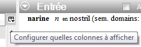
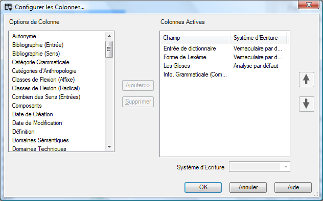
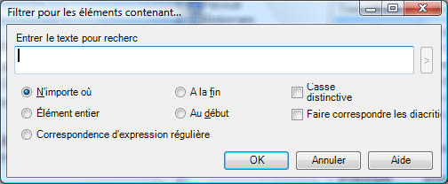
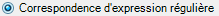
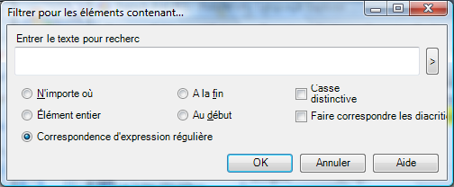
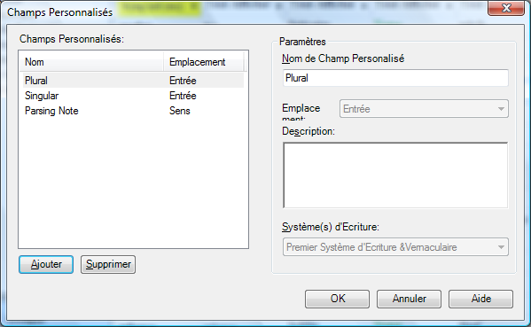

:::tip Info
This files contains summaries of all the original videos. It needs to be split up either by individual video or groups of videos. Some images that were inserted into tables did not convert to markdown. See the Word doc for those pictures.

Ce fichier contient des résumés de toutes les vidéos originales. Il doit être divisé soit par vidéo individuelle, soit par groupes de vidéos. Certaines images qui ont été insérées dans des tableaux n'ont pas été converties en markdown. Voir le document Word pour ces images.
:::
## Introduction

### 1 Visite rapide de FLEx

Les outils dans l'explorateur de langue sont organisés en des **zones**. Dans chaque zone il y a un certain nombre d'outils ou d’affichages. Cette liste change selon la zone où vous êtes actuellement.

| **Zone**               | C’est où vous…                                                                                 | Diverses vues/outils pour…                                                                                                                              |
|------------------------|------------------------------------------------------------------------------------------------|---------------------------------------------------------------------------------------------------------------------------------------------------------|
| **Lexique**            | maintenez votre base de données lexicale.                                                      | Le dictionnaire intégré a dénommé le rédacteur Outils d’édition en bloc  Vue spéciale pour entrer dans des domaines sémantiques.                        |
| **Textes & mots**      | entrez et interlinéarisez les textes                                                           | Les outils de recherche de concordance examinent les analyses.                                                                                          |
| **Zone de grammaire**  | écrivez et organisez l'information et les règles de grammaire                                  | La catégorie édite : contrôlez la liste de catégories grammaticales  Règles flexionnelles en créant des modèles  Compilez dans le croquis de grammaire  |
| **Listes**             | maintenez les diverses listes utilisées pour classifier et classer des articles par catégorie  | Ajoutez/éditez les articles dans les listes                                                                                                             |

### 2 Parcourir et éditer des volets
*2_pane_layout.mp4*

### Les volets de navigation et d'édition

De nombreuses vues contiennent à la fois des volets de navigation et de modification. Le volet de navigation affiche de nombreux enregistrements tandis que le volet d'édition vous permet de travailler en détail sur un enregistrement. Les deux volets peuvent être réduits et restaurés facilement.

## Parcourir / Lecture rapide “Browsing”

#### Personnalisation du volets de parcourir

### 3_configure_columns.mp4

#### Adapter les colonnes

*Dans la zone de « Lexique », Affichage « Éditer lexique »*

-   Utilisez le bouton de colonne de configuration (à la droite de la dernière colonne)

\- ou -

-   Cliquez sur le menu **Outils** puis choisir **Configurer**, puis **colonnes...**, puis
-   Ajoutez ou enlevez les colonnes selon les besoins
-   Mettre dans l’ordre les colonnes utilisant les boutons de flèches.
-   Choisissez les systèmes d'écriture selon les besoins.

#### Mettre les colonnes dans l’ordre

*Dans la zone de « Lexique », affichage « Éditer lexique »*

-   Mettre les colonnes dans l’ordre en glissant les en-têtes de colonne.

### 4 Filtrage (Filtering)

*3 Filtering.swf/4_filtering.mp4*

#### Filtres Standard

*Dans la zone de « Lexique », affichage « Éditer lexique »*

-   Utilisez les menus déroulants au-dessous des en-têtes de colonne

#### Arrêtez le filtre

*Dans la zone de « Lexique », affichage « Éditer lexique »*

-   Choisissez le « Tout Afficher » filtre   
    \- ou -

Cliquez sur le **Arrêtez le filtre** bouton   
(c’est bon si vous faites placer plus d'un filtre)

#### Divers exemples de filtres

| **Pour…**                                       | **Choisissez… de la liste déroulant du filtre puis…**                                                                                                                                                                  |
|-------------------------------------------------|------------------------------------------------------------------------------------------------------------------------------------------------------------------------------------------------------------------------|
| Pour voir les champs vides                      | Choisissez les **Espaces Vides**                                                                                                                                                                                       |
| Pour spécifier le filtre fait sur commande      | Choisissez le **Filtre pour...** et complétez la boîte de dialogue                                                                                                      |
| Le filtre est-il en activité ?                  | Le Choisir est jaune  et la barre de statut indique également les résultats en couleur jaune.                                                                                                                          |
| Erreurs d'orthographe                           | Si des dictionnaires orthographiques ont été installés alors il y aura un filtre additionnel « erreurs d'orthographe » qui montre par des vagues rouges au-dessous des mots ceux qui ne sont pas dans le dictionnaire  |
| Pour des articles inscrits d'une liste          | Choisissez le filtre « **choisir** » et une liste apparaît. Dans la choisir, cliquez sur différents articles, ou ctrl+click pour lui et tous ses enfants.                                                              |
| Champs de date                                  | Choisissez le filtre de **Limiter** et…                                                                                                                                                                                |
| Filtres préconfigurés                           | quelques champs ont préconfiguré des filtres, par exemple : oui/non, ou le nombre de champs plus grand \> 0…                                                                                                           |

### 6 Filtrage avec des expressions régulières

*4 regex.swf/6_filtering_regex.mp4*

Pour plus de flexibilité dans le filtrage vous pouvez utiliser ce qui est appelé une expression régulière.

Par exemple, trouver tous les lexèmes commençant avec mb- ou mp ou mu. Lancer les expressions régulières et utiliser le bouton de menu d'aide pour insérer des codes.   
**\\ b (mp\|mb\|mu)**

#### Filtre avec des expressions régulières

*Dans la plupart des zones, et la plupart des affichages   
(par exemple lexique. & des textes ; Mots)*

-   Choisissez le **Filtre pour…** d'un menu de filtre de lecture rapide
-   Cliquez sur 
-   Tapez l'expression régulière désirée ou utilisez l'aide

Elle a l’air plus compliquée que ce qu'elle est vraiment. Voyez les expressions régulières d'aide par exemple que vous pouvez copier et coller. Regardez également sur Internet pour plus d'aide. (Note : FLEx emploie la variété de .NET d'expressions régulières).

Quelques expressions régulières utiles :

| \^(mb\|mp\|mu)            | trouver soit **mb** soit **mp** soit **mu** au début      |
|---------------------------|-----------------------------------------------------------|
| \^(see\|saw\|seen)        | trouver le verbe ‘see’ annoté au présent passé ou présent |
| I\|you\|she\|he\|we\|they | trouvez un verbe annoté avec un marqueur de personne      |
| yo\#                      | trouvez tous les mots finir avec ‘yo’                     |
|                           |                                                           |
|                           |                                                           |
|                           |                                                           |

### 7 Mettre dans l’ordre
*5. sorting.swf*

|---|---|
| L’ordre primaire | -   Cliquez sur l'en-tête de colonne |
| L’ordre Secondaire | -   Shift+Cliquez sur l'en-tête de colonne (Note: la flèche est plus petite) |
| Arranger à partir de la fin | -   Cliquez avec le bouton droit sur l’en-tête de colonne |

:::tip
**Noteez**: tri sur les champs répétés. Si on trie sur un champ avec des enregistrements répété alors le nombre (droite inférieure) est le nombre de **sens** et n’est pas le nombre d’**entrées**.
:::

## Personnalisation du volet d'entrée

### 8 (6. Field visibility.swf/8_show_hidden.mp4/9_inserted_fields.mp4)

#### Pour voir les champs qui sont cachés

Dans la zone de lexique, l’affichage éditer (le) lexique

-   Cliquez sur la case à cocher **Afficher les champs cachés**
-   Cliquez sur le bouton vers la gauche du champ (c.-à-d. le bouton du menu de contexte),
-   Choisissez **Visibilité du Champ** puis choisissez ce qui est approprié
-   Cliquez sur la case à cocher « afficher les champs cachés »

#### Pour cacher des champs

-   Cliquez sur le bouton vers la gauche du champ (comme ci-dessus),
-   Choisissez Visibilité du champ
-   Choisissez comme approprié (l'un ou l'autre toujours visible, normalement caché s’il n’est pas vide, ou normalement caché)

#### Note:

Quelques champs ne se montrent pas jusqu'à ce que vous ajoutiez un objet. Ajoutez les champs sur commande

### 11 Ajouter des champs personnalisé

-   Outils-Configurer-Champs Personnalisé
-   Cliquez sur **Ajouter**
-   Tapez un nom
-   Choisissez l’**Emplacement**
-   Choisissez le **système d’écriture**
-   Cliquez sur **OK**

