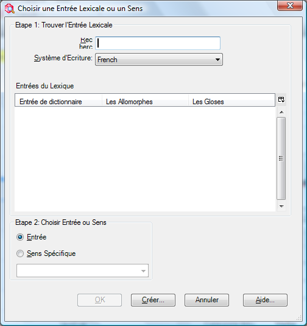
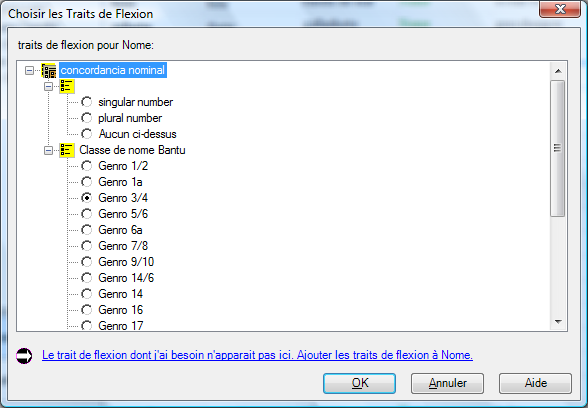
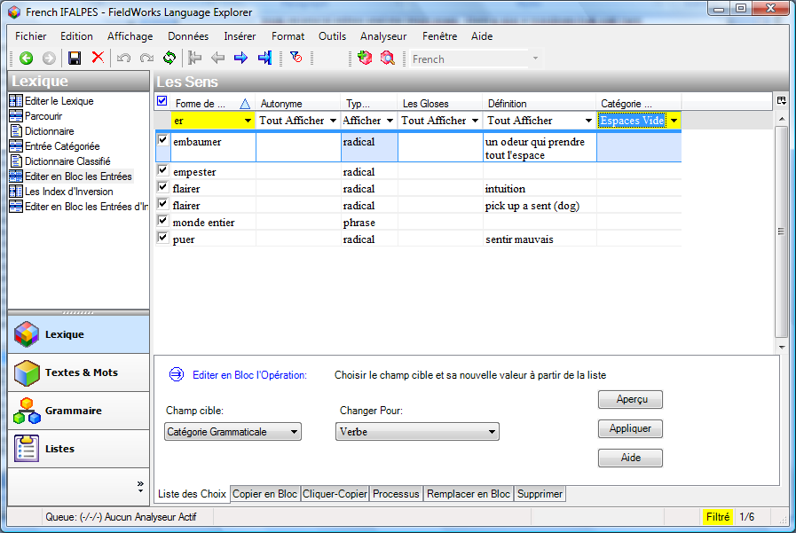
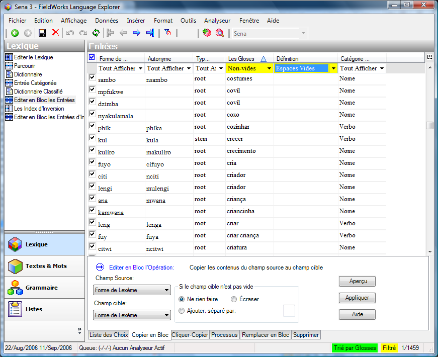

## Ajouter une entrée

### 12 - 7 add entry.swf/11_create_entry.mp4

#### Ajouter une entrée

*Dans la zone lexique,*

-   Cliquez le bouton **Ajouter entrée** sur la barre d’outils
-   *ou -*

    Dans le menu **Insérer**, choisissez **l'entrée**…

-   Tapez le lexème.   
    Comme vous tapez le lexème, les entrées semblables sont montrées en bas.
-   Tapez la glose (des entrées semblables sont également montrées)
-   Cliquez **Créer**.   
    L’entrée est créée et montrée.

#### Si l'entrée existe déjà

-   Utilisez le lien « **Atteindre entrée similaire** » (il saut à l'entrée pour que vous puissiez l'éditer)

## 13 Trouver l’entrée lexical

### 8 find entry.swf/12_create_entry.mp4

Pour arriver à une autre entrée qui n'est pas montrée sur l'écran, utilisez la fonction de « trouver » :

#### Trouvez une entrée

Dans la zone de lexique, quel que soit l’affichage

-   Cliquez sur le bouton de trouvaille dans la barre-outils   
    \- ou -

    Dans le menu **d'édition** choisissez **Trouver l'entrée lexicale…**

-   Tapez l'ensemble ou une partie de l'entrée [Les résultats sont montrés lorsque vous tapez].

#### Si l'entrée est montrée

-   Choisissez l'entrée dans la liste
-   Cliquez sur **Atteindre**

#### Si l'entrée n'est pas montrée

-   Cliquez sur **Créer**… pour ajouter l'entrée absente.

## 14 Ajouter des entrées d'homographe, ajouter des sens

### 9 homographs.swf/14_homographs_senses.mp4

Quand deux mots ont la même forme de lexème, ils devraient être ajoutés en tant **qu'entrées séparées** (c.à.d. homographes) si leurs significations ne sont pas connexes ou en tant que **différents sens de la même entrée** si leurs significations sont étroitement liées.

#### Pour ajouter une entrée d'homographe

*Dans la zone de lexique, l’affichage éditer (le) lexique*

-   Ajoutez la nouvelle entrée comme d’habitude (voyez « ajouter une entrée » ci-dessus pour plus d'aide) [une entrée semblable est montrée]
-   Ignorez l'entrée semblable et avancez et **Créer** la nouvelle entrée.

-   Des nombres d'homographe sont ajoutés automatiquement

#### Pour ajouter un sens

*Dans la zone de lexique, l’affichage éditer (le) lexique*

-   Cliquez dans la section de sens
-   Cliquez sur **Insérer le Sens** [un deuxième sens est ajouté]
-   Complétez les détails pour le nouveau sens.

## Ajouter des entrées pour des affixes

### 10 affix entries.swf

#### Ajouter un affixe flexionnel

*Dans la zone de lexique, l’affichage éditer (le) lexique*

-   Créez une nouvelle entrée
-   Tapez un trait d'union - puis l'affixe [le type de morphème change immédiatement au suffixe]
-   Choisissez le type d’affixe (c.à.d. flexionnel)
-   Choisissez la Catégorie à laquelle il s’attache comme appropriée
-   Puis utilisez alors l'aide d’annotation pour aider avec une glose appropriée (voir ci-dessous)

#### Constructeur de glose d’affixe flexionnel

[Malheureusement cela ne marche pas en français dans FLEx 6.0. Il faut changer la langue en anglais]

-   Cliquez sur le bouton **Assistant**
-   Cliquez sur **+,** près de la section appropriée (p.ex. *noun-related*)
-   Cliquez sur **+,** près de la section appropriée sous-section (p.e. *noun agreement*)
-   Cliquez sur **+,** près de la section appropriée sous-sous-section (p.e. *number*)
-   Cliquez sur le **bouton** **radio** près du choix approprié
-   Cliquez sur le bouton **Insert** pour l’ajouter à la glose
-   Continuez si nécessaire.
-   Cliquez sur **Accept Gloss**

    [la glose est entrée]

-   Clique sur **Créer**  
    [l’entrée est créé est montrée.]

**Notez** : L'avantage d'utiliser l'aide d’annotation est que les gloses sont conformés et les traits de flexion sont ajoutés.

#### Ajouter un allomorphe

*Dans la zone de lexique, l’affichage éditer (le) lexique*

-   Cliquez dans la section **Les allomorphes**
-   Cliquez sur le lien **Insérer l’allomorphe**
-   Tapez la forme
-   Remplissez l’environnement pour limiter l’allomorphe   
    (p.e. /x_\#)

    **Note**: Vous pouvez taper directement ou utiliser le menu de contexte.

#### Ajouter un affixe dérivatif

*Dans la zone de lexique, l’affichage éditer (le) lexique*

-   Créez une nouvelle entrée
-   Tapez un trait d'union - puis la forme de l'affixe   
    [le type de morphème change immédiatement au suffixe]
-   Choisissez le **type d'affixe** (c.-à-d. dérivationnel)
-   Choisissez **S’attache à la catégorie :** catégorie d'attachée comme appropriée
-   Cliquez sur **Créer**

## Spécification des formes complexes

Dans FLEx 6.0 la manière dont vous spécifiez les formes complexes et les variantes ont changé. Les nouveaux champs fournissent plus de flexibilité mais peuvent sembler légèrement plus compliqués. Des améliorations sont nécessaires à l'avenir.

Si un lexème contient plus d'un morphème vous pouvez spécifier quels sont ses composantes.

#### Caractéristiques des composantes d'une forme complexe

Dans la zone de lexique, l’affichage éditer (le) lexique

-   Montrez l’entrée pour éditer.
-   Dans les domaines de composantes, cliquez sur le bouton de points de suspension (à l'extrême droite) 

#### 

#### 

-   Recherchez une des composantes.
-   Si l'entrée est trouvée vous pouvez cliquez sur **OK**
-   Vous pouvez ajouter une autre composante en répétant l'action.
-   Si l'entrée n'était pas trouvée, vous pouvez l'ajouter en cliquant sur **Créer**

#### 

Plus de champs sont ajoutés à l'entrée.

-   Cliquez dans le champ « Type de forme complexe »
-   Vérifiez le type désiré (ou ajoutez comme nécessaire).
-   Cliquez sur **OK**

#### 

**Note** : Vous ne devez pas ajouter une entrée pour tous les dérivés qui sont possibles, seulement ceux dont la signification des composantes n'est pas prévisible.

## 15 Ajouter l'information grammaticale

###  13 grammatical info.swf

#### Ajouter une partie du discours

*Dans la zone de lexique, l’affichage éditer (le) lexique*

-   Choisissez l’entrée
-   Dans la section de sens, cliquez sur **Info. grammatical**
-   Cliquez sur le bouton pour montre les choix
-   Choisissez comme approprié.

**Note**: Si vous ajoutez un autre sens, la même Info. grammaticale se transférera sur le nouvelle sens mais on peut le changer selon les besoins.

**Tuyau** : Choisissez **Afficher les champs cachés** pour voir plus de détails d’informations grammaticales. Il y a d'autres champs qui peuvent être affichés aussi (voir au-dessous).

## 16 Précision du genre utilisant les champs de flexion

#### \_16_gender_infl_feature.mp4

Le champ flexionnel de dispositifs est où vous pouvez préciser la classe de genre ou de nom. Vous ajoutez d'abord les traits et une fois qu'ils sont ajoutés, vous pouvez alors utiliser le trait approprié dans l'entrée.

#### Insérez un trait au projet

Quelle que soit la zone

-   Dans le menu d’**affichage**, choisissez la **grammaire**, puis **traits de flexion**.
-   Dans le menu **d'insertion**, choisissez le **trait**

    Un catalogue est montré.

-   Cliquez sur **+,** près de noun-related
-   Cliquez sur **+,** près de noun agreement (l'accord de nom)
-   Cliquez sur **+,** près du gender (genre) (ou de la classe de nom) comme approprié
-   Cliquez sur les cases à cocher désirées.
-   Retournez au lexique.

#### 

#### Ajouter un trait de flexion à une entrée

*Dans la zone de lexique, l’affichage éditer (le) lexique*

-   Montrez l'entrée
-   Cliquez sur le bouton ... pour le champ de traits de flexion
-   Choisissez le trait désiré
-   Cliquez sur **OK**
-   Réactualisez l'écran en tapant sur (F5).

    Le trait est montré dans le champ d’info. grammaticale.

   

## 22 Ajouter des relations lexicologiques

### 15 lexical relations.swf

L'explorateur de langue a quelques relations lexicologiques intégrées et vous pouvez ajouter vos propres.

#### Utiliser une des relations lexicologiques intégrées

Dans la zone de lexique, l’affichage éditer (le) lexique

-   Utilisez le bouton de menu de contexte sur le champ lexicologique de relations 
-   Choisissez la relation désirée (par exemple la relation de synonymes d'insertion)

    

    La relation lexicologique est ajoutée aux deux entrées. 

    Le lien est maintenu même si l'autre entrée est éditée. Quelques relations lexicologiques permettent d'ajouter plus d'une entrée à la relation.

## 16 Ajouter des mots groupés par domaines sémantiques

### 16 1 categorized entry.swf

L'entrée classée par catégorie est un outil spécial pour introduire efficacement les mots qui ont été obtenus dans des domaines sémantiques à un atelier. (Voir le processus de développement de dictionnaire sur le site Web de sil.org).

#### Mots entrants par domaine sémantique

Dans la zone de lexique, l’affichage d'entrée catégorie

-   Choisissez le domaine sémantique désiré dans le carreau de centre (par exemple 2.1.1. Tête)
-   Dans le carreau droit supérieur vous pouvez le configurer pour montrer ou cacher les questions et réponses pour récupérer de l'espace
-   Dans le carreau droit inférieur, introduisez les mots pour le domaine sémantique choisi. [Pendant que vous les entrez dans l'explorateur de langue, faites de nouvelles entrées]
-   Utilisant le clavier, appuyez sur entrée pour une nouvelle rangée
-   Alors, tapez le mot puis appuyer TAB et tapez alors la définition.

    

La nouvelle entrée créée contient l'information écrite : c.-à-d. forme de lexème, définition et domaine sémantique (comme montré ci-dessus).

-   Si une entrée assortie est trouvée, l'explorateur de langue ajoute juste le domaine sémantique à l'entrée.
-   Si la définition ne correspond pas, alors l'explorateur de langue ajoute un deuxième sens avec le nouveau domaine. De cette façon l'explorateur de langue n'ajoute pas des reproductions quand vous utilisez l'entrée classée par catégorie.

# Éditer en bloc

## Éditer en bloc : Liste des choix

### 16 2a BE List Choice.swf

Les outils d’éditer en bloc vous permettent d'apporter des modifications à de nombreuses entrées choisies en même temps. Il y a plusieurs outils d’éditeurs en bloc dans l'explorateur de langue. Chacun vous permet de travailler dans différents genres de champs. Dans le lexique, il y a deux pareils affichages : un pour travailler sur les entrées lexicales et un sur des inversions. Il y a également un affichage « éditer en bloc » dans la zone de textes & mots pour éditer des formes de mots. Les affichages d’éditer en bloc fournissent différentes options d’édition sur des onglets.

Le choix de liste est réservé aux champs où les données viennent d'une liste ou d'un ensemble fixe de choix. Par exemple, la catégorie grammaticale, et le type de morphe.

#### Éditer en bloc les entrées avec le liste des choix

*Dans la zone de lexique*

-   Cliquez sur l’affichage **Éditer en bloc les entrées**
-   Cliquez sur l’onglet **Liste des choix**
-   Assurez-vous que le champ désiré de cible est montré dans une des colonnes (sinon configurez les colonnes)
-   Placez un filtre selon les besoins pour montrer les entrées désirés
-   Choisissez le champ de cible
-   Faites le choix dans « Changer pour »
-   Cliquez sur **Aperçu**
-   Passez en revue les changements (cochez ce que vous ne voulez pas changer)
-   Cliquez sur **Appliquer** pour apporter des modifications

**Note** : Il est utile d’avoir un aperçu avant que vous apportiez des modifications. C'est également une bonne idée de faire un support (sauvegarde) d'abord.

## Éditer en bloc: Copie

### 16 2b BE Copy.swf

La copie en bloc est pour copier des données d'un champ à l'autre. Par exemple, copiez les définitions d'un mot au champ de glose.

#### Éditer en bloc en utilisant « Copier en bloc »

*Dans la zone de lexique*

-   Cliquez sur l’affichage **Éditer en bloc entrées**
-   Cliquez sur l’onglet **Copier en bloc**
-   Assurez-vous que les champs désirés de source et de cible sont montrés dans les colonnes (sinon configurez les colonnes)
-   Placez un filtre selon les besoins pour montrer les entrées désirées.
-   Cochez toutes les entrées que vous ne voulez pas copier.
-   Choisissez le champ **Source**
-   Choisissez le champ **Cible**
-   Cliquez sur **Aperçu**
-   Passez en revue les changements et faites d'autres ajustements pour ne pas sélectionner tous les autres entrées qu’on ne veut pas copier
-   Cliquez sur **Appliquer** pour apporter les modifications.

## Éditer en bloc : Cliquer-Copier

### 16 2c BE Click Copy.swf

La cliquer-copier est un outil peu commun avec lequel quelque chose sur laquelle vous cliquez est copier dans un champ indiqué. Par exemple, vous pouvez placer l'inversion comme cible et cliquez sur n'importe quoi dans le champ de définition pour faire des entrées d'inversion.

#### Éditer en bloc un champ avec cliquer-copier

*Dans la zone de lexique*

-   Cliquez sur **Éditer en bloc entrées**
-   Cliquez sur l’onglet **Cliquer-copier**
-   Assurez-vous que le champ désiré de cible est montré dans les colonnes (sinon configurez les colonnes)
-   Placez un filtre selon les besoins pour montrer les entrées désirés.
-   Choisissez le champ de **Cible**
-   Cliquez sur n'importe quel mot dans le domaine de source et le mot sera ajouté au champ de cible.

    Note : si le champ de cible n'est pas vide il ajoute le mot séparé par des virgules. Pour changer voir les options dans « si le champ de cible n'est pas section vide. »

## Éditer en bloc: Processus

### 16 2d BE Process.swf

### 

L'onglet de processus vous permet de l'appliquer à un champ qui est alors enregistré dans le même champ ou dans un champ différent.

Les processus soutenus dans cet outil incluent des convertisseurs de codage tels que TECkit et des tables conformes aux changements régulier.

#### Éditer en bloc : un champ avec un processus

*Dans la zone de Lexique*

-   Cliquez sur **Éditer en bloc entrées**
-   Cliquez sur l’onglet **Processus**
-   Cliquez sur le bouton **Installation**
-   Cliquez sur **Ajouter**
-   Tapez un nom pour le nouveau convertisseur
-   Choisissez le type de Convertisseur
-   Choisissez alors le dossier et de fichier de **TECkit**
-   Choisissez alors le type de convertisseur (p.e. Unicode vers et de Unicode)
-   Assurez que les champs désirés de sources et de cible sont montrées dans les colonnes (sinon configurez les colonnes)
-   Choisissez le champ de **Source**
-   Choisissez le champ de **Cible** (avec le système d’écriture correct)
-   Cliquez sur **Aperçu**
-   Réexaminez les résultats
-   Cliquez sur **Appliquer**
