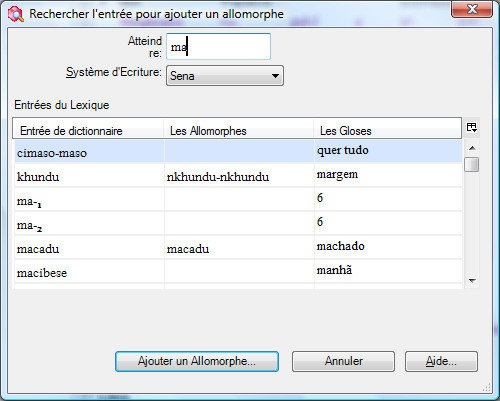
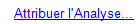
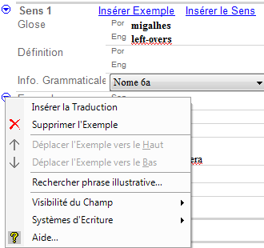
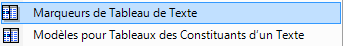
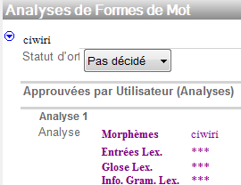

## 34 Textes interlinéaires

### 17 texts.swf

| **Étiquettes**   | **But**                                                                                                                                   |
|------------------|-------------------------------------------------------------------------------------------------------------------------------------------|
| Info             | cela te permet d'enregistrer les métadonnées pour le texte                                                                                |
| Ligne de base    | utilisé au saisir/coller le texte                                                                                                         |
| Glose            | affichage d’interlinéaire préconfiguré pour écrire des gloses du mot et sa catégorie                                                      |
| Analyse          | préconfigurée, te permet de travailler pour diviser des mots en morphèmes, pour choisir et créer les entrées appropriées dans le lexique  |
| Étiqueter        | l’affichage interlinéaire pour indiquer un phénomène de mots multiples.                                                                   |
| Visionner        | l’affichage interlinéaire pour le texte d'impression (configurez au besoin)                                                               |
| Tableau de texte | utilisation pour préparer un diagramme de discours                                                                                        |

#### Ajoutez un nouveau texte

*Dans la zone de textes & mots*

• Cliquez sur le menu d'insertion et choisissez le nouveau texte d'option

• Tapez le titre

• Tapez ou collez le texte lui-même dans l'onglet de ligne de base

#### Analysez un texte

*Dans la zone des textes et de mots, l’affichage interlinéaire des textes*

-   Cliquez sur l'onglet **Analyse**
-   Cliquer sur le mot à analyser
-   Cliquez sur la flèche bas à la gauche de la ligne de **Entrées Lex.**
-   S'il n'y a aucune analyse existante alors choisissez créer la nouvelle entrée (autrement choisissez une analyse existante)
-   Remplissez la glose
-   Cliquez sur le menu déroulant de la liste de catégorie
-   Choisissez de la liste

    \- ou -  
    Cliquez sur **Plus...** pour montrer le catalogue,   
    Choisissez et cliquez sur la catégorie désirée selon les besoins   
    puis cliquez sur **Ajouter**

-   Cliquez sur **Créer**   
    [toutes les lignes sont complétées]
-   Modifiez la **Cat. de mot** si nécessaire.

## Textes interlinéaires : Des analyses précédentes sont suggérées

### 18 suggested analyses.swf

Vous noterez que quelques mots qui étaient interlinéaires avant sont accentués dans le bleu. Les mots que vous avez interlinéaires en d'autres textes, et pour les mots qui sont trouvés dans le lexique sont montrés l'analyse comme suggestion. La couleur bleue indique que vous devez confirmer cette analyse suggérée dans ce contexte.

#### Confirmer une analyse suggérée

*Dans la zone des textes et de mots, l’affichage interlinéaire et l'onglet d'analyse*

-   Cliquez sur l'analyse suggérée bleue
-   Cliquez sur la marque de contrôle verte   
    \- ou -

    Utilisez une touche de raccourci comme ENTREE

-   Tous les changements sont sauvés automatiquement (l'utilisation **Annuler** si vous ne voulez pas enregistre)

## 36 Textes interlinéaires : Diviser des mots en morphèmes

### 19 splitting morphemes.swf

#### Divisez le mot en morphèmes en saisissant directement

Dans la zone des textes et de mots, l’affichage interlinéaire et l'onglet d'analyse

-   Cliquez sur la ligne de morphèmes du mot à analyser
-   Tapez un trait d'union à la coupure de morphème

#### 

-   [Le mot est coupé en morphèmes]

#### Diviser le mot en morphèmes utilisant le dialogue

Dans la zone de textes & mots, l’affichage interlinéaire et l'onglet d'analyse

-   Cliquez sur la ligne de morphèmes du mot à analyser
-   Cliquez sur le bouton de menu dans la ligne de morphèmes du mot à analyser

#### 

#### 

-   Séparez les morphèmes avec les espaces et les caractères appropriés (par exemple le trait d'union).
-   Cliquez sur **OK**

#### Ajouter les morphèmes au lexique comme nécessaire

Dans la zone des textes et mots, l’affichage interlinéaire et l'onglet d'analyse

-   Cliquez sur le bouton de menu dans la ligne d'Entrée Lex.
-   Choisissez « Créer un Nouvelle Entrée »
-   Remplir l'information comme approprié
-   Cliquez sur **Créer**

#### Choisissant un morphème différent (quand il y en a multiples)

Dans la zone des textes et de mots, l’affichage interlinéaire et l'onglet d'analyse

-   Cliquez sur le bouton de menu dans la ligne d'Entrée Lex.

    ****

-   Choisissez l'entrée existante désirée   
    **- ou -  
    **Ajoutez un Nouveau Sens

## 37 Textes interlinéaires : Ajouter un allomorphe

### 20 allomorph.swf

Il est parfois nécessaire d'ajouter un morphème comme allomorphe d'un lexème existant.

#### Ajouter un allomorphe à une entrée existante

Dans la zone des textes & mots, l’affichage interlinéaire et l'onglet d'analyse

-   Cliquez dans le mot à analyser
-   Divisez le mot en morphèmes (voir ci-dessus)
-   Cliquez sur le bouton de menu dans la ligne d'Entrée Lex.
-   Choisissez « l'allomorphe de ... »

    

-   Dans l'attendre tapez l'entrée existante
-   Puis cliquer « **Ajouter un Allomorphe...** »
-   Continuez l'analyse ajoutant toutes les entrées absentes au besoin.

## ?? Textes interlinéaires : Faire une locution

### 21 phrase.swf

Pour joindre deux mots dans un groupe pour une analyse simple nous employons le bouton de locution. Si vous décidez ultérieurement vous pouvez décomposer la phrase en mots.

#### Faire une locution avec le prochain mot (pour une analyse simple)

Dans la zone des textes et de mots, l’affichage interlinéaire et l'onglet d'analyse

-   Cliquez sur le premier mot de l'expression
-   Cliquez sur le bouton de « faire une locution avec la prochaine mot »   
    

-   Ajoutez maintenant une entrée lexicologique simple pour eux

#### Diviser la phrase en mots

Dans la zone des textes & mots, l’affichage interlinéaire et l'onglet d'analyse

-   Cliquez dans l'expression
-   Cliquez sur le bouton **Décomposez la phrase en mots**

## 42 Textes interlinéaires : L'onglet de glose

### 22 gloss tab.swf

Comme l'onglet d'analyse l'onglet de Glose fournit un affichage interlinéaire. Mais elle est préconfigurée pour ajouter des gloses de mot, des catégories de mot et des traductions libres. Vous pouvez la changer en employant l'Outil-Configuration interlinéaire et la rendre plus simple ou plus compliquée. À la différence de l'onglet d'analyse l'onglet de glose a une option spéciale qui te permet d'ajouter des mots dans le lexique pendant que vous ajoutez des gloses ou des catégories de mot. Puisque le lexique contient habituellement des morphèmes ce dispositif est prévu pour les langues qui ont la morphologie très peu.

#### Lancer le mode spécial pour ajouter des mots

Dans la zone des textes & mots, l’affichage interlinéaire et l'onglet de glose

-   Cliquez dans le mot à analyser
-   Cochez « Ajouter des mots au Lexique »

    ****

#### Ajouter les mots au lexique

Dans la zone des textes & mots, l’affichage interlinéaire et l'onglet de glose

-   Cliquez dans le mot à analyser
-   Tapez le glose de mot et appuyez **entrée** [des entrées sont aussi bien créées dans le lexique utilisant le glose de mot comme le glose lexicologique]

## 44 Textes interlinéaires : Analyseur morphologique

### 23 parser.swf

L'explorateur de langue a également un analyseur morphologique qui est commandé par des options dans le menu d'analyseur. L'analyseur essaye de suggérer ou prévoir des analyses basées sur les entrées dans le lexique et les règles et des faits dans la zone de grammaire. Si vous n'utilisez pas l'analyseur vous verrez toujours les analyses que vous avez écrites précédemment suggéré pour vous dans le bleu. Ces suggestions bleues sont limitées aux mots que vous avez analysés précédemment. En revanche, l'analyseur morphologique peut suggérer des analyses pour des mots que vous n'avez pas rencontrés avant. Et il peut faire une suggestion/prévision tant qu’il peut trouver les morphèmes dans le lexique et les règles de grammaire pour le permettre.

#### Commencer l'analyseur

Dans la zone des textes et de mots, l’affichage interlinéaire et analyse l'onglet

-   Dans le menu d'analyseur choisissez **analyser tout les mots**
-   Vous pouvez suivre le progrès de l'analyseur sur la barre de statut
-   Appuyez sur **Actualiser** pour voir les résultats
-   Maintenant vous pouvez voir des suggestions faites par l'analyseur accentué dans l'orange.

****

-   Les suggestions d'analyseur n'incluent pas une glose de mot ou une catégorie de mot
-   Vous pouvez éditer et approuver ces suggestions comme d'habitude.

## 45 L’affichage d'analyses de mots

### 24 words analyses.swf

Tous les mots qui sont en textes sont énumérés dans l’affichage d'analyses de mots. Il y a une colonne qui montre combien d'occurrences là sont dans le corpus entier des textes. Vous pouvez également affichage d'autres colonnes comprenant le nombre d'analyses que vous avez approuvées pour chaque mot et le nombre d'analyses que l'analyseur a affirmées pour chaque mot. Cet affichage est utile pour passer en revue les diverses analyses pour chaque mot.

Des analyses qui sont suggérées par l'analyseur sont d'abord mises dans la section **Opinion d'utilisateur pas connue** puisque c'est seulement un candidat d'analyse. On peut déclarer qu’on approuve cette analyse.

#### Approuvez un candidat d'analyse (comme suggéré par l'analyseur)

Dans la zone des textes & mots, l’affichage d'analyses de mot

-   Naviguez pour le mot à être analysé
-   Dans le carreau d'analyse trouvez le candidat d'analyse
-   Cliquez sur le bouton de menu de **candidat pour l'analyse**
-   Choisissez l'opinion d'utilisateur, puis **approuver**

    

    Elle est alors montée dans la section d'analyses approuvée par utilisateur.

## Ajouter une analyse

### 25 add analysis.swf

Vous pouvez également ajouter de nouvelles analyses dans l’affichage d'analyses de mot.

#### Ajouter une nouvelle Analyse

Dans la zone des textes & mots, l’affichage d'analyses

-   Naviguez pour le mot à être analysé
-   Dans le carreau d'analyses, cliquez sur l'utilisateur section approuvée (d'analyses)
-   Cliquez sur le bouton de menu d'approuvées par utilisateur (Analyses)
-   Choisissez **Ajouter l’analyse approuvée...**

Le dialogue de insérer séparations de morphème est affichage.

-   Indiquez les séparations de morphème comme approprié et cliquez sur OK
-   Ajoutez ou choisissez les entrées lexicologiques comme appropriées (comme dans le texte)
-   Ajoutez une catégorie de mot et une glose de mot utilisant des champs (Catégorie, Mot)

## 46 Attribution des analyses

### 26 assign analysis.swf

L’affichage d'analyses de mot a un outil qui te permet d'assigner des analyses à tout nombre d'occurrences en textes. Par à l'aide de l'outil d'analyse d'attribution je peux spécifier quelle analyse est bonne pour ces autres occurrences que je n'ai pas encore travaillées dessus dans les textes.

Dans le texte & mots zone, l’affichage d'analyses de mot

-   Naviguez pour le mot à être analysé
-   Cliquez sur la commande d'analyse d'attribution (à la droite supérieure de la fenêtre)   
    

    Le dialogue d'utilisation d'analyse est montré.

    

-   Choisissez une analyse (1.)
-   Choisissez les occurrences qui se rapportent à une de l'analyse (2.)
-   Cliquez sur la glose de mot pour l'analyse désirée (3.)
-   Cliquez sur le bouton d'**attribuer** (4.)
-   Choisissez les occurrences qui se rapportent à la prochaine analyse (2.)
-   Cliquez sur la glose de mot pour l'analyse (3.)
-   Cliquez sur le bouton d'attribuer (4.)
-   Cliquez sur **Fermer.**

## 47 Ajouter un modèle d’affixe flexionnel

### 27 template table.swf

Si vous utilisez l'analyseur morphologique, le candidat d'analyse que l'analyseur produit peut indiquer des zones où vos règles de grammaire ont besoin de plus de travaille.

#### Ajoutez un modèle

Dans la zone de grammaire, l’affichage éditer la catégorie

-   Choisissez la catégorie grammaticale désirée
-   Dans le menu d'**insertion,** choisissez **Modèle d'Affixe**
-   Tapez un nom pour le modèle (par exemple le temps)
-   Utilisez le menu de contexte près de mot **stem** pour insérer la case soit après soit avant STEM
-   Choisissez si la case est facultative ou obligatoire
-   Tapez un nom pour la case
-   Utilisez alors le menu bleu de contexte « ajoutent des morphèmes flexionnels » à cette case.
-   Cochez sur les affixes qui peuvent remplir case.
-   Cliquez sur **l'OK**

-   Retournez au zone de Textes & Mots, l’affichage d'analyse et commencent l'analyseur, puis cliquer sur **réaliser** pour voir les résultats. Les inadmissibles analysent ne devraient pas être produits.

## 49 Outils de concordance

### 29 concordance.swf

L'outil de concordance te permet de spécifier du texte pour que l'outil de concordance recherche.

Vous pouvez également spécifier dans quelle ligne le texte devrait se produire. Pour des recherches plus spécifiques telles que l'entrée spécifique ou le sens, utilisez les commandes de saut qui sont disponible quand vous cliquez avec le bouton droit.

#### Utilisez l’affichage de concordance

Dans la zone de Textes & Mots ; l’affichage de concordance

-   Tapez le texte pour rechercher
-   Spécifiez la ligne pour rechercher dedans
-   Cliquez sur la **recherche**

#### 

#### 

#### Utilisez la commande de saut

Dans la zone de Textes & Mots ; l’affichage de concordance

-   Cliquez avec le bouton droit sur une entrée dans la ligne *d’entrée de Lex*
-   Choisissez **Afficher concordance de**
-   Puis choisissez **forme de mot**
-   Une concordance juste de cette entrée n'est montrée, pas une concordance d'aucune occurrence du texte spécifique. Seulement des occurrences qui ont été approuvées sont montrées (et pas des occurrences non proposées).

Dans d'autres affichages d'explorateur de langue il y a également des commandes de saut. Par exemple, dans la zone de lexique, l’affichage de lexique éditent, sous le menu de contexte d'entrée. Également dans le menu de contexte de sens.

## 30 Trouver des exemples illustratives

### 30 find example sentence.swf

Un outil spécial de concordance est fourni pour aider à trouver des phrases illustratives. Utilisez le bouton bleu de menu de contexte et choisissez les phrases d'exemple de trouvaille.

#### Trouvez la phrase d'exemple

Dans la zone de lexique, l’affichage de lexique éditent

-   Naviguez pour l’entrée désirée
-   Cliquez sur le menu bleu de contexte du champ *d'exemple*,
-   Choisissez **Rechercher phrase illustrative…**

#### 

#### 

Le dialogue « Find Example Sentence » (trouver des phrases illustratives) est montré.

#### 

-   Cochez la phrase désirée
-   Cliquez sur **Add** (Ajouter**)**

 

La phrase d'exemple et quelle que soit la traduction libre sont insérées dans l'entrée.

## 50 Tableau de Texte (Discourse Chart)

### discourse.swf

L'onglet de tableau de texte te permet de faire une carte des composants de discours. Pour fournir plus de pièce pour le diagramme c’est bon de réduire au minimum les textes carreau et faire la même chose avec la barre de zones.

#### Ajouter les mots au diagramme

-   Cliquez sur un mot ou des mots du texte en tant que ci-dessous montré tableau
-   Cliquez sur les boutons qui correspondent à l'en-tête de colonne

#### Ajouter la nouvelle rangée au tableau

-   Choisissez une colonne qui est à la gauche du mot déjà dressé dans le tableau. Une nouvelle rangée est insérée.

#### Déplacez le contenu de la cellule

-   Cliquez sur le bouton de menu de cellules
-   Choisissez **Déplacez cellule** ou **Déplacer mot**
-   Choisissez **Avancer** ou **Précédent**

#### Marquez une clause de la parole

-   Choisissez l'endroit d'où le discours est marqué
-   Cliquez sur le bouton de cellules
-   Choisissez « En faire un proposition de discours » puis de la « Proposition suivante » (ou comme approprié).

#### L'article de marque n'est pas dans l'endroit habituel

-   Cliquez sur le bouton de cellules
-   Choisissez la « Indiquer postposé de » ou « Indiquer antéposé de »
-   Choisissez « externo » ou « intérno »

#### Indiquez où les séparations de phrase viennent

(de sorte que la ligne numérotation soit appropriée).

-   Cliquez sur le bouton de cellules
-   Choisissez « **Dernier rangée du paragraphe** » ou « **dernière rangée dans la Phrase** » comme approprié.

#### Titres changeants de tableau et marqueurs intégrés  (si c’est nécessaire le fait avant de commencer le tableau)

-   Dans le menu **Affichage**, choisissez les **listes**
-   Puis choisissez « marqueurs de tableau de texte »   
    (ou « Modèles pour Tableaux des Constituants d’un Texte »

    

## 54 Ressources d'aide et de formation

### help.swf

Pour trouver une aide plus complète et plus détaillée en employant l'explorateur de langue un dossier d'aide a été fourni. Malheureusement tous est en anglais.

...

##  53 Vérification de l’orthographe

### spelling.swf

FLEx peut vous aider à la vérification de l’orthographe. Pour des langues de communication plus large nous recommandons que vous téléchargez un dictionnaire orthographique par exemple du site Web OpenOffice. De pleines instructions sur la façon dont faire ceci sont trouvées dans les dossiers d'aide d'explorateur de langue. Une fois que le dictionnaire orthographique est en place l'explorateur de langue accentue des mots mal épelés. De diverses options sont fournies dans le menu de cliquer à droite. Vous pouvez également filtrer pour des mots mal épelés.

#### Installer le dictionnaire de contrôle de l’orthographe pour LWC

-   Téléchargez le correcteur orthographique d'OpenOffice
-   Copiez le correcteur :   
    pour XP - c:\\documents and settings\\user\\Application data\\ enchant\\myspell   
    pour Vista - C:\\Users\\\<username\>\\ AppData\\Roaming\\enchant\\myspell
-   Puis redémarrer FLEx

#### Corriger les mots mal épelés

-   Cliquer avec le bouton droit sur un mot accentué avec les lignes vagues rouges
-   Choisissez une option appropriée

#### Filtrer pour des mots mal épelés

Dans la zone de lexique, l’affichage Éditer (le) lexique

-   Dans le menu déroulant de filtre
-   Choisissez **Erreurs d’orthographe.**

#### Vérification d’orthographe pour des langues minoritaires (installation)

-   Dans le menu **d'outils**, choisissez Orthographe, puis Afficher les Erreurs d’Orthographe Vernaculaire.

    (un dictionnaire vide sera créé)

#### Ajouter des mots au dictionnaire d’orthographe

*Dans la zone de Texte & Mots, l’affichage Analyses de Mot*

-   Changez le “Statut d’orthographe” à “Correcte”

#### Changer le statut d’orthographe utilisant Éditer en bloc

-   Dans le menu **Outils,** choisissez **Orthographe**-**Éditer statut d’orthographe…**

    L’affichage d’Éditer en bloc est montré avec un filtre pour les mots pas décidé.

-   Modifier le filtre comme approprié
-   Cochez les mots qui ne sont pas correctes c.à.d. le boite est vide).
-   Exécutez un éditer en bloc comme montré ci-dessous :

-   Regardez un texte pour voir rester des résultats incorrects ou irrésolus.
